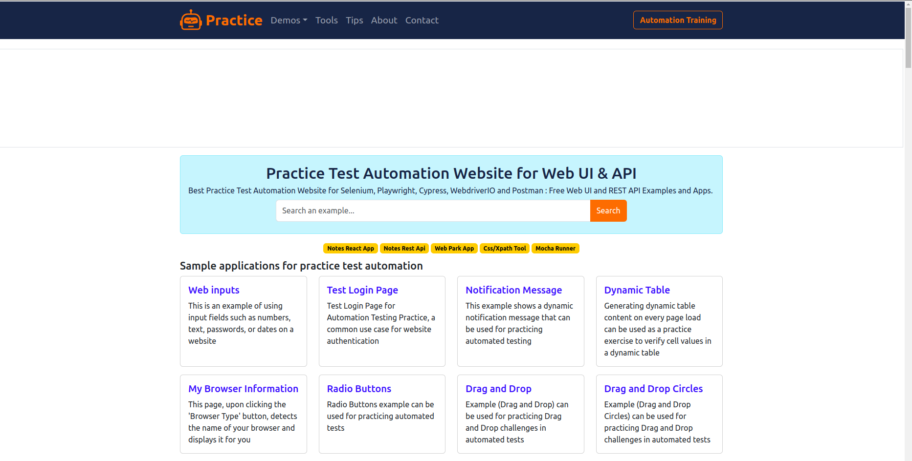
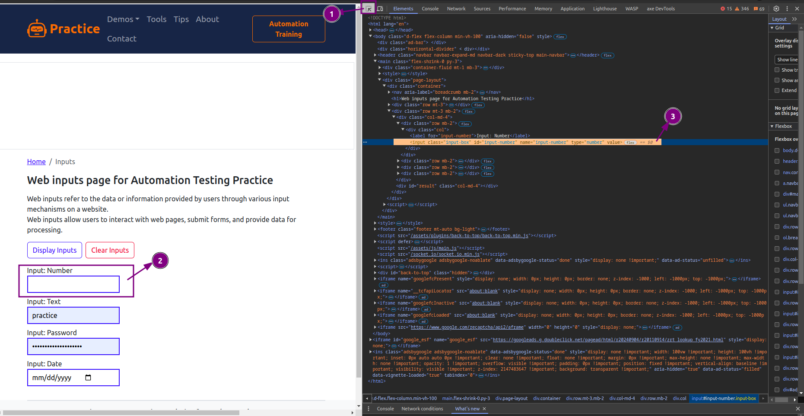

# 10. Proyek Web Automation Testing

Author: Fajar Triady Putra (@fajartriadyp)


## Overview

Setelah kalian mempelajari dasar pemrograman dan ujicoba secara manual, saatnya kamu kenalan dengan automation web test baik itu mengenai selector inspect element hingga Playwright.

Sekarang mari kita coba untuk membuat project automation website sederhana dari sebuah website bernama https://practice.expandtesting.com/. 

[](https://practice.expandtesting.com/)

Seperti yang bisa kalian lihat di dalam website tersebut banyak sekali metode yang dapat kita gunakan untuk latihan automation website, Seperti, web inputs, login page, notification, dll. Pada website ini, mari kita belajar dari yang paling mudah yaitu web input. 

## Setup Proyek

Pertama kamu perlu membuat folder di dalam komputermu, pilih folder yang kamu ingat dan gampang untuk jangkau. Selanjutnya buka folder ini dengan VS Code.


Kedua, buat virtualenv dengan cara menuliskan ini pada terminal di dalam foldermu, jangan lupa untuk membuka terminal, `pilih Terminal > New Terminal`.

```bash
python -m venv venv
```

Kamu juga bisa memasukannya dengan cara:

```bash
python3 -m venv venv
```

Kemudian aktifkan venvnya dengan cara:

- Linux
    ```bash
    source venv/bin/activate
    ```
- Windows
    ```bash
    venv\Scripts\activate
    ```

Hasilnya akan menjadi seperti ini, kamu akan melihat teks `(venv)` pada bagian kiri.
```bash
(venv) C:\Users\acer\Desktop>
```

> [!NOTE]
> virtualenv digunakan untuk memisahkan library yang akan diinstall secara global di komputer, fungsinya sama seperti node modules pada NodeJS.

Ketiga, kita akan instalasi framework `Playwright`, pastikan kamu sudah mengaktifkan venv.

```bash
pip install playwright
```

Kemudian, jalankan perintah berikut untuk menginstal browser yang didukung oleh framework `Playwright`:

```bash
playwright install
```

> [!NOTE]
> Secara teori, browser yang didukung playwright adalah Firefox dan Google Chrome

Dikarenakan bahasa pemograman yang kita pakai adalah python install maka kita wajib menginstall libray pytest untuk mengujicoba program.

```bash   
pip install pytest
```

Setelah selesai ketiganya sekarang kita bisa masuk ke langkah selanjutnya yaitu ke struktur proyek.

---

## Folder Structure

Di dalam automation testing kita akan mengenal paradigma Page Object Model (POM), dimana kita memisahkan logika interaksi dengan elemen-elemen di halaman web dari logika uji (test cases). 

Berikut adalah contoh struktur tanpa paradigma POM:

```bash
/automation_project
│
├── /tests                  # Semua test case diletakkan di sini
│   ├── test_login.py       # Test file untuk pencarian
│   └── test_home.py         # Test file untuk beranda
│
├── playwright-config.py
├── requirements.txt        # File dependencies
└── README.md               # Dokumentasi proyek
```

Sedangkan, berikut adalah contoh struktur dengan paradigma POM:

```
/automation_project
│
├── /pages                  # Folder untuk Page Object Models (POM)
│   ├── home_page.py         # Page Object untuk halaman beranda
│   └── search_page.py       # Page Object untuk halaman pencarian
│
├── /tests                  # Folder untuk test case
│   ├── test_search.py       # File test untuk pencarian
│   └── test_home.py         # File test untuk beranda
│
├── /datas                  # Folder untuk data test yang dipakai
│   └── home_data.py
|   └── search_data.py
│
├── playwright-config.py
├── requirements.txt        # File dependencies
└── README.md               # Dokumentasi proyek
```

Terlihat jelas bukan perbedaannya dimana jika kita memakai paradigma `POM` maka dapat melakukan kolaborasi lebih lanjut antar QA dan juga dapat membuat code kita lebih clean dan dapat di-maintenance dengan baik. 

Pada proyek kali ini kita akan langsung mengimplemetasikan POM ke dalam code kita.

## Page Object

Yaps, tahap pertama atau tahapan paling penting dalam melakukan web automation adalah page object atau pencarian `selector`. 

> Tapi, kenapa memakai selector?

`Selector` ini penting sekali dalam web automation testing untuk mengidentifikasi dan berinteraksi dengan elemen-elemen di halaman web. 

`Selector` memungkinkan kamu memilih elemen tertentu, seperti tombol, kolom input, atau link, sehingga kamu dapat melakukan tindakan seperti mengklik, mengisi formulir, atau memverifikasi atribut elemen.

Sekarang paham kan kenapa kita harus mencari selector? Mari kita langsung lihat kedalam website tersebut.

Langkah pertama buka console kalian.
   
Ada dua cara untuk membuka console atau melakukan inspect element. Carannya adalah dengan klik kanan lalu pilih console / inspect elemtn atau langsung saja tekan `F12` pada keyboard kalian

<br />

Pilih bagian mana yang kalian mau ambil:
   
[]()

Disini kita bisa lihat pada bagian yang kita pilih yaitu input number memiliki attribute seperti ini:

```html
<input class="input-box" id="input-number" name="input-number" type="number" value="">
```

kita bisa memilih id-nya untuk dimasukkan ke dalam code, untuk lebih jelasnya mengenai selector kalian bisa cek di modul sebelumnya atau bisa juga mengunjungi link ini [Selector Hierarchy]( https://medium.com/@fajartriady/element-selector-hierarchy-on-web-automation-testing-57ad47cfbf00)

<br/>

Sekarang buat file baru bernama `input_page.py` di dalam folder `pages`, lalu masukkan keseluruhan kode di bawah ini:

```python
from playwright.sync_api import Page

class InputPage:
    def __init__(self, page: Page):
        self.page = page
        self.input_number = page.locator("#input-number")
        self.input_text = page.locator("#input-text")
        self.input_password = page.locator("#input-password")
        self.input_date = page.locator("#input-date")
        self.dismiss_button = page.locator("#dismiss-button")
        self.output_number = page.locator("#output-number")
        self.output_text = page.locator("#output-text")
        self.output_password = page.locator("#output-password")
        self.output_date = page.locator("#output-date")
        self.display = page.locator("#btn-display-inputs")

    def dismiss_ads_if_visible(self):
        if self.dismiss_button.is_visible():
            self.dismiss_button.click()

    def click_display(self):
        self.display.click()
        
    def fill_number(self, number: str):
        self.input_number.fill(number)

    def fill_text(self, text: str):
        self.input_text.fill(text)

    def fill_password(self, password: str):
        self.input_password.fill(password)

    def fill_date(self, date: str):
        self.input_date.fill(date)

    def get_output_number(self):
        return self.output_number.inner_text()

    def get_output_text(self):
        return self.output_text.inner_text()

    def get_output_password(self):
        return self.output_password.inner_text()

    def get_output_date(self):
        return self.output_date.inner_text()

```

## Data 

Karena kita menggunakan POM, maka kita memisahkan `data` dari test case sehingga folder `data` bisa lebih mudah di-maintain. Pada folder `data`, buat file baru bernama `input_data.py` lalu masukkan kode di bawah ini:

```python
test_data = {
    "number": "12345",
    "text": "Sample Text",
    "password": "password123",
    "date": "2024-08-19"
}
```


## Test Case

Tahap terakhir dalam automation website adalah test script. Sekarang mari kita ambil contoh test script untuk `test case positive` dalam halaman input form yang sudah kita kumpulkan pages dan data. 

Sekarang mari kita buat file test baru bernama `input_test.py` di dalam folder `test`. Kemudian, masukkan keseluruhan kode di bawah ini:

```python
import pytest
from playwright.sync_api import sync_playwright
from pages.input_page import InputPage
from data.input_data import test_data

@pytest.fixture(scope="function")
def setup():
    with sync_playwright() as p:
        browser = p.chromium.launch(headless=False)
        page = browser.new_page()
        page.goto("https://practice.expandtesting.com/inputs")
        input_page = InputPage(page)
        input_page.dismiss_ads_if_visible()
        yield input_page
        browser.close()
        
def test_tc_001_input_number(setup):
    input_page = setup
    input_page.fill_number(test_data["number"])
    input_page.click_display()
    assert input_page.get_output_number() == test_data["number"], "Output number verification failed."
```


### Explanation

Bagian ini berfokus kepada import library dan juga file file yang dipakai:

```python
import pytest
from playwright.sync_api import sync_playwright
from pages.input_page import InputPage
from data.input_data import test_data
```

---

```python
import pytest
```

Bagian ini mengimpor modul `pytest` yang merupakan framework pengujian di Python. `pytest` menyediakan cara yang mudah dan kuat untuk menulis serta menjalankan unit test, test fungsi, atau test skenario.

<br />

```python
from playwright.sync_api import sync_playwright
```

Bagian ini mengimpor fungsi `sync_playwright` dari modul `Playwright`. `Playwright` adalah framework untuk melakukan pengujian otomatisasi browser. Method `sync_playwright` digunakan untuk berinteraksi dengan browser dalam mode sinkron (sync), yang berarti kode akan berjalan secara berurutan.

<br />

```python
from pages.input_page import InputPage
```

Bagian ini mengimpor `InputPage` dari file atau modul `input_page.py` di dalam folder `pages`. Berdasarkan namanya, `InputPage` kemungkinan adalah sebuah kelas atau objek yang merepresentasikan Page Object Model (POM) dari halaman input di aplikasi web, yang digunakan untuk mengotomatisasi interaksi dengan halaman tersebut.

<br />

```python
from data.input_data import test_data
```

Bagian ini mengimpor variabel `test_data` dari file atau modul `input_data.py` di dalam folder data. Variabel `test_data` adalah sekumpulan data yang digunakan dalam pengujian, seperti data input untuk skenario pengujian otomatisasi.


<br />


```python
@pytest.fixture(scope="function")
def setup():
    with sync_playwright() as p:
    browser = p.chromium.launch(headless=False)
    page = browser.new_page()
    page.goto("https://practice.expandtesting.com/inputs")
    input_page = InputPage(page)
    input_page.dismiss_ads_if_visible()
    
    yield input_page
    
    browser.close()
```

---

```python
@pytest.fixture(scope="function")
```

Bagian ini adalah decorator untuk mendefinisikan fixture di pytest. Fixture menyediakan mekanisme untuk setup dan teardown (persiapan dan pembersihan) yang dilakukan sebelum atau setelah.


```python
def setup()
```

<br />


Ini mendefinisikan sebuah fungsi bernama setup(). Fungsi ini mungkin digunakan sebagai bagian dari fixture di pytest untuk menyiapkan lingkungan pengujian.

```python
with sync_playwright() as p:
```

<br />

Menggunakan konteks with untuk memulai sesi Playwright dalam mode synchronous.

```python
sync_playwright()
```

Menginisiasi Playwright dan objek p memungkinkan akses ke berbagai browser yang didukung (seperti Chromium, Firefox, WebKit).


<br />

```python
browser = p.chromium.launch(headless=False)
``` 

Meluncurkan browser Chromium (Chrome). Kode ini bisa diganti sesuai dengan website apa yang kalian inginkan

```python
headless=False
``` 

<br />

Berarti browser akan dibuka dalam mode grafis, sehingga kamu dapat melihat jendela browser selama pengujian. Jika diatur ke True, browser akan berjalan di background tanpa antarmuka grafis.

<br />

```python
page = browser.new_page()
``` 

Membuka sebuah halaman baru di browser yang baru saja diluncurkan. Halaman ini akan digunakan untuk melakukan interaksi dan pengujian.

<br />

```python
page.goto("https://practice.expandtesting.com/inputs"
``` 

Mengarahkan halaman yang baru dibuka ke URL yang diberikan, yaitu https://practice.expandtesting.com/inputs. 

<br />

```python
input_page = InputPage(page)
``` 

Menerima objek page dari Playwright dan menyediakan metode untuk berinteraksi dengan elemen di halaman tersebut.

<br />

```python
input_page.dismiss_ads_if_visible()
``` 

Memanggil metode dismiss_ads_if_visible() dari objek input_page untuk menutup atau mengabaikan iklan jika mereka terlihat di halaman. Ini adalah langkah untuk memastikan iklan tidak mengganggu pengujian.

<br />

```python
yield input_page
``` 

`yield` digunakan untuk mengembalikan objek input_page ke pengujian. Dengan menggunakan `yield`, fungsi ini menyimpan status lingkungan pengujian (seperti halaman web yang dimuat) untuk digunakan dalam test case. Setelah yield, eksekusi fungsi akan dilanjutkan.

<br />

```python
browser.close()
```

Menutup browser setelah pengujian selesai. Ini adalah langkah pembersihan yang penting untuk memastikan bahwa semua sumber daya (seperti proses browser) dilepaskan setelah pengujian.

<br />

Test case pertama:

```python
def test_tc_001_input_number(setup):
   input_page = setup
   input_page.fill_number(test_data["number"])
   input_page.click_display()
   assert input_page.get_output_number() == test_data["number"], "Output number verification failed."
```

<br />


```python
def test_tc_001_input_number(setup)
``` 

Bagian ini mendefinisikan sebuah fungsi uji bernama `test_tc_001_input_number`. Fungsi ini dirancang untuk menguji fitur tertentu dari halaman web. Fungsi ini menggunakan fixture setup yang sebelumnya didefinisikan.

<br />

```python
input_page = setup
``` 

`setup` disini adalah fixture yang dikembalikan oleh fungsi `setup()` dan menyediakan objek `input_page`. Dengan pernyataan ini, `input_page` sekarang mengacu pada instance dari `InputPage` yang telah diinisiasi dan siap digunakan untuk pengujian.

<br />

```python
input_page.fill_number(test_data["number"]) 
```

Memanggil metode `fill_number` pada objek input_page dan mengisinya dengan nilai yang diambil dari `test_data["number"]`.

<br />

```python
test_data["number"] 
```

Mengacu pada data uji yang sebelumnya telah didefinisikan yang berisi angka atau nilai lain yang akan dimasukkan ke dalam elemen input di halaman web.

Method `fill_number` diharapkan berfungsi untuk mengisi nilai input di halaman web dengan angka yang diberikan.

<br />

```python
input_page.click_display()
``` 

Memanggil metode `click_display` pada objek `input_page`.

<br />

```python
assert input_page.get_output_number() == test_data["number"], "Output number verification failed."
``` 

Memeriksa apakah nilai yang diperoleh dari metode `get_output_number()` sama dengan nilai yang diharapkan dari `test_data["number"]`.

<br />

```python
input_page.get_output_number()
```

Mengembalikan teks yang ditampilkan sebagai hasil dari input yang dimasukkan.

<br />

```python
assert
``` 

`Assert` adalah verifikasi apakah kondisi yang diberikan bena. Jika tidak, pesan kesalahan `"Output number verification failed."` akan ditampilkan.

Jika hasil dari `get_output_number()` tidak cocok dengan `test_data["number"]`, maka tes disebut gagal dan pesan kesalahan akan muncul.


## Menjalankan Test

Untuk menjalakan test scriptnya kalian bisa menggunakan perintah berikut dengan cara menuliskannya pada terminal

```bash
pytest test/
``` 

Perintah di atas adalah untuk menjalakan semua test suites pada folder yang dipanggil. 

Apabila hanya ingin satu test suites maka bisa juga seperti ini :

```bash
pytest test/input_test.py
```

Ini adalah contoh ketika code sudah di run.


jika kamu tidak merasa puas dengan reportingnya  bisa kamu tambahkan html report dimana hasilnya akan seperti ini.


Dan jika kalian penasaran dan ingin reporting yang lebih advance bisa kalian coba memakai `allure reporter`

---

Yuhuu, ini adalah bagian terakhir dari percobaan simple project web automation pada website https://practice.expandtesting.com/. selalu diingat bahwa ***pratice make perfect*** jadi mari kita jadikan Komandro sebagai sarana berlatih bersama. 

Segitu saja jika kalian ada pertanyaan mengenai tutorial ini kalian bisa tanya langsung di forum QA Komandro atau bisa reach out langsung author di [ Linkedin](https://www.linkedin.com/in/fajartriadyp). 

Thank you and happy learning 😁😁