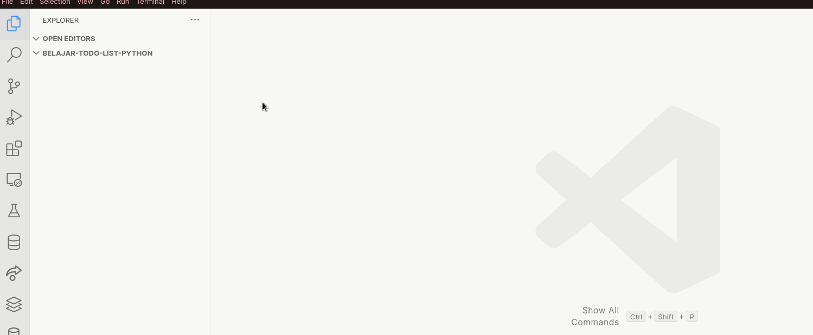

# 2. Exercise with Todo List App

Author: Erisa Mayla

## Overview

Setelah kamu belajar basic programming, kamu perlu latihan agar dapat berlatih pada studi kasus.

Aplikasi Todo List adalah aplikasi Python dengan berbasis Command Line Interface (CLI) yang memungkinkan pengguna
mengelola tugas secara efektif. Pengguna dapat menambahkan, memperbarui, menghapus, dan melihat tugas menggunakan perintah berbasis teks sederhana.

Penggunaan CLI memang terkesan membosankan, tapi aplikasi ini sangat cocok untuk latihan studi kasus.

## Code Time

Pertama, buatlah sebuah folder dengan nama `belajar-todo-list-python` pada komputer kamu.

Kemudian buka folder tersebut pada Visual Studio Code dan kurang lebih tampilannya akan menjadi seperti ini:


## Membuat Fungsi Dasar

Pertama, buatlah sebuah file bernama `main.py`, kalau kamu masih bingung, perhatikan GIF di bawah ini.



Selanjutnya masukkan kode berikut pada file `main.py`.

```python
def task():
    tasks = [] # Membuat variabel array kosong
    print("WELCOME TO THE TASK MANAGEMENT APP")

    total_task = int(input("Enter how many task you want to add = ")) # Membuat input dimana task yang dimasukkan akan diubah menjadi integer karena defaultnya adalah string

    for i in range(1, total_task + 1): # Lakukan perulangan sebanyak n (jumlah total task)
        task_name = input(f"Enter task {i} = ") # Membuat input untuk menuliskan task yang ingin ditulis
        tasks.append(task_name) # Memasukkan task ke dalam array

    print(f"Today's task are\n{tasks}") # Hasil task yang muncul


task()
```

Sekarang coba jalankan kodenya dengan menuliskan `python main.py` pada terminal, perhatikan GIF di bawah ini.


Kurang lebih setelah dijalankan kamu akan melihat output seperti ini:

```bash
hudya@perogeremmer-pc:~/code/komandro/belajar-todo-list-python$ python main.py
WELCOME TO THE TASK MANAGEMENT APP
Enter how many task you want to add = 1
Enter task 1 = Memasak
Today's task are
['Memasak']
```

## Penjelasan Rinci

### Mendefinisikan Fungsi

```python
def task():
```

Baris ini mendefinisikan fungsi yang disebut '`task`'. Fungsi ini adalah titik masuk utama program.

### Inisiasi

```python
tasks = []
print("WELCOME TO THE TASK MANAGEMENT APP")
```

- Task (list): Daftar kosong yang akan menampung tugas yang ditambahkan oleh pengguna.
- Pesan Selamat Datang: Menampilkan sapaan kepada pengguna saat aplikasi dimulai.

### Menambahkan Tugas Awal

```python
total_task = int(input("Enter how many task you want to add = "))

    for i in range(1, total_task + 1):
        task_name = input(f"Enter task {i} = ")
        tasks.append(task_name)

    print(f"Today's task are\n{tasks}")
```

- Masukkan Total Tugas: Pengguna diminta untuk menentukan berapa banyak tugas yang ingin mereka tambahkan mulanya.
- Loop Input Tugas: Untuk setiap tugas, aplikasi meminta nama tugas dan menambahkannya ke daftar tugas.
- Menampilkan Tugas Awal: Setelah semua tugas awal dimasukkan, tugas tersebut ditampilkan kepada pengguna.

> [!NOTE]
> Di atas adalah contoh program sederhana dari Todo List, sekarang kita akan membuat yang lebih proper lagi!

## Another Example

Sekarang buat file baru bernama `todo.py`, lalu masukkan kode di bawah ini.

```python
def task():
    tasks = []
    
    while True:
        print("WELCOME TO THE TASK MANAGEMENT APP")
        print("1-Add")
        print("2-Update")
        print("3-Delete")
        print("4-View")
        print("5-Exit")
        operation = int(input("Please choose the menu: "))
        
        if operation == 1:
            add = input("Please write the task: ")
            tasks.append(add)
            print(f"\nTask {add} has been succesfully added\n")
        elif operation == 5:
            break
            
task()
```

Sekarang coba jalankan dengan menuliskan python todo.py pada terminal lalu lihat hasilnya.

```bash
hudya@perogeremmer-pc:~/code/komandro/belajar-todo-list-python$ python todo.py
WELCOME TO THE TASK MANAGEMENT APP
1-Add
2-Update
3-Delete
4-View
5-Exit
Please choose the menu: 1
Please write the task: Memasak

Task Memasak has been succesfully added

WELCOME TO THE TASK MANAGEMENT APP
1-Add
2-Update
3-Delete
4-View
5-Exit
Please choose the menu: 5
```
