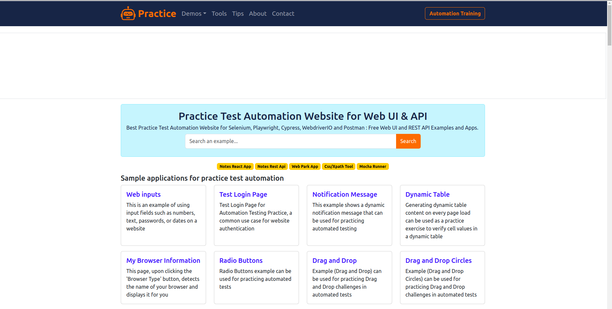

## Projek simple Web Automation Testing

---

Author: Fajar Triady Putra (@fajartriadyp)


# Overview

Setelah kalian mempelajari Kenalin tentang automation web test baik itu mengenai selector inspect element hingga playwright sekarang mari kita coba untuk membuat project automation website sederhana dari sebuah website https://practice.expandtesting.com/. 
[](https://practice.expandtesting.com/)
Seperti yang bisa kalian lihat di didalam website tersebut banyak sekali metode yang dapat kita gunakan untuk latihan automation website. seperti web inputs, login page, notification dll. dan disini mari kita belajar dari yang paling mudah yaitu web input. 

# Instalasi
 
Langkah pertama yang kita lakukan adalah melakukan installasi playwright
```sh
pip install playwright
```
Kemudian, jalankan perintah berikut untuk menginstal browser yang didukung oleh Playwright:

```sh
playwright install
```
dan karena bahasa pemograman yang kita pakai adalah python install maka kita wajib menginstall pytest
```sh   
pip install pytest
```

setelah selesai ketiganya sekarang kita bisa masuk ke langkah selanjutnya yaitu ke structur project

# Folder Structure

Didalam automation testing kita akan mengenal istilah POM atau **Page Object Model** dimana kita memisahkan logika interaksi dengan elemen-elemen di halaman web dari logika uji atau (test cases). 

### Contoh Folder Stucture tanpa POM
```
/automation_project
│
├── /tests                  # Semua test case diletakkan di sini
│   ├── test_login.py       # Test file untuk pencarian
│   └── test_home.py         # Test file untuk beranda
│
├── playwright-config.py
├── requirements.txt        # File dependencies
└── README.md               # Dokumentasi proyek
```

### Contoh Folder Stucture dengan POM
```
/automation_project
│
├── /pages                  # Folder untuk Page Object Models (POM)
│   ├── home_page.py         # Page Object untuk halaman beranda
│   └── search_page.py       # Page Object untuk halaman pencarian
│
├── /tests                  # Folder untuk test case
│   ├── test_search.py       # File test untuk pencarian
│   └── test_home.py         # File test untuk beranda
│
├── /datas                  # Folder untuk data test yang dipakai
│   └── home_data.py
|   └── search_data.py
│
├── playwright-config.py
├── requirements.txt        # File dependencies
└── README.md               # Dokumentasi proyek
```

Terlihat jelas bukan perbedaannya dimana jika kita memakai POM maka dapat melakukan colaborasi lebih lanjut antar QA dan juga dapat membuat code kita lebih clean dan dapat di maintance dengan baik. dan pada project kali ini kita akan langsung mengimplemetasikan POM kedalam code kita

# Page Object

Yaps, tahap pertama atau tahapan paling penting dalam melakukan web automation adalah page object atau pencarian selector. 

`Tapi pak kenapa memakai selector??` 

Selector ini penting sekali dalam web automation testing untuk mengidentifikasi dan berinteraksi dengan elemen-elemen di halaman web. Selector memungkinkan kamu memilih elemen tertentu, seperti tombol, kolom input, atau link, sehingga kamu dapat melakukan tindakan seperti mengklik, mengisi formulir, atau memverifikasi atribut elemen.

sekarang paham kan kenapa kita harus mencari selector. sekarang mari kita langsung lihat kedalam website tersebut.

1. Langkah pertama buka console kalian.
   
   Ada 2 cara untuk membuka console atau melakukan inspect element. carannya adalah dengan click kanan lalu pilih console atau langsung saja tekan f12 di keyboard kalian

   <br>

2. Pilih bagian mana yang kalian mau ambil
   
   []()

   Disini kita bisa lihat jika di bagian yang kita pilih yaitu input number memiliki attribute yang seperti ini
   ```
   <input class="input-box" id="input-number" name="input-number" type="number" value="">
   ```
   kita bisa memilih idnya untuk di masukan ke dalam code kita untuk lebih jelasnya mengenai selector kalian bisa cek di modul sebelumnya atau bisa juga mengunjungi link ini [Selector Hierarchy]( https://medium.com/@fajartriady/element-selector-hierarchy-on-web-automation-testing-57ad47cfbf00 'Selector Hierarchy')

    <br>
3. Masukan kedalam `pages/webInput_page.py`
   
   
   ```
    from playwright.sync_api import Page
    class InputPage:
        def __init__(self, page: Page):
            self.page = page
            self.input_number = page.locator("#input-number")
   ```
<br>

1. Masukan interaksi apa yang akan kita pakai untuk selector tersebut
   
   ```
     def fill_number(self, number: str):
        self.input_number.fill(number)
   ```

2. Masukan expetasi ketika sesudah melakukan input
   ```
    def get_output_number(self):
        return self.output_number.inner_text()
   ```

Setelah selesai dengan itu semua maka akan seperti ini untuk `pages/webInput_page.py`

```
from playwright.sync_api import Page

class InputPage:
    def __init__(self, page: Page):
        self.page = page
        self.input_number = page.locator("#input-number")
        self.input_text = page.locator("#input-text")
        self.input_password = page.locator("#input-password")
        self.input_date = page.locator("#input-date")
        self.dismiss_button = page.locator("#dismiss-button")
        self.output_number = page.locator("#output-number")
        self.output_text = page.locator("#output-text")
        self.output_password = page.locator("#output-password")
        self.output_date = page.locator("#output-date")
        self.display = page.locator("#btn-display-inputs")

    def dismiss_ads_if_visible(self):
        if self.dismiss_button.is_visible():
            self.dismiss_button.click()

    def click_display(self):
        self.display.click()
        
    def fill_number(self, number: str):
        self.input_number.fill(number)

    def fill_text(self, text: str):
        self.input_text.fill(text)

    def fill_password(self, password: str):
        self.input_password.fill(password)

    def fill_date(self, date: str):
        self.input_date.fill(date)

    def get_output_number(self):
        return self.output_number.inner_text()

    def get_output_text(self):
        return self.output_text.inner_text()

    def get_output_password(self):
        return self.output_password.inner_text()

    def get_output_date(self):
        return self.output_date.inner_text()

```


# Data 

Karena kita menggunakan POM maka kita memisahkan data dari test case sehingga folder data bisa lebih maintainable. data dibuat di folder `data/input_data.py`

```
test_data = {
    "number": "12345",
    "text": "Sample Text",
    "password": "password123",
    "date": "2024-08-19"
}
```


# Test Case

Tahap terakhir dalam automation website adalah test script. sekarang mari kita ambil contoh test script untuk test case positive dalam halaman input form yang sudah kita kumpulkan pages dan datanya. Sekarang mari kita buat file test didalam folder test seperti ini `test/input_test.py`

1. Import library dan juga file file yang dipakai
   ```
    import pytest
    from playwright.sync_api import sync_playwright
    from pages.input_page import InputPage
    from data.input_data import test_data
    @pytest.fixture(scope="function")
   ```
    <br>

        import pytest
    Ini mengimpor modul pytest, yang merupakan framework pengujian di Python. pytest menyediakan cara yang mudah dan kuat untuk menulis serta menjalankan unit test, test fungsi, atau test skenario.
    <br>

        from playwright.sync_api import sync_playwright
    Ini mengimpor sync_playwright dari modul Playwright. Playwright adalah alat untuk melakukan pengujian otomatisasi browser. Metode sync_playwright digunakan untuk berinteraksi dengan browser dalam mode sinkron (sync), yang berarti kode akan berjalan secara berurutan.
    <br>

        from pages.input_page import InputPage
    Ini mengimpor InputPage dari file atau modul input_page.py di dalam folder pages. Berdasarkan namanya, InputPage kemungkinan adalah sebuah kelas atau objek yang merepresentasikan Page Object Model (POM) dari halaman input di aplikasi web, yang digunakan untuk mengotomatisasi interaksi dengan halaman tersebut.
    <br>

        from data.input_data import test_data
    Ini mengimpor test_data dari file atau modul input_data.py di dalam folder data. test_data kemungkinan adalah sekumpulan data yang digunakan dalam pengujian, seperti data input untuk skenario pengujian otomatisasi.
    <br>

        @pytest.fixture(scope="function")
    Ini adalah decorator untuk mendefinisikan fixture di pytest. Fixture menyediakan mekanisme untuk setup dan teardown (persiapan dan pembersihan) yang dilakukan sebelum atau setelah.

<br>

2. Setup website yang dipakai 
   <br>
   ```
   def setup():
    with sync_playwright() as p:
        browser = p.chromium.launch(headless=False)
        page = browser.new_page()
        page.goto("https://practice.expandtesting.com/inputs")
        input_page = InputPage(page)
        input_page.dismiss_ads_if_visible()
        yield input_page
        browser.close()
   ```

    ```def setup()```

     Ini mendefinisikan sebuah fungsi bernama setup(). Fungsi ini mungkin digunakan sebagai bagian dari fixture di pytest untuk menyiapkan lingkungan pengujian.
    
    ```with sync_playwright() as p```
     Menggunakan konteks with untuk memulai sesi Playwright dalam mode synchronous.

    ```sync_playwright()```
     menginisialisasi Playwright, dan objek p memungkinkan akses ke berbagai browser yang didukung (seperti Chromium, Firefox, WebKit).
     
    ```browser = p.chromium.launch(headless=False)``` 
    Meluncurkan browser Chromium. code ini bisa diganti sesuai dengan website apa yang kalian inginkan

    ```headless=False``` 
    berarti browser akan dibuka dalam mode grafis, sehingga kamu dapat melihat jendela browser selama pengujian. Jika diatur ke True, browser akan berjalan di background tanpa antarmuka grafis.

    ```page = browser.new_page()``` 
    Membuka sebuah halaman baru di browser yang baru saja diluncurkan. Halaman ini akan digunakan untuk melakukan interaksi dan pengujian.

    ```page.goto("https://practice.expandtesting.com/inputs")``` 
    Mengarahkan halaman yang baru dibuka ke URL yang diberikan, yaitu "https://practice.expandtesting.com/inputs". 

    ```input_page = InputPage(page)``` 
     Menerima objek page dari Playwright dan menyediakan metode untuk berinteraksi dengan elemen di halaman tersebut.

    ```input_page.dismiss_ads_if_visible()``` 
    Memanggil metode dismiss_ads_if_visible() dari objek input_page untuk menutup atau mengabaikan iklan jika mereka terlihat di halaman. Ini adalah langkah untuk memastikan iklan tidak mengganggu pengujian.

    ```yield input_page``` 
    yield digunakan untuk mengembalikan objek input_page ke pengujian. Dengan menggunakan yield, fungsi ini menyimpan status lingkungan pengujian (seperti halaman web yang dimuat) untuk digunakan dalam test case. Setelah yield, eksekusi fungsi akan dilanjutkan.

    ```browser.close()```
     Menutup browser setelah pengujian selesai. Ini adalah langkah pembersihan yang penting untuk memastikan bahwa semua sumber daya (seperti proses browser) dibebaskan setelah pengujian.

<br>

1. Buat test case pertama untuk valid input number
   <br>
   ```
   def test_tc_001_input_number(setup):
    input_page = setup
    input_page.fill_number(test_data["number"])
    input_page.click_display()
    assert input_page.get_output_number() == test_data["number"], "Output number verification failed."
   ```

    <br>

    ```def test_tc_001_input_number(setup)``` 
    Ini mendefinisikan sebuah fungsi uji bernama test_tc_001_input_number. Fungsi ini dirancang untuk menguji fitur tertentu dari halaman web. Fungsi ini menggunakan fixture setup yang sebelumnya didefinisikan.

    ```input_page = setup``` 
    setup di sini adalah fixture yang dikembalikan oleh fungsi setup() dan menyediakan objek input_page. Dengan pernyataan ini, input_page sekarang mengacu pada instance dari InputPage yang telah diinisialisasi dan siap digunakan untuk pengujian.

    ```input_page.fill_number(test_data["number"]) ```
    Memanggil metode fill_number pada objek input_page dan mengisinya dengan nilai yang diambil dari test_data["number"].

    ```test_data["number"] ```
    Mengacu pada data uji yang sebelumnya didefinisikan, yang berisi angka atau nilai lain yang akan dimasukkan ke dalam elemen input di halaman web.
    Metode fill_number diharapkan berfungsi untuk mengisi nilai input di halaman web dengan angka yang diberikan.

    ```input_page.click_display()``` 
    Memanggil metode click_display pada objek input_page.

   ``` assert input_page.get_output_number() == test_data["number"], "Output number verification failed."``` 
   Memeriksa apakah nilai yang diperoleh dari metode get_output_number() sama dengan nilai yang diharapkan dari test_data["number"].

   ``` input_page.get_output_number()```

   Mengembalikan teks yang ditampilkan sebagai hasil dari input yang dimasukkan.
    
    ```assert``` 
    
    Assert adalah verifikasi apakah kondisi yang diberikan benar. Jika tidak, pesan kesalahan "Output number verification failed." akan ditampilkan.
    Jika hasil dari get_output_number() tidak cocok dengan test_data["number"], maka tes akan gagal dan pesan kesalahan akan muncul.


# Menjalankan Test

Untuk menjalakan test scriptnya kalian bisa menggunakan `pytest test/` untuk menjalakan semua test suites pada folder tersebut atau jika ingin hanya 1 test suites maka bisa juga seperti ini `pytest test/input_test.py`.

Ini adalah contoh ketika code sudah di run.


jika kamu tidak merasa puas dengan reportingnya  bisa kamu tambahkan html report dimana hasilnya akan seperti ini .

Dan jika kalian penasaran dan ingin reporting yang lebih advance bisa kalian coba memakai `allure reporter`

# Finish✨

Yuhuu, ini adalah bagian terakhir dari percobaan simple project web automation pada website https://practice.expandtesting.com/. selalu diingat bahwa ***pratice make perfect*** jadi mari kita jadikan komandro sebagai sarana berlatih bersama. 

segitu saja jika kalian ada pertanyaan mengenai tutorial ini kalian bisa tanya langsung di forum QA Komandro atau bisa reach out langsung author di [ Linkedin](https://www.linkedin.com/in/fajartriadyp). 

Thank you and happy learning 😁😁