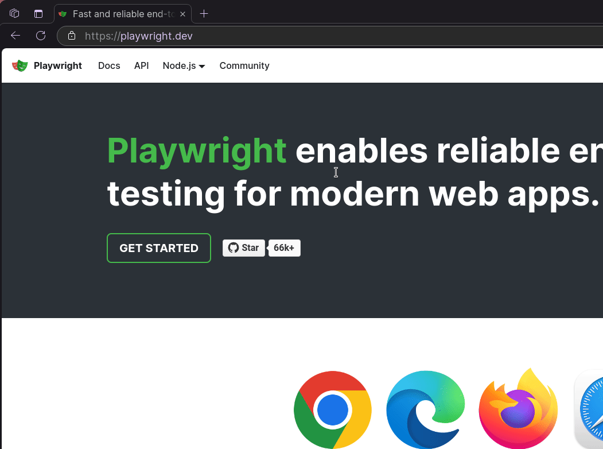

# 8 - Introduction to Automation Testing

Author: Erisa Mayla
Editor: Hudya

## Overview

Automation merupakan proses menggunakan teknologi untuk mengotomatisasi tugas yang biasanya dilakukan oleh manusia. Jadi automation web test adalah proses memeriksa adanya bug pada website secara otomatis menggunakan tools untuk membantu proses testing.

Untuk menguji suatu fitur atau fungsi dalam web diperlukan panduan untuk tahapan pengujian, apa saja komponen yang akan diuji, bagaimana cara mengujinya, data, dan hasil yang diharapkan. Maka dari itu digunakanlah test case, yakni serangkaian kondisi yang digunakan untuk memastikan apakah sistem sudah berfungsi dengan benar atau memenuhi persyaratan yang ditentukan.

Keunggulan dari automation testing adalah dapat mengurangi pekerjaan yang berulang, menghemat waktu dan tenaga, serta memberikan hasil yang lebih cepat dan akurat. Automation testing juga dapat meningkatkan efisiensi proses pengembangan website maupun web app.

## Jenis Test

Ada berbagai jenis test case, masing-masing memiliki tujuan yang berbeda. Berikut penjelasannya:

1. **Functional testing:** Pengujian ini memastikan semua fitur dan fungsi di website berjalan sesuai yang diharapkan. Contohnya, memeriksa apakah form pendaftaran atau login berfungsi dengan baik.
2. **Usability testing:** Pengujian ini mengukur kenyamanan pengguna dan kemudahan interaksi, misalnya seberapa mudah menemukan tombol atau alur web yang logis.
3. **Interface testing:** Pengujian ini lebih teknis, fokus pada apakah elemen UI berfungsi dengan benar, seperti apakah tombol merespons klik, atau apakah data tampil dengan benar di antarmuka.
4. **Performance testing:** Pengujian ini mengukur seberapa cepat website merespon ketika diakses banyak pengguna atau ketika ada beban besar.
5. **Compability testing:** Pengujian ini memeriksa apakah website dapat berjalan dengan baik di berbagai perangkat (seperti mobile dan dekstop), browser (seperti Safari, Chrome), dan sistem operasi (seperti macOS, Windows, Linux.
6. **Security testing:** Pengujian keamanan fokus pada melindungi website dari ancaman keamanan, mencakup deteksi terhadap kerentanan sistem.

## Contoh

**Fitur:** Login
**Description:** Memastikan bahwa fitur login di website bekerja dengan baik di berbagai skenario, seperti halaman login tampil dengan benar di website, login berhasil.

**Kasus Uji 1**

- **Test Case Title:** Login - Open Website
- **Test Scenario:** Sebagai user, sebelum login harus mengakses website. User akan melihat form login dan tombol login
- **Test Steps:**
  1. Membuka website
  2. Validasi form login yang ada dengan username dan password
- **Expected result:** Dapat melihat halaman login dan form login dengan username, password dan juga tombol login
- **Actual Result:** Same as expected
- **Status:** Pass

**Kasus Uji 2**

- **Test Case Title:** Login - Valid
- **Test Scenario:** Sebagai user, harus bisa login menggunakan data yang valid
- Test Data:
  1. Valid Username
  2. Valid password
- **Test Steps:**
  1. Membuka website
  2. Ketik username yang valid pada formulir kolom username
  3. Ketik password yang valid pada formulir kolom password
  4. Klik tombol "Login"
- **Expected result:** Dapat login ke halaman berikutnya dan memunculkan UI dari halaman tersebut
- **Actual Result:** Same as expected
- **Status:** Pass


Lalu bagaimana kita mencobanya? Untuk menunjang proses automation testing diperlukan sebuah alat yaitu **Playwright**.

## Apa itu Playwright?

Playwright merupakan tools yang dirancang untuk pengujian end-to-end (memeriksa alur aplikasi web dari awal sampai akhir) secara otomatis. 

Tools ini bersifat:
- Cross-platform: Playwright bisa digunakan di berbagai sistem operasi seperti Windows, Linux, dan macOS.
- Cross-browser: Playwright dapat melakukan pengujian web dengan menggunakan browser Chromium, Webkit, Firefox
- Cross-language: Playwright bisa dipakai dengan berbagai bahasa pemrograman seperti TypeScript, JavaScript, Python, .NET, dan Java.
Tools ini dirancang untuk pengujian yang kompleks dan berjalan sangat cepat

## Instalasi

Step pertama, buatlah folder di dalam komputermu. Pilihlah folder yang kamu ingat dan mudah dijangkau. Selanjutnya buka folder ini dengan VS Code.

Step kedua, buka terminal dalam foldermu, caranya  `pilih terminal > New Terminal`. Kemudian buat virtualenv dengan cara menuliskannya pada terminal di dalam foldermu. 

```
python -m venv venv
```

Kemudian aktifkan venv-nya dengan cara:

```
venv\Scripts\activate
```


Contoh:


Hasilnya akan menjadi seperti ini:
```
(venv) PS C:\Belajar Playwright>
```

### Error Policy

```
PS C:\Belajar Playwright> venv\Scripts\activate 
venv\Scripts\activate : File C:\Belajar 
Playwright\venv\Scripts\Activate.ps1 cannot be loaded because running 
scripts is disabled on this system. For more information, see about_Execution_Policies at 
https:/go.microsoft.com/fwlink/?LinkID=135170. 
At line:1 char:1 
+ venv\Scripts\activate 
+ ~~~~~~~~~~~~~~~~~~~~~ 
	+ CategoryInfo          : SecurityError: (:) [], PSSecurityExcept ion 
	+ FullyQualifiedErrorId : UnauthorizedAccess
```

Apabila kamu menemukan error di atas, hal tersebut terjadi karena Execution Policy di PowerShell mencegah menjalankan script, termasuk mengaktifkan virtual environment. 

Ini adalah fitur keamanan di Windows untuk mencegah menjalankan script yang tidak diizinkan. Untuk mengatasi masalah ini, kamu perlu mengubah kebijakan eksekusi (execution policy) di PowerShell.  

Untuk meengatasinya, simak penjelasannya di bawah ini ya.

**Step 1: Memeriksa kebijakan Execution Policy**
Ketik "Powershell" di search bar, kemudian pilih "Run as Administrator". Kemudian dapatkan Kebijakan eksekusi dengan perintah:
```
Get-ExecutionPolicy
```

**Step 2: Menetapkan kebijakan Execution Policy**
Tetapkan Kebijakan eksekusi dengan perintah berikut: 
```
Set-ExecutionPolicy` `RemoteSigned 
```

**Step 3: Konfirmasi perubahan**
Kamu akan melihat peringatan risiko keamanan dan diminta untuk mengonfirmasi perubahan kebijakan eksekusi. Ketik `Y` lalu tekan Enter.

**Step 4: Aktifkan kembali virtual environment**
Setelah kebijakan diubah, coba lagi jalankan perintah:
```
venv\Scripts\activate
```

Hasilnya akan menjadi seperti ini:
```
(venv) PS C:\Belajar Playwright>
```

## Instalasi Framework Playwright

Kita akan instalasi framework `Playwright`, pastikan kamu sudah mengaktifkan venv.

```
pip install playwright
```

Kemudian, jalankan perintah berikut untuk menginstal browser yang didukung oleh framework `Playwright`:

```
playwright install
```

Kita menggunakan bahasa pemrograman Python untuk pembelajaran QA, maka kita harus menginstall library pystest untuk uji coba program.

```
pip install pytest
```

Untuk proses instalasi udah selesai nih, sekarang kita coba test yaa

- Step 1: Buat file bernama `test_sample.py`
- Step 2: Coba masukkan script ini kedalam file `test_sample.py`

```python
import re
from playwright.sync_api import Page, expect

def test_has_title(page: Page):
    page.goto("https://playwright.dev/")

    # Expect a title "to contain" a substring.
    expect(page).to_have_title(re.compile("Playwright"))

def test_get_started_link(page: Page):
    page.goto("https://playwright.dev/")
    
    # Click the get started link.
    page.get_by_role("link", name="Get started").click()

    # Expects page to have a heading with the name of Installation.
    expect(page.get_by_role("heading", name="Installation")).to_be_visible()
```

Untuk melihat apakah sudah berjalan atau belum, coba tuliskan `pytest` di terminal.

Outputnya adalah sebagai berikut:

```
(venv) PS C:\Belajar Playwright> pytest
======================== test session starts =========================
platform win32 -- Python 3.12.4, pytest-8.3.3, pluggy-1.5.0
rootdir: C:\Belajar Playwright
plugins: base-url-2.1.0, playwright-0.5.2
collected 2 items

test_sample.py ..                                               [100%]

========================= 2 passed in 4.42s ==========================
```

Jalankan perintah dengan `pytest --headed` apabila kamu ingin melihat automation membuka sebuah browser untuk mencoba.

## Penjelasan


Perhatikan fungsi `test_has_title`, hal yang dilakukan pada fungsi tersebut adalah membuka URL https://playwright.dev, kemduain program diberi ekspektasi bahwa halaman tersebut memiliki judul yang ada tulisan **Playwright** di dalamnya.

Coba cek GIF di bawah ini, kamu dapat melihat bahwa judul websitenya memiliki teks **Playwright**. Sehingga ekspektasinya menjadi benar.



> [!NOTE]
> Sintaks `re.compile("Playwright")` menggunakan library regex pada python yang memeriksa apakah teks tersebut memiliki tulisan Playwright.

<br />

Kemudian periksa fungsi `test_get_started_link`, hal yang dilakukan pada fungsi tersebut adalah membuka URL https://playwright.dev, kemduain program diberi ekspektasi bahwa halaman tersebut memiliki judul yang ada tulisan **Playwright** di dalamnya.

Kemudian program mencari URL yang bertuliskan Get Started, dimana URL tersebut berada pada tag `anchor <a></a>` pada HTML. Setelahnya tombol tersebut diberi aksi klik sehingga akan pergi ke halaman selanjutnya.

Kemudian pada bagian ekspektasi, kamu dapat melihat bahwa program diberi ekspektasi bahwa halaman tersebut memiliki tag `heading <h1></h1> (h1 dan sejenisnya)` yang memiliki tulisan **Installation**. Perintah ekspektasinya adalah to be visible, artinya memastikan bahwa teksnya bisa dilihat dengan mata manusia.

Perhatikan GIF di bawah ini.


> [!NOTE]
> Untuk memastikan apakah tulisan installation memiliki tag heading silahkan klik kanan > inspect element.

Sekarang kamu sudah bisa melakukan testing dasar bukan? Tentu ini belum sulit karena kamu akan mencoba melakukan testing dengan website [saucedemo](https://www.saucedemo.com/v1/) secara automation.