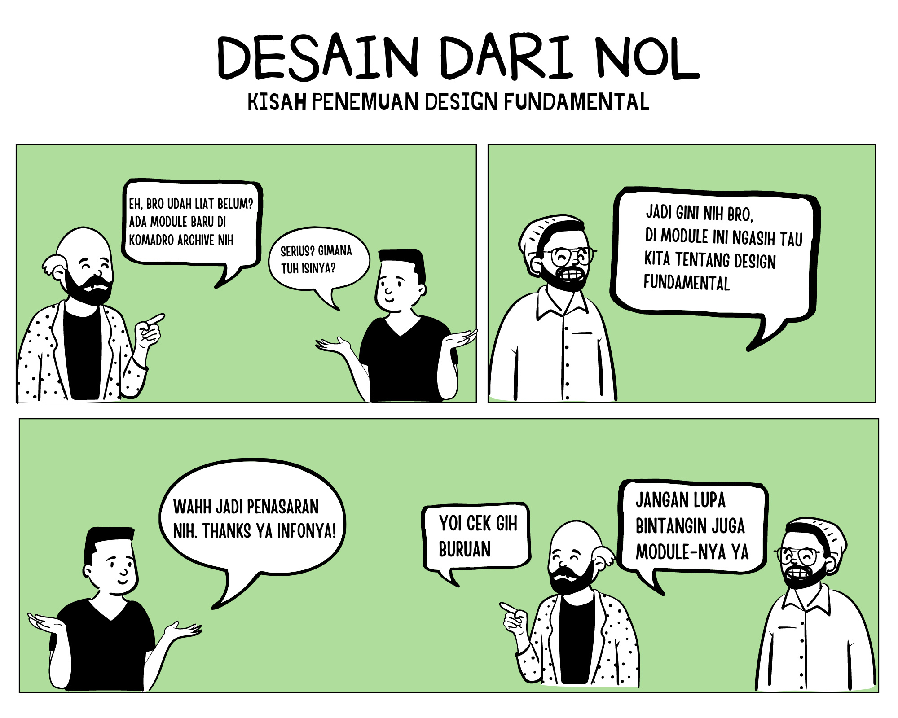

# Design fundamental

Nah kalian udah pada tau belum, apa itu Design Fundamental \*\*\*\*?

## Pengertian Design Fundamental

Jadi Fundamental desain (design fundamental) adalah pondasi keren dari setiap media visual, mulai dari seni rupa, desain web, hingga desain grafis. Meskipun sering dianggap remeh, menguasai fundamental desain itu suatu keharusan hukumnya buat setiap desainer UI/UX. Kenapa? Karena sejatinya, apapun yang kita bikin mau itu aplikasi, website, atau interface lainnya,semuanya adalah hasil dari penerapan fundamental desain ini. Elemen-elemen seru kayak _line (garis), shape (bentuk), colour (warna), texture (tekstur), space (ruang), dan typography (tipografi)_ semuanya berperan di sini. Menguasai elemen-elemen ini nggak cuma bikin kreativitas kamu tambah kaya, tapi juga memastikan karya kamu jadi efektif, estetis, dan punya daya tarik tinggi. Jadi, yuk, dalemin fundamental desain UI/UX ini dan bikin karya kamu makin keren! berikut adalah dasar-dasar yang harus kamu kuasai untuk mulai mendalami mengenai fundamental desain UI/UX ini. line, shape, color, texture, space, dan size. Shape, colour, space, lines, typography and texture

# **Elemen**

## Line(Garis)

**Line(Garis)** adalah elemen dasar yang terbentuk dari penyatuan titik-titik, memiliki peran penting dalam dunia desain. Ketika satu titik terhubung dengan titik lainnya, terbentuklah garis yang dapat berwujud lurus halus, putus-putus, tebal, atau lengkung. Garis-garis ini tidak hanya berfungsi sebagai outline, tetapi juga sebagai elemen yang membentuk, mengarahkan, dan menambahkan dimensi dalam sebuah karya. Mereka dapat membimbing mata, menciptakan kontras yang menarik perhatian, serta menguatkan konsep desain. Dalam berbagai bentuknya, garis dapat menjadi pembatas tegas, pengarah pandangan ke titik fokus, atau elemen yang menjaga kesederhanaan namun tetap memberikan kesan elegan pada desain.

## Shape(Bentuk)

**Shape(Bentuk)** memiliki peran penting dalam membentuk titik fokus (point of interest) dan menonjolkan elemen tertentu dalam desain. Bentuk-bentuk ini dapat berupa bulat, persegi, segitiga,persegi panjang, atau bahkan bentuk abstrak. Shape terbentuk dari garis-garis yang terhubung dan membentuk pola yang kemudian menjadi elemen visual yang efektif dalam mengarahkan pandangan dan memperkuat konsep desain secara keseluruhan.

## Colour(Warna)

**Colour(Warna)** adalah salah satu elemen paling penting dalam desain yang patut diperhatikan, karena warna tidak hanya memberikan identitas visual tetapi juga menyampaikan tujuan dan membentuk emosi dalam sebuah karya. Melalui warna, sebuah desain dapat menunjukkan identitas, memperjelas bentuk visual, menciptakan kontras, dan memberikan penekanan (emphasis) pada elemen-elemen penting, sehingga pesan yang ingin disampaikan menjadi lebih kuat dan efektif.

Terdapat tiga spektrum warna yang penting untuk dipahami: warna primer, warna sekunder, dan warna tersier.

1. **Warna primer** adalah warna dasar yang menjadi sumber bagi semua warna lainnya. Warna-warna yang termasuk dalam kategori ini adalah merah, biru, dan kuning.
2. **Warna sekunder** terbentuk dari pencampuran dua warna primer. Misalnya, campuran antara merah dan kuning menghasilkan warna oranye. Kombinasi merah dan biru menghasilkan ungu, sementara kuning dan biru bersama-sama menciptakan hijau.
3. **Warna tersier** adalah hasil dari pencampuran antara warna primer dan warna sekunder.

## Texture(Tekstur)

**Texture(Tekstur)** adalah visualisasi permukaan suatu objek yang dapat dinilai baik melalui penglihatan maupun perabaan. Contohnya termasuk berbagai corak permukaan, seperti halus, kasar, lembut, licin, berpori, atau mengkilap. Penggunaan tekstur dalam desain dapat menambah dimensi dan memperkaya layout, menjadikan objek terlihat lebih hidup dan memberikan kesan yang lebih mendalam.

Tekstur juga memainkan peran penting dalam menyampaikan rasa atau emosi tertentu dalam desain. Tekstur dibedakan menjadi dua jenis:

1. **Tekstur visual**, yang hanya dapat dirasakan melalui penglihatan.
2. **Tekstur taktil**, yang dapat dirasakan melalui penglihatan dan perabaan.

Dengan mengaplikasikan tekstur pada desain, kamu dapat memberikan dimensi tambahan pada karya, seperti membuat permukaan terlihat lebih halus, kasar, atau lembut. Bayangkan bagaimana sensasi menyentuh permukaan desain tersebut—tekstur dapat menambah kedalaman dan vitalitas pada setiap karya desain kalian.

## Space(Ruang)

**Space(Ruang)** dalam desain merujuk pada area kosong yang dihasilkan dari jarak antar elemen desain, seperti objek, latar belakang, dan teks. Pengaturan ruang yang efektif sangat penting untuk menciptakan komposisi yang menarik, profesional, dan enak dipandang. Ruang dapat dibagi menjadi ruang positif (area yang ditempati oleh elemen) dan ruang negatif (area kosong di sekitar elemen). Perpaduan dan jarak antar elemen harus diatur dengan hati-hati untuk memastikan keseimbangan dan keterbacaan.

## Typograpy(Tipografi)

**Typograpy(Tipografi)** adalah teknik menyusun huruf dan teks dalam desain visual agar dapat terbaca dengan jelas dan menarik perhatian. Teknik ini melibatkan pemilihan font atau jenis huruf yang digunakan serta penerapan tiga prinsip utama: keterbacaan (readability), keterbacaan huruf (legibility), dan visibilitas (visibility).

Dalam desain, penempatan tipografi tidak hanya bertujuan untuk menempatkan teks, tetapi juga untuk menggunakannya secara efektif dalam komunikasi dan penyampaian pesan. Tipografi mencakup berbagai aspek seperti jenis, ukuran, susunan, warna, dan jarak antar huruf, yang semuanya berkontribusi pada cara teks disajikan dan diterima oleh audiens.

# Prinsip-Prinsip Desain

**\*composition(komposisi), alignment(penyelarasan), balance(keseimbangan), emphasis(penekanan)**, dan **repetition(pengulangan)**.\*

## Composition(Komposisi)

**Composition(Komposisi**) adalah susunan visual elemen pada area antarmuka yang telah ditentukan, yang berfungsi untuk membangun harmoni, keseimbangan, dan hierarki yang jelas dalam sebuah desain. Dalam konteks UI (User Interface) dan UX (User Experience), komposisi yang efektif sangat penting untuk memastikan bahwa pengguna dapat dengan mudah memahami, menavigasi, dan berinteraksi dengan produk.

Dalam **UI**, komposisi berfokus pada penataan elemen visual di layar, seperti teks, gambar, dan ikon, untuk menciptakan antarmuka yang menarik secara estetika dan fungsional. Komposisi yang baik memungkinkan pengguna untuk secara intuitif mengetahui di mana harus memperhatikan, sehingga memudahkan mereka dalam menjalankan tugas atau menemukan informasi.

Dalam **UX**, komposisi tidak hanya tentang visual, tetapi juga tentang bagaimana elemen-elemen tersebut bekerja sama untuk menciptakan alur interaksi yang alami dan lancar. Komposisi yang baik dalam UX membantu mengarahkan pengguna melalui pengalaman dengan sedikit hambatan, memastikan bahwa perjalanan pengguna dari satu elemen ke elemen lain berlangsung secara mulus dan memuaskan.

Terdapat dua format utama dalam penataan komposisi, yaitu **statis** dan **dinamis**:

1. **Statis**: Komposisi statis melibatkan elemen-elemen yang cenderung diam atau tidak bergerak. Dalam UI, ini sering digunakan untuk menarik perhatian pada elemen utama, seperti pada halaman utama mesin pencari. Dalam UX, komposisi statis dapat diterapkan pada situasi di mana fokus pada satu tugas atau informasi sangat penting, seperti halaman checkout yang sederhana.
2. **Dinamis**: Komposisi dinamis memungkinkan elemen visual untuk bergerak atau berubah, menciptakan interaksi yang lebih hidup. Dalam UI, ini bisa berupa animasi atau transisi yang memberikan kesan lebih interaktif. Dalam UX, komposisi dinamis sangat penting untuk skenario yang memerlukan respons cepat atau interaksi yang lebih mendalam, seperti pada aplikasi yang memerlukan keterlibatan pengguna secara aktif.

## **Alignment(Penyelarasan)**

**Alignment(Penyelarasan)** adalah prinsip desain yang menekankan pentingnya menempatkan elemen-elemen visual secara rapi dan teratur. Dalam konteks UI (User Interface) dan UX (User Experience), alignment yang baik memainkan peran penting dalam menciptakan tata letak yang intuitif, konsisten, dan mudah dipahami.

Dalam **UI**, alignment berfokus pada penempatan elemen-elemen visual yang berkaitan secara berdekatan dan sejajar. Ini membantu menciptakan antarmuka yang rapi dan profesional, memungkinkan pengguna untuk dengan cepat memindai dan menemukan informasi yang mereka butuhkan. Tampilan yang teratur juga memberikan kesan estetis yang kuat, membuat antarmuka lebih menarik dan mudah digunakan.

Dalam **UX**, alignment mempengaruhi lebih dari sekadar penataan visual; ia juga menyangkut bagaimana informasi dan tugas disusun secara logis dalam pengalaman pengguna. Alignment yang baik memandu pengguna melalui alur interaksi yang efisien, mengurangi kebingungan, dan menurunkan beban kognitif. Dengan menempatkan elemen-elemen yang berkaitan dengan tepat, pengguna dapat dengan mudah memahami struktur dan navigasi produk, yang pada akhirnya meningkatkan kepuasan dan efektivitas pengalaman mereka.

## **Balance (Keseimbangan)**

**Balance (Keseimbangan)** adalah prinsip desain yang mengatur distribusi bobot visual di seluruh layar untuk menciptakan tampilan yang stabil dan harmonis. Dalam desain, keseimbangan memastikan bahwa elemen-elemen visual terdistribusi dengan baik sehingga antarmuka tidak terasa berlebihan atau berantakan.

Terdapat dua jenis keseimbangan utama:

1. **Simetris**: Keseimbangan simetris terjadi ketika elemen-elemen visual terdistribusi secara merata di kedua sisi, menciptakan kesan yang harmonis dan teratur. Pendekatan ini sering digunakan untuk desain yang ingin menampilkan kesan formal dan seimbang secara visual.
2. **Asimetris**: Keseimbangan asimetris, di sisi lain, melibatkan distribusi elemen yang tidak merata. Meskipun elemen-elemen tidak sama ukurannya, mereka tetap bisa seimbang melalui penempatan strategis, warna, atau kontras. Keseimbangan asimetris memberikan kesan yang lebih dinamis dan menarik dalam sebuah desain.

Selain simetris dan asimetris, terdapat juga konsep keseimbangan radial, di mana elemen-elemen tersebar dari pusat dengan pola melingkar, menciptakan keseimbangan di sekitar titik fokus tertentu.Dengan menerapkan prinsip keseimbangan, baik simetris, asimetris, maupun radial, desain Anda tidak hanya akan lebih estetis tetapi juga lebih komunikatif.

## **Emphasis(Penekanan)**

**Emphasis(Penekanan)** adalah prinsip desain yang berfokus pada penentuan bagian mana yang menjadi prioritas dalam sebuah desain. Ini adalah cara untuk menyoroti elemen yang paling penting atau informasi utama yang ingin disampaikan kepada audiens. Penekanan dapat dicapai melalui berbagai teknik, dan tiga cara utama untuk mencapainya adalah melalui **hierarki**, **skala dan proporsi**, serta **kontras**.

1. **Hierarki**: Hierarki mengatur penempatan elemen berdasarkan urutan atau susunan pentingnya. Ini melibatkan penggunaan ukuran, warna, dan gaya yang berbeda untuk menonjolkan elemen utama di atas elemen yang kurang penting. Hierarki yang baik membantu memandu pengguna melalui antarmuka, memastikan bahwa mereka memahami prioritas informasi dengan jelas.
2. **Skala dan Proporsi**: Teknik ini menonjolkan informasi utama dengan menggunakan ukuran font yang lebih besar atau membuat elemen lebih dominan dalam ruang desain. Dengan menyesuaikan skala dan proporsi, desainer dapat menarik perhatian pada bagian penting dari desain dan memastikan bahwa informasi utama mendapatkan fokus yang layak.
3. **Kontras**: Kontras mengatur elemen-elemen desain agar tetap menonjol dan mudah dibaca. Ini melibatkan penempatan elemen yang berbeda secara visual dalam satu frame desain, sehingga menciptakan perbedaan yang jelas antara elemen yang saling bertentangan. Kontras yang baik meningkatkan readability, legibility, dan visibility pada antarmuka, membantu pengguna untuk melihat dan memahami informasi dengan lebih mudah.

## **Repetition(Pengulangan)**

**Repetition(Pengulangan)** adalah prinsip desain yang melibatkan penggunaan elemen visual dan pola interaksi yang konsisten di seluruh antarmuka. Dalam konteks UI (User Interface) dan UX (User Experience), repetition berperan penting dalam menciptakan pengalaman pengguna yang kohesif dan intuitif.

Dalam **UI**, repetition fokus pada penggunaan elemen visual yang sama dan berulang, seperti warna, ikon, tombol, dan gaya tipografi. Dengan mengulang elemen-elemen ini, desainer dapat membangun pola yang konsisten, memperkuat identitas visual, dan membantu pengguna mengenali fungsi atau informasi tertentu. Pengulangan ini membuat antarmuka terasa lebih teratur dan mudah dipahami, karena pengguna dapat dengan cepat mengidentifikasi elemen yang sudah dikenal dan memahami bagaimana cara menggunakannya.

Dalam **UX**, repetition melibatkan pengulangan pola interaksi dan struktur navigasi yang familiar. Hal ini mencakup konsistensi dalam cara pengguna berinteraksi dengan produk, seperti penggunaan tombol dan menu yang seragam, serta alur navigasi yang mudah diikuti. Dengan mengulang pola-pola yang sudah dikenal, pengguna dapat lebih mudah menavigasi dan berinteraksi dengan produk, sehingga pengalaman mereka menjadi lebih lancar dan memuaskan.

---

Author : [Salvia](https://github.com/https://github.com/salviaaaa)
