# Introduction to the Basics of UI/UX 

## Apa itu UI/UX?

  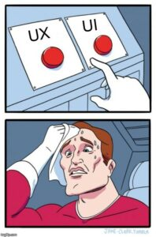

<b>Desain Antarmuka Pengguna</b> atau disebut juga dengan <i>User Interface</i> adalah suatu ilmu yang merancang antarmuka suatu aplikasi atau website pada perangkat, baik itu mobile maupun desktop. Dengan adanya <b>antarmuka pengguna</b> atau <i>User Interface</i> diharapkan dapat memaksimalkan tujuan yang ingin dicapai.

Selain itu, ada juga yang namanya <b>Pengalaman Pengguna</b> atau disebut juga dengan <i>User Experience</i> yang digunakan untuk menggambarkan suatu interaksi pada aplikasi atau website yang di design. Hal ini bertujuan agar pegguna mendapatkan apa yang mereka butuhkan dari pengalaman tersebut.

<b>Antarmuka (UI) dan Pengalaman (UX)</b> harus memungkinkan pengguna untuk  dapat melakukan tugas apa pun yang diperlukan agar mereka dapat menggunakan fungsi atau fitur yang ada.

## Kenapa UI/UX itu Penting?

  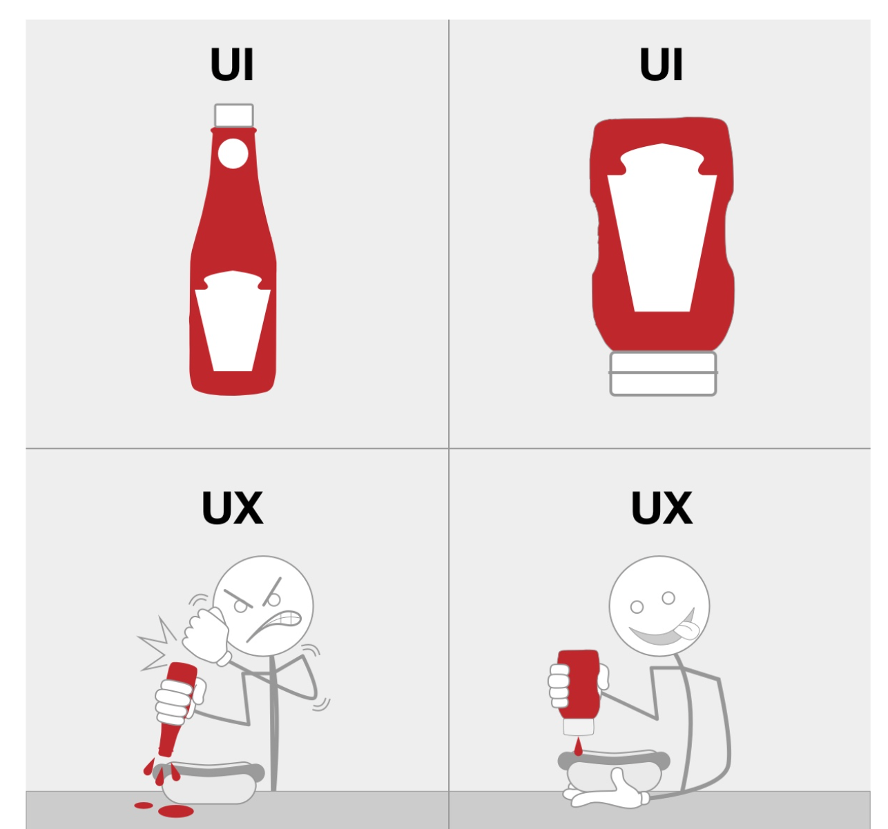

<b>Antarmuka (UI) dan Pengalaman (UX)</b> adalah titik interaksi antara pengguna dengan aplikasi atau website yang mereka gunakan. Jadi, sangat penting untuk diperhatikan karena dapat memengaruhi kepuasan dan perspektif dari pengguna pada produk.

## Apa Saja Perkerjaan yang Dilakukan oleh UI/UX Designer?

  

Biasanya, dalam pengembangan dan pengembangan suatu design, pekerjaan UI/UX dilakukan oleh beberapa orang yang membentuk tim. Jumlah anggota dari tim ini tergantung dari persetujuan bersama atau perusahaannya. Pada tim ini juga terbagi menjadi beberapa peran, misalnya yaitu seorang Project Manager, User Researcher, UI Designer, UX Designer, dan lain sebagainya.

* Untuk seorang **UI Designer**, biasanya fokus pada tampilan dan nuansa layar. Misalnya Branding, Pengembangan Grafis, dan Riset Design.
* Sedangkan, untuk **UX Designer**, mereka bertanggung jawab untuk memastikan design yang responsif dan interaktif. Misalnya, apakah design dan prototype yang dibuat dapat beradaptasi terhadap Semua Ukuran Layar Perangkat, Interaktif, Animasi, Implementasi dengan Pengembang, Alur Pengguna atau Userflow, dan lain sebagainya. 

Untuk penjelasan mengenai role-role lain akan dibahas di next topic ya guysss :)

## Design Seperti Apa yang Bisa Dikatakan "Bagus"?
Design yang bisa dikatakan baik dan bagus adalah design yang memiliki fitur-fitur berikut:

* Jelas dan Tidak Membingungkan

* Responsif

* Konsisten

* Menarik

* Dapat Diterima 

## Konsistensi - Apa itu?

  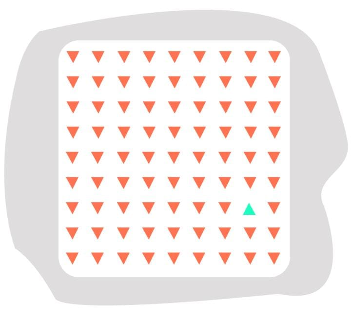

<b>Konsistensi</b> adalah salah satu hal yang wajib diperhatikan oleh designer. <b>Design yang konsisten adalah design yang intuitif.</b> Artinya, design yang dirancang sedemikian rupa, sehingga pengguna bisa mengerti cara menggunakan produk tanpa harus banyak belajar.

Jika <b>konsistensi</b> diterapkan dalam design, pengguna dapat mempelajari hal-hal baru dengan cepat tanpa kesulitan. Selain itu, dapat berpengaruh juga pada <i>feedback</i> yang akan kita dapatkan dari pengguna.

Bayangkan rasa frustasi saat menemukan mobil yang sempurna, hanya untuk menemukan bahwa pedal gas berada di sebelah kanan dan rem di sebelah kiri. Apa tidak kesal? Dan pada akhirnya, kita tidak jadi membeli mobil itu karena tidak konsisten dalam penempatan pedal gasnya.

 

Sama halnya dengan kasus diatas, <b>jika suatu design tidak konsisten, hal ini dapat memberikan <i>interface</i> yang kurang bagus dan pengalaman pengguna yang buruk. Oleh karena itu, konsistensi pada design termasuk hal yang esensial dan tidak boleh terlupakan.</b>

## Ada 4 Tipe dari Konsistensi Design, Apa Saja?
**1. Konsistensi Visual**

  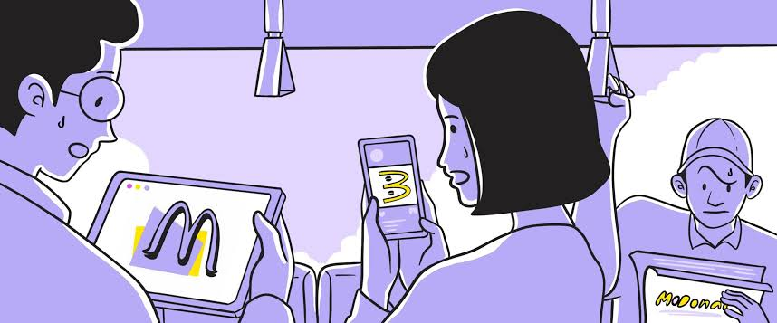

 Elemen serupa yang dipersepsikan dengan cara yang sama akan membentuk <b>konsistensi visual</b>. Contohnya seperti jenis font, ukuran, tombol, pelabelan, dan sejenisnya harus konsisten untuk menjaga konsistensi visualnya. 

&nbsp;

**2. Konsistensi Fungsional**

  

 Kontrol serupa yang berfungsi dengan cara yang sama membentuk <b>konsistensi fungsional</b>. Hal ini akan meningkatkan prediktabilitas produk. Apabila prediktabilitas produk sudah tercapai, maka pengguna tidak akan kesulitan untuk memahami fungsi dari suatu tombol atau label yang ada. 

&nbsp;

**3. Konsistensi Internal**

  

Ini adalah kombinasi antara <b>konsistensi visual dan konsistensi fungsional</b> dalam design. Apabila dalam suatu design kedua konsistensi ini terpenuhi, maka terpenuhilah juga konsistensi internalnya. Tujuan utama dari konsistensi ini adalah untuk meningkatkan kegunaan dan kemampuan belajar produk bagi pengguna.

Bahkan, ketika kita memperkenalkan fitur atau halaman baru, pengguna akan mudah untuk menggunakannya selama kita menjaga konsistensi internalnya.

&nbsp;

**4. Konsistensi Eksternal**

  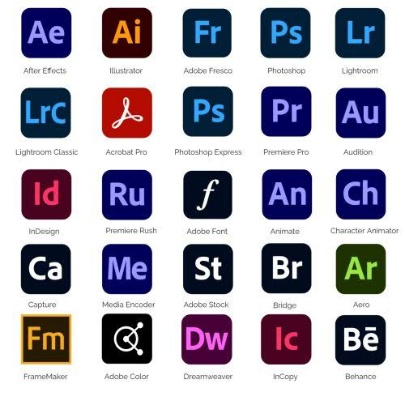

Konsistensi jenis ini dicapai ketika terdapat konsistensi design di berbagai sistem atau produk. Dengan cara ini, pengetahuan pengguna untuk satu produk dapat digunakan kembali di produk lain.

Contoh yang baik dari <b>konsistensi eksternal</b> adalah antarmuka pengguna produk Adobe. Setelah kita mengetahui Photoshop, akan lebih mudah untuk menggunakan kembali pengetahuan yang sama untuk mulai menggunakan Illustrator dan seterusnya.

## Apa Perbedaan antara Affordance dan Signifiers?
**1. Affordance (Keterjangkauan)**

<i>Affordance</i> atau dalam bahasa Indonesia disebut dengan 'keterjangkauan' adalah istilah yang digunakan untuk mengkualifikasikan kemampuan suatu objek untuk membantu pengguna memahami bahwa pengguna dapat berinteraksi dengan objek tersebut.

 

Ketika kita menggunakan sesuatu (produk, objek, design, dll) dengan <i>affordance</i> yang baik, kita akan langsung tahu apa fungsinya dan bagaimana cara menggunakannya tanpa perlu memikirkannya.

 Contoh dari <i>affordance</i> ini adalah tombol, teks box, combo box, dan lain sebagainya.

   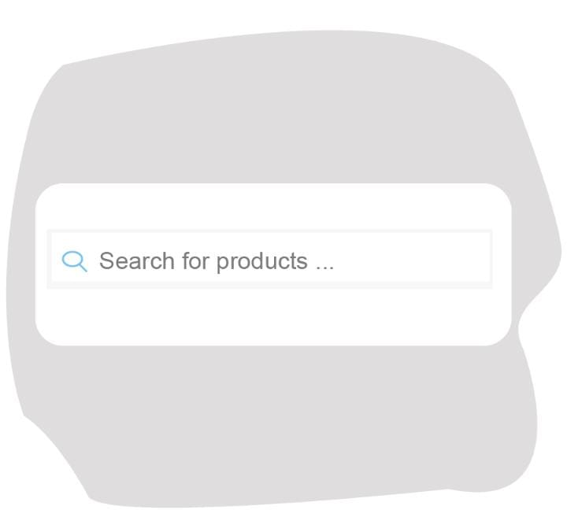 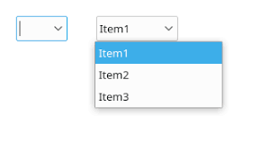

&nbsp;

**2. Signifiers (Penanda)**

Untuk meningkatkan keterjangkauan sesuatu, kita menggunakan apa yang kita sebut sebagai <i>Signifiers</i>. <b>Penanda atau <i>Signifiers</i> dapat berupa apa saja yang digunakan untuk menunjukkan keterjangkauan yang dimiliki suatu benda.</b>

 

Sebuah penanda adalah semacam indikator, suatu sinyal di dunia fisik atau sosial yang dapat ditafsirkan secara mendalam. Umumnya mereka menandakan informasi penting, meskipun penanda itu sendiri merupakan produk sampingan yang tidak disengaja dari dunia.

 

Pengguna memerlukan suatu cara untuk memahami suatu produk, gambaran tentang kegunaannya, apa yang sedang terjadi, dan tindakan alternatif apa yang dapat diambil. Pengguna mencari petunjuk, tanda apa pun yang mungkin bisa membantu mereka mengatasi dan memahami. Itu adalah tanda yang penting, segala sesuatu yang mungkin menandakan informasi yang bermakna untuk pengguna. Hal inilah yang kita sebut dengan <i>Signifiers!</i>

 

Contoh dari <i>signifiers</i> ini adalah perubahan warna tombol, perubahan bentuk cursor, pesan <i>pop-up</i>, dan masih banyak lagi yang bisa dijadikan sebagai <i>signifiers.</i>

  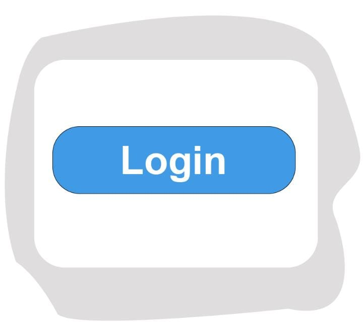  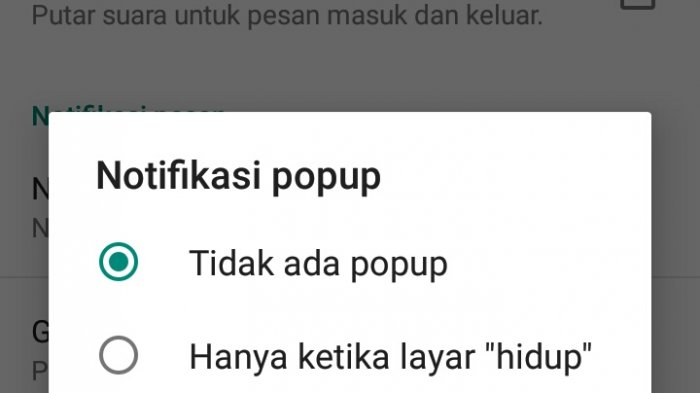

## Tools Apa Saja yang Digunakan untuk UI/UX?
Ada banyak tools yang bisa kita gunakan untuk melakukan pekerjaan yang berhubungan dengan UI/UX, contohnya yaitu:

**1. Adobe XD**

  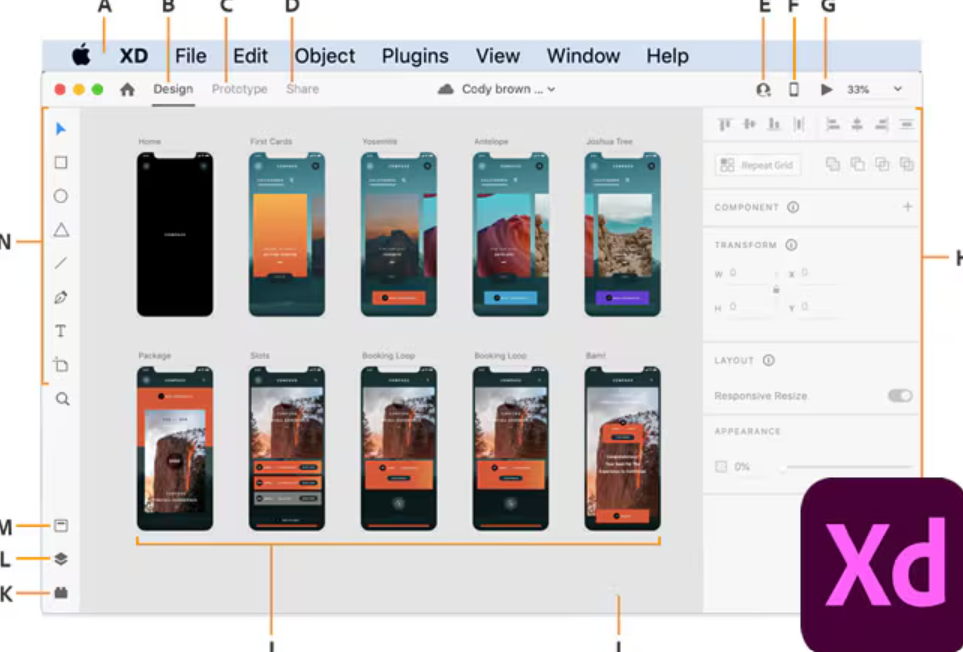

Tools ini digunakan untuk membuat prototipe yang interaktif dan desain antarmuka pengguna. Adobe XD juga memungkinkan pengguna untuk membuat desain vektor, wireframing, dan animasi.

&nbsp;

**2. Sketch**

  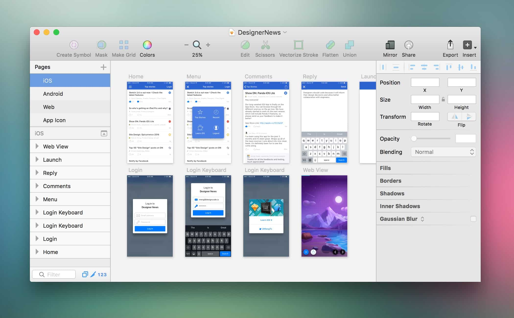

Sketch adalah tools desain vektor yang digunakan untuk membuat user interface. Fitur-fiturnya mencakup pembuatan prototipe, kolaborasi dalam tim, dan integrasi dengan alat lain seperti Zeplin dan Avocode.

&nbsp;

**3. Figma**

  

 Figma adalah platform desain berbasis web yang memungkinkan kolaborasi dalam waktu nyata. Figma mendukung desain vektor, prototyping, dan pembuatan kode desain. Selain itu, Figma juga menjadi salah satu tools yang paling umum digunakan oleh UI/UX designer karena fitur-fiturnya yang mudah dipahami.

## Penutup
Selamat, kamu sudah menyelesaikan pembelajaran mengenai basics dari UI/UX!!!

  

Eitsss, jangan seneng dulu! Masih banyakkk lagi materi-materi mengenai UI/UX yang wajib kamu ketahui! Ini masih basicnya aja, hehehe. See you di next perjumpaan yaaa!

*"Tetap Semangat dan Jangan Menyerah!"* -snpmb

>All Right Reserved by: Muhammad Rizky Brilian (Angkatan tahun 2023-2025)
