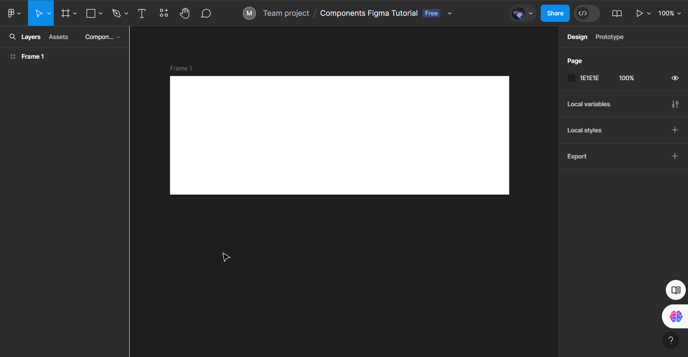

# Components in UI/UX and Figma

## Apa Peran dari Komponen dan Kenapa itu Penting di UI/UX?

  

Komponen UI/UX adalah elemen dasar yang membangun antarmuka pengguna (UI) dan pengalaman pengguna (UX). Mereka seperti blok penyusun yang digunakan untuk merancang berbagai elemen interaktif dalam aplikasi, website, dan produk digital lainnya.

### Peran dan Pentingnya Komponen di UI/UX
**1. Membangun Konsistensi**

: Komponen memastikan konsistensi visual dan fungsional di seluruh antarmuka, sehingga pengguna dapat dengan mudah memahami dan menggunakan produk.

**2. Meningkatkan Efisiensi Desain**

: Komponen yang dapat digunakan kembali untuk menghemat waktu dan tenaga desainer, memungkinkan kita untuk fokus pada aspek desain yang lebih kompleks.

**3. Memperkuat Aksesibilitas**

: Komponen yang dirancang dengan baik dapat membantu meningkatkan aksesibilitas produk bagi pengguna.

**4. Mempercepat Waktu Pengembangan**

: Penggunaan komponen yang dapat digunakan kembali dapat mempercepat proses pengembangan, memungkinkan produk diluncurkan lebih cepat ke pasar.

**5. Mempermudah Pemeliharaan** 

: Sistem desain yang terorganisir dengan baik dengan komponen yang terdokumentasi memudahkan pemeliharaan dan pembaruan produk di masa depan.

Komponen UI/UX adalah elemen penting dalam desain digital. Mereka memainkan peran penting dalam membangun antarmuka yang konsisten, efisien, mudah digunakan, dan dapat diakses. Dengan menggunakan komponen secara efektif, desainer dan pengembang dapat menciptakan produk digital yang lebih baik dan lebih sukses.

&nbsp;

## Mengenal Macam-Macam Komponen yang Umum Digunakan!

Terlepas dari seberapa uniknya desain sebuah situs web, ada beberapa komponen <i>User Interface</i> (UI) umum yang mungkin kita temukan di dalamnya. Komponen yang paling umum kita temui meliputi tombol, checkbox, radio button, toggle switch, text input, dan masih banyak lagi. Jika kita memahami cara kerja komponen ini beserta cara memasukkannya ke dalam desain, kita akan menambah pengalaman positif bagi pengguna. Selain itu, kita bisa menggunakan kreativitas diri sendiri dalam hal penerapan dan penataannya.

### Contoh Komponen yang Umum Digunakan:
**1. Tombol (Button)**

  

Asal mula tombol fisik yang pertama kali muncul di perangkat elektronik dan gadget lainnya. Pada produk digital, tombol adalah salah satu blok bangunan interaktif utama. Tombol ini memungkinkan pengguna untuk melakukan tindakan dengan satu klik atau ketukan - misalnya, Kirim, Mulai, Buat Baru, dan lain-lain.

Peran tombol adalah mendorong pengguna untuk bertindak. Label tombol sama pentingnya dengan desain. Gunakan kata kerja tindakan pada label tombol, seperti "Beli Sekarang" atau "Tambahkan ke Keranjang" untuk memberi tahu pengguna apa yang dilakukan tombol tersebut sehingga mereka dapat bertindak tanpa membaca teks pendukung.

&nbsp;

**2. Kotak Centang (Checkbox)**

  

Kotak Centang (Checkbox) memungkinkan beberapa opsi dipilih oleh pengguna secara bersamaan dan juga memungkinkan mereka mengaktifkan atau menonaktifkan opsi. Apabila diaktifkan, kotak akan menampilkan tanda centang di dalamnya. Apabila dinonaktifkan, kotak akan kosong. Kotak centang memiliki label di sampingnya dan dapat digunakan sendiri (seperti kotak centang yang memberikan izin untuk ditambahkan ke daftar email) atau ditumpuk satu sama lain.

Kotak Centang (Checkbox) biasanya digunakan untuk pertanyaan pilihan ganda pada formulir, preferensi fitur, atau memilih item untuk suatu tindakan. Sifat dari Kotak Centang (Checkbox) ini harus jelas dan intuitif, memberikan konfirmasi visual kepada pengguna atas pilihan mereka.

&nbsp;

**3. Radio Button**

  

Jika Kotak Centang (Checkbox) memungkinkan beberapa pilihan untuk dipilih, Radio Button hanya memungkinkan satu pilihan. Radio Button akan kosong ketika tidak dipilih dan diisi dengan warna ketika dipilih. Tombol ini sering kali ditampilkan tanpa opsi yang dipilih. Setelah sebuah opsi dipilih, opsi tersebut tidak dapat dikembalikan ke kondisi semula hanya dengan berinteraksi dengan tombolnya (pengguna hanya dapat mengalihkan pilihan mereka di antara tombol yang ada). Jika status yang dibatalkan pilihannya penting, kita harus memberikan cara alternatif kepada pengguna untuk kembali ke status tersebut.

Radio Button sering digunakan untuk pertanyaan dengan pilihan yang saling terpisah, seperti memilih jenis kelamin atau metode pembayaran yang disukai. Tombol ini memberikan pengambilan keputusan yang jelas dan menyederhanakan interaksi pengguna dengan aplikasi.

&nbsp;

**4. Toggle Switch**

  

Toggle Switch memberikan pengguna sebuah kemampuan untuk bergantian di antara dua opsi yang tidak dapat hidup berdampingan, biasanya mewakili status seperti "on" dan "off" untuk elemen atau fungsi tertentu.

Toggle Switch biasanya muncul di layar pengaturan dalam aplikasi. Sakelar ini kegunaannya secara khusus efektif untuk tugas-tugas yang responsnya seketika, seperti mengaktifkan mode gelap atau mode pesawat terbang. Sifatnya yang lugas, memastikan pengambilan keputusan yang cepat dan kontrol langsung atas fungsi tertentu, sehingga meningkatkan pengalaman pengguna pada aplikasi.

&nbsp;

**5. Text Input**

  

Text Input adalah jenis input formulir yang paling umum. Text Input dapat memiliki banyak bentuk dan rupa, tergantung pada situasi dan jenis data yang dimasukkan. Kita dapat menggunakan ini untuk mengumpulkan nama, alamat email, nomor telepon, atau teks yang lebih panjang (seperti alamat) dari pengguna.

Pastikan kita membuat text input yang mengenali berbagai jenis data. Misalnya, ketika pengguna memasukkan nomor telepon, bidang input dapat memformat angka secara otomatis ke dalam pola yang diharapkan dan mengalihkan keyboard ponsel ke tata letak numerik. Demikian pula, untuk alamat email, input dapat menerapkan struktur yang benar dan menyesuaikan jenis keyboard yang sesuai. Hal ini dapat membantu mengurangi kesalahan dan pada akhirnya meningkatkan pengalaman pengguna.

&nbsp;

## Komponen dan Instance, apa itu?

Komponen (Components) dan Turunan (Instance) di Figma adalah dua konsep penting yang terkait erat dengan pembuatan dan penggunaan elemen yang dapat digunakan kembali dalam desain UI/UX. Meskipun keduanya memungkinkan kita untuk membuat dan mengelola elemen yang konsisten, terdapat perbedaan fundamental dalam cara kerjanya:

**-Komponen (Components)-**

  

 Komponen (Components) adalah elemen utama yang berfungsi sebagai cetakan untuk membuat Turunan (Instance). Hal ini memiliki properti dan pengaturan yang menentukan tampilan dan perilaku elemen. Setiap modifikasi yang dilakukan pada elemen utama ini akan secara otomatis diterapkan ke semua Turunan (Instance) yang terkait padanya.

&nbsp;

**-Turunan (Instance)-**

  

 Turunan (Instance) adalah salinan dari Component yang dapat ditempatkan dan dimanipulasi dalam desain. Turunan (Instance) akan mewarisi properti dan setiap pengaturan dari elemen utama yaitu Komponen (Components). Modifikasi yang dilakukan pada suatu Turunan (Instance) hanya memengaruhi Turunan (Instance) tersebut, tidak memengaruhi Komponen (Components) yang merupakan elemen utama atau Turunan (Instance) lain.

 Untuk analoginya, bayangkan Komponen (Components) sebagai resep kue dan Turunan (Instance) sebagai kue yang dipanggang. Resep (Komponen) menentukan bahan dan instruksi dasar, sedangkan kue yang dipanggang (Turunan) adalah produk akhir yang dapat dinikmati. Kita dapat memodifikasi resep (Komponen) untuk mengubah rasa atau tekstur kue secara keseluruhan, atau kita dapat menambahkan topping atau dekorasi (Turunan) ke kue individual untuk membuatnya unik!

&nbsp;

## Cara Membuat Komponen di Figma!
**1. Siapkan Aplikasi atau Website Figma**

  

Untuk membuat komponen UI/UX, kita akan menggunakan sebuah tools berupa Figma. Pertama, apabila kamu belum membuat akun Figma, maka kamu bisa mendaftarkannya dengan email mu! Namun, jika kamu sudah memiliki akun, maka kamu bisa menggunakan akun tersebut dan melakukan login. Figma menawarkan paket gratis untuk pemula dan paket berbayar dengan fitur yang lebih lengkap untuk tim dan organisasi. Kita juga dapat menginstal aplikasi Figma di desktop untuk bekerja secara offline.

Setelah siap, kamu dapat langsung menjelajahi berbagai alat dan fitur Figma untuk mulai membuat desain yang indah dan fungsional. Pada topik ini, kita fokuskan untuk membuat sebuah komponen UI/UX.

&nbsp;

**2. Buat File di Figma untuk Membuat Projectnya**

  

Sebelum kita bisa membuat komponen, tentu saja yang pertama harus dilakukan adalah membuat tempat berupa files di Figma nya. Pada contoh ini, saya memberikan nama filenya berupa "Components Figma Tutorial"

&nbsp;

**3. Membuat Frame**

  

Dalam memulai sebuah pekerjaan di dalam file Figma, pertama-tama kita harus membuat sebuah "Frame" yang akan menjadi tempat kita mendesain.

&nbsp;

**4. Tambahkan Sebuah "Shape" pada Frame**

  

Selanjutnya, kita tambahkan "Shape" yang tersedia ke dalam frame. Nantinya, ini lah yang akan kita jadikan sebuah Komponen (Components). Pemilihan jenis bentuk (shape) nya bebas, sesuai dengan keinginan dan kebutuhan.

&nbsp;

**5. Menambahkan Tulisan dan Menjadikannya Komponen (Components)**

  

Pada bentuk (shape) yang ada di dalam frame bisa kita masukkan teks. Gunanya yaitu untuk menjelaskan fungsi ataupun hanya sebagai penanda saja. Namun, pada contoh yang diberikan, penambahan teks digunakan untuk menjelaskan bahwa bentuk (shape) tersebut sebagai tombol (button).

Tak sampai disitu, pada contoh juga diberikan cara bagaimana menjadikan suatu objek menjadi sebuah Komponen (Components) yang pilihannya terletak di bar atas.

&nbsp;

**6. Membuat Turunan (Instance) dari sebuah Komponen (Components)**

  

Selain membuat Komponen (Components), dengan ini kita juga bisa membuat Turunan (Instance) menggunakan short cut CTRL + C pada Komponen (Components) dan CTRL + V pada lokasi yang ingin kita tambahkan. Dengan begitu, secara otomatis jadilah Turunan (Instance) yang dilambangkan dengan bentuk belah ketupat tunggal.

&nbsp;

**7. Memodifikasi Komponen (Components) = Turunan (Instance) Ikut Termodifikasi**

  

Perbedaan yang paling mencolok antara Komponen (Components) dan Turunan (Instance) adalah dari aksi yang terjadi. Apabila Komponen (Components) dimodifikasi, maka Turunan (Instance) akan ikut berubah sesuai dengan Komponen (Components) utamanya.

  

Tidak hanya memodifikasi warna dari Komponen (Component), tetapi juga berlaku untuk sudut, lebar, tinggi, font, dan lain sebagainya. 

&nbsp;

**8. Melepas Turunan (Instance) dari Komponen (Components) Utamanya, Emang Bisa?**

  

Jawabannya, bisa dong! Untuk melepas suatu Turunan (Instance) dari Komponen (Components) utamanya, cukup kita pilih Turunan (Instance) nya dan modifikasi baik dari warna, ukuran, font, dan lain-lain. Namun, perlu diingat bahwa jika kita memodifikasi sebuah Turunan (Instance) maka tidak akan berpengaruh pada Komponen (Components) utamanya.

  

&nbsp;

## Penutup
Selamat, kamu baru saja menyelesaikan pembelajaran mengenai Komponen (Components) UI/UX dasar!

  

Perlu diingat ya guys, materi yang ada di module ini hanya membahas beberapa Komponen (Components) yang umum digunakan oleh seorang UI/UX Designer. Masih banyak lagi hal-hal terkait materi ini yang tentu saja menarik dan penting untuk dipelajari! Terus belajar dan mencoba ya guysss :D

*"Jika kamu tak sanggup menahan lelahnya belajar, maka kamu harus sanggup menahan perihnya kebodohan!"* -Imam Syafi'i

>All Right Reserved by: Muhammad Rizky Brilian (Angkatan tahun 2023-2025)