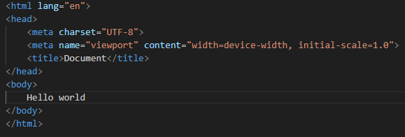
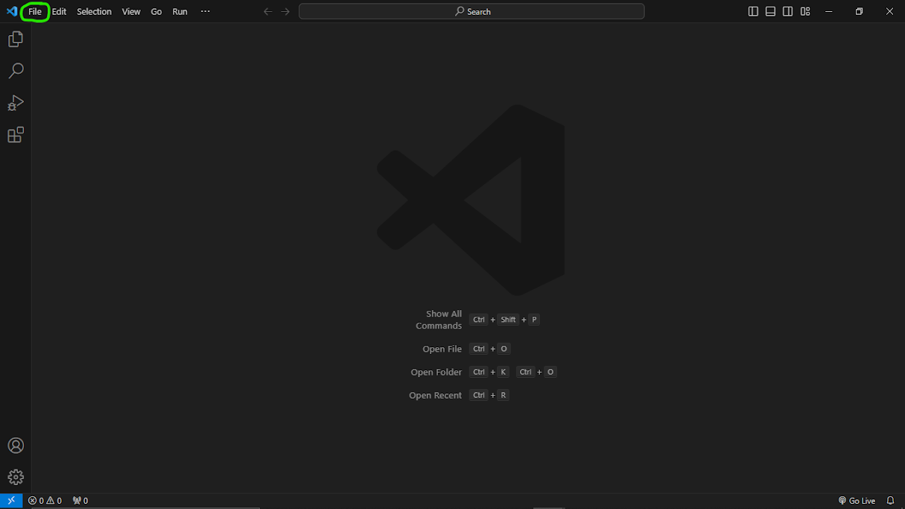
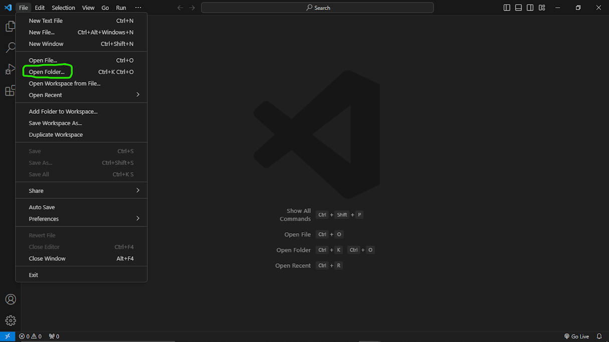
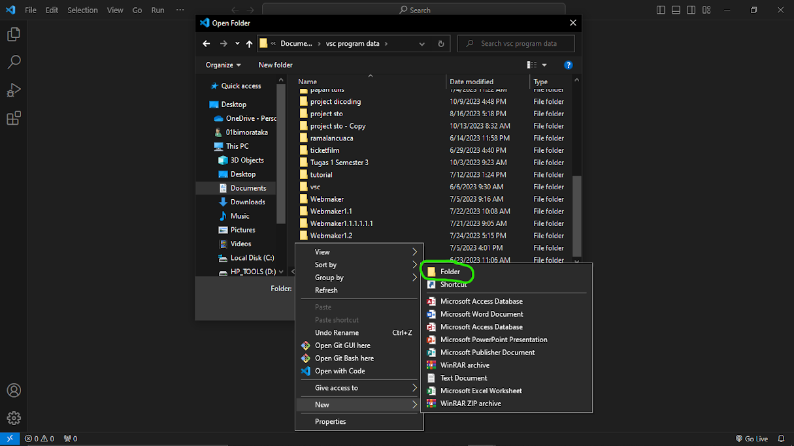
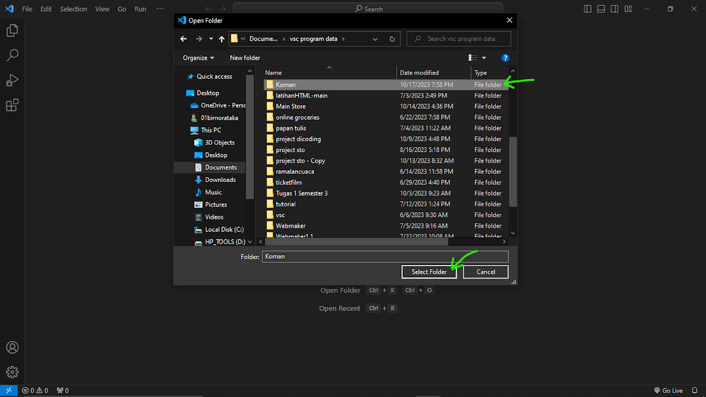
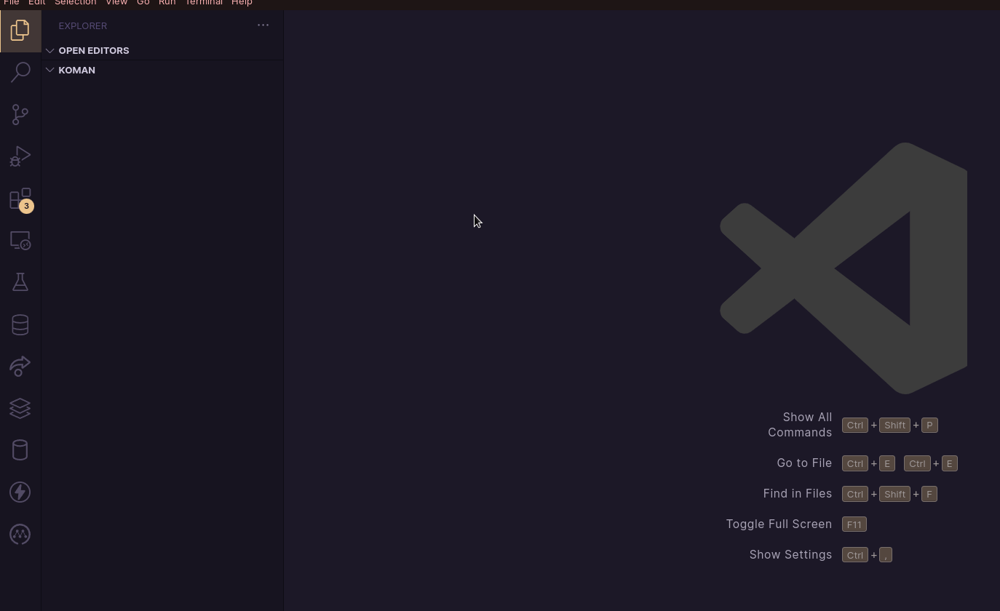
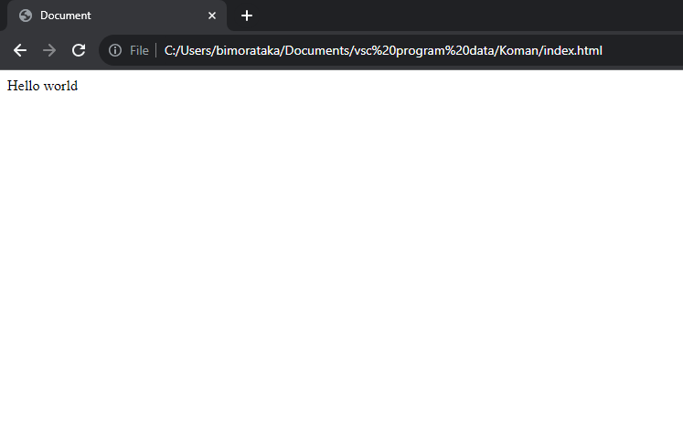
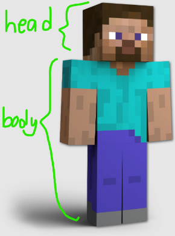
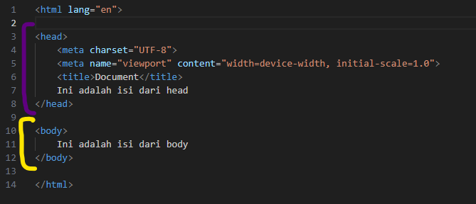
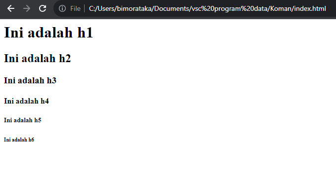

| **Author**       | **Editor** |
|------------------|------------|
| HasthoRahtomo    | Ifarra     |

---

- [Introduction](#introduction)
  - [**HTML**](#html)
  - [**CSS**](#css)
  - [**Visual Studio Code**](#visual-studio-code)
  - [**Membuat Folder dan File**](#membuat-folder-dan-file)
  - [**Membuat dasar pada HTML**](#membuat-dasar-pada-html)
  - [Struktur HTML](#struktur-html)
  - [Heading](#heading)
  - [Paragraf](#paragraf)
  - [Break](#break)
  - [Bold, Underline, dan Italic](#bold-underline-dan-italic)
  - [List](#list)
  - [Div](#div)
  - [Image](#image)
  - [Button](#button)
  - [Anchor](#anchor)

# Introduction

Pernahkah kamu membuka website pada gadget-mu? Kamu pasti pernah mengakses website hiburan seperti Spotify dan Youtube, jejaring sosial seperti Twitter dan Instagram maupun website untuk belajar seperti Ruang Guru dan Brainly. Mereka dibuat menggunakan bahasa pemograman ***HTML***, namun apa itu HTML?

## **HTML**



HTML singkatan dari `HyperText Markup Language`, yang dalam bahasa Indonesia dapat diartikan sebagai \"Bahasa Markup Hiperteks.\" HTML adalah bahasa pemrograman yang digunakan untuk membuat halaman web dan struktur dasar dari konten di dalamnya. Ini adalah komponen kunci dari web, karena digunakan untuk mengatur teks, gambar, tautan, media, dan elemen-elemen lainnya dalam sebuah halaman web.

HTML bekerja dengan cara menandai atau \"markup\" berbagai elemen pada halaman web dengan menggunakan tag-tag khusus yang ditempatkan di dalam dokumen HTML. Tag-tag ini memberi petunjuk kepada browser web tentang cara menampilkan konten pada halaman.

Namun, HTML tidak dapat bekerja sendiri. HTML membutuhkan bantuan dari bahasa lain seperti CSS (Cascading Style Sheet) dan JS (JavaScript) yang memiliki berbagai fungsi untuk membantu HTML, CSS berfungsi untuk "menghias" website yang tersedia dan JS untuk mengatur logic dari website yang telah dibuat. Kali ini kita akan belajar bagaimana cara menggunakan HTML dan CSS untuk membuat sebuah website statis.

## **CSS**

CSS adalah singkatan dari Cascading Style Sheets, yang dalam bahasa Indonesia dapat diterjemahkan sebagai \"Lembar Gaya Berkaskelana.\" CSS adalah bahasa pemrograman yang digunakan untuk mengontrol tampilan dan format dari elemen-elemen yang ditandai dalam sebuah dokumen HTML, seperti teks, gambar, tautan, dan elemen-elemen lainnya dalam halaman web.

Kita akan menggunakan ***Text Editor*** untuk membantu kita dalam menggunakan bahasa pemograman HTML dan CSS. Terdapat banyak text editor yang dapat kamu gunakan, seperti Atom, Notepad++ dan Visual Studio Code tetapi untuk kali ini kita akan menggunakan Visual Studio Code. Kamu dapat mengakses website Visual Studio Code lewat link berikut,
<https://code.visualstudio.com/>

## **Visual Studio Code**

Visual Studio Code (biasanya disingkat sebagai VS Code) adalah sebuah text editor kode sumber terbuka (open-source) yang dikembangkan oleh Microsoft. VS Code dirancang khusus untuk pengembangan perangkat lunak.

Setelah kamu mendownload Visual Studio Code, ayo kita mulai.

Hal pertama yang harus kamu lakukan untuk membuat website adalah membuat file untuk website mu terlebih dahulu serta menyiapkan file file yang diperlukan.

## **Membuat Folder dan File**

Step 1: Buka aplikasi visual studio mu lalu klik "file" pada bagian kiri atas.



Step 2: Klik "open folder"



Step 3: Pilih letak dimana folder mu ingin dibuat, lalu buat folder baru dengan meng-klik kanan pada mouse lalu memilih new -\> folder kemudian beri nama folder mu.



Step 4: klik kiri satu kali pada Folder yang sudah dibuat kemudian klik "select folder". Visual studio akan membuka folder yang telah kamu pilih, isinya masih kosong namun jangan khawatir. Selanjutnya kita akan mengisi folder tersebut.



Step 5: Klik kanan pada bagian explore (bagian kiri) kemudian pilih `New File`, perhatikan GIF berikut:



Step 6: Beri nama file `index.html` seperti berikut, ulangi step 5 namun berikan nama file `style.css`.

## **Membuat dasar pada HTML**

Langkah selanjutnya setelah kamu membuat folder dan file projek mu adalah mengisi file projek mu dengan kode-kode. Namun kamu harus mempersiapkan file tersebut agar kode yang kamu masukan dapat dikenal oleh file mu. Kamu dapat mencoba hal berikut.

Buka file `index.html`, lalu masukkan kode berikut:

```html
<!DOCTYPE html>
<html lang="en">
<head>
    <meta charset="UTF-8">
    <meta name="viewport" content="width=device-width, initial-scale=1.0">
    <title>Document</title>
</head>
<body>
    Hello World
</body>
</html>
```

Selanjutnya kamu dapat membuka file yang telah kamu buat menggunakan browser.



Selamat, ini adalah website pertama mu. Pada chapter selanjutnya kita akan mulai mengisi file HTML yang telah kamu buat.

## Struktur HTML

Kamu telah membuat folder untuk menampung projek mu, kamu juga telah mengisinya dengan index.html dan style.css. Selanjutnya kita akan mulai mengisi file index.html mu dengan kode kode berikut.



Coba bayangkan seorang manusia normal, ia memiliki kepala dan badan, begitu pula dengan kode HTML.

Tag Head berfungsi untuk mengatur body, tag head tidak akan ditampilkan pada output website. Sebaliknya, tag body merupakan tempat dari elemen elemen yang akan ditampilkan pada output. Tanda dari akhir bagian heda dan body dapat dilihat dengan adanya kode tag penutup seperti berikut.



Bagian berwarna ungu adalah daerah dari `head` dan bagian berwarnkuning adalah bagian dari `body`, akhir dari setiap daerah dapat dikenali dengan penggunaan tanda tutup dengan nama tag yang sama dengan pembuka. Maka dapat disimpulkan rumus dari kode HTML yang digunakan adalah seperti kode berikut:

```html
<tag>
  isi kode disini
</tag>
```

## Heading

Tag heading menunjukan data judul pada HTML, contoh:

```html
<!DOCTYPE html>
<html lang="id">
<head>
    <meta charset="UTF-8">
    <meta name="viewport" content="width=device-width, initial-scale=1.0">
    <title>Halaman HTML Dasar</title>
</head>
<body>
    <h1>Ini adalah h1</h1>
    <h2>Ini adalah h2</h2>
    <h3>Ini adalah h3</h3>
    <h4>Ini adalah h4</h4>
    <h5>Ini adalah h5</h5>
    <h6>Ini adalah h6</h6>
</body>
</html>

```

Hasilnya akan menjadi seperti berikut.



## Paragraf

Paragraf merupakan tag yang digunakan untuk mengisi teks dalam ukuran normal.

```html
<!DOCTYPE html>
<html lang="id">
<head>
    <meta charset="UTF-8">
    <meta name="viewport" content="width=device-width, initial-scale=1.0">
    <title>Halaman HTML Dasar</title>
</head>
<body>

    <h1>Ini adalah h1</h1>
    <p>Ini adalah paragraf pertama. HTML adalah bahasa markup yang digunakan untuk membuat halaman web.</p>
    <p>Ini adalah paragraf kedua. HTML terdiri dari elemen-elemen yang diapit oleh tanda kurung sudut.</p>
</body>
</html>
```

> [!NOTE]
> Cobalah untuk menjalankan file dari kode di atas untuk melihat hasilnya

## Break

Break dipakai untuk membuat baris baru atau jeda yang dapat dipakai didalam sebuah elemen maupun sebagai pembatas antar elemen.

```html
<!DOCTYPE html>
<html lang="id">
<head>
    <meta charset="UTF-8">
    <meta name="viewport" content="width=device-width, initial-scale=1.0">
    <title>Halaman HTML Dasar</title>
</head>
<body>
    <h1>Ini adalah h1</h1>
    <h2>Ini adalah h2 <br/> dengan <br/> break</h2>
    
    <p>Ini adalah paragraf pertama tapi dengan break. <br/> HTML adalah bahasa <br> markup yang digunakan untuk membuat <br/> <br> halaman web.</p>
    <p>Ini adalah paragraf kedua. HTML terdiri dari elemen-elemen yang diapit oleh tanda kurung sudut.</p>
</body>
</html>
```

Baik `<br>` maupun `<br/>`, keduanya sama-sama dapat digunakan

> [!NOTE]
> Cobalah untuk menjalankan file dari kode di atas untuk melihat hasilnya

## Bold, Underline, dan Italic

Ketiga kode tersebut memiliki kesamaan, yaitu memberikan efek pada text, yaitu:

- Bold menjadikan text tersebut tebal
- Underline memberikan garis bawah
- Italic memberikan efek miring pada text. Perhatikan kode berikut.

```html
<!DOCTYPE html>
<html lang="id">
<head>
    <meta charset="UTF-8">
    <meta name="viewport" content="width=device-width, initial-scale=1.0">
    <title>Contoh HTML Dasar</title>
</head>
<body>
    <h1>Ini adalah h1</h1>
    <p>
        <b>ini adalah bold.</b>
        <br>
        <u>ini adalah underline.</u>
        <br>
        <i>ini adalah italic.</i>
    </p>
</body>
</html>
```

> [!NOTE]
> Cobalah untuk menjalankan file dari kode di atas untuk melihat hasilnya

## List

List merupakan tag HTML untuk mengurutkan, terdapat 2 tipe list yang dapat kamu gunakan, yaitu:

- Ordered List: Sebuah list dimana data yang kamu masukan akan terurut menggunakan angka/huruf. Ordered list digambarkan dengan tag `<ol>`.
- Unordered List: Sebuah list yang tidak mengurutkan data yang dimasukan dan hanya menggunakan dot/bullet sebagai indikator. Ordered list digambarkan dengan tag `<ul>`.

```html
<!DOCTYPE html>
<html lang="id">
<head>
    <meta charset="UTF-8">
    <meta name="viewport" content="width=device-width, initial-scale=1.0">
    <title>Halaman HTML Dasar</title>
</head>
<body>
    <h1>Ini adalah h1</h1>

    <p>Ini adalah paragraf pertama. HTML adalah bahasa markup yang digunakan untuk membuat halaman web.</p>

    <ul>
        <li>Item pertama dalam daftar tidak terurut</li>
        <li>Item kedua dalam daftar tidak terurut</li>
        <li>Item ketiga dalam daftar tidak terurut</li>
    </ul>

    <ol>
        <li>Item pertama dalam daftar terurut</li>
        <li>Item kedua dalam daftar terurut</li>
        <li>Item ketiga dalam daftar terurut</li>
    </ol>

</body>
</html>
```

> [!NOTE]
> Cobalah untuk menjalankan file dari kode di atas untuk melihat hasilnya

## Div

Tag Div berfungsi sebagai wadah untuk menyatukan elemen elemen yang ada didalamnya menjadi satu kelompok, perlu diingat bahwa div tidak memiliki pengaruh visual maupun efek secara langsung, div sendiri tidak memiliki warna dan menyesuaikan ukurannya dengan elemen yang ada didalamnya.

```html
<!DOCTYPE html>
<html lang="id">
<head>
    <meta charset="UTF-8">
    <meta name="viewport" content="width=device-width, initial-scale=1.0">
    <title>Contoh HTML Dasar</title>
</head>
<body>
    <div>
        <h1>Judul Halaman</h1>
        <p>Ini adalah paragraf pertama.</p>
        <p>Ini adalah paragraf kedua.</p>
    </div>
</body>
</html>
```

> [!NOTE]
> Cobalah untuk menjalankan file dari kode di atas untuk melihat hasilnya

## Image

Memiliki fungsi untuk memasukan gambar pada html. Image memiliki format kode sebagai berikut.

```html

```

Contohnya adalah sebagai berikut:

```html
<!DOCTYPE html>
<html lang="id">
<head>
    <meta charset="UTF-8">
    <meta name="viewport" content="width=device-width, initial-scale=1.0">
    <title>Contoh HTML Dasar</title>
</head>
<body>
    <div>
        <h1>Judul Halaman</h1>
        <p>Ini adalah paragraf pertama.</p>
        <p>Ini adalah paragraf kedua.</p>
        
        <p>Gambar di atas adalah Steve dari Minecraft.</p>
        
        <p>Gambar di atas adalah gambar placeholder.</p>
    </div>
</body>
</html>
```

> [!NOTE]
> Cobalah untuk menjalankan file dari kode di atas untuk melihat hasilnya

## Button

Tag Button digunakan untuk membuat tombol dalam halaman web. Tombol ini biasanya berfungsi untuk memicu tindakan atau peristiwa tertentu saat diklik oleh pengguna.

Tombol ini dapat digunakan untuk mengirim formulir, memulai kode JavaScript, atau menjalankan berbagai tindakan sesuai dengan kebutuhan program.

Contoh kode:

```html
<!DOCTYPE html>
<html lang="id">
<head>
    <meta charset="UTF-8">
    <meta name="viewport" content="width=device-width, initial-scale=1.0">
    <title>Contoh Tombol HTML</title>
</head>
<body>
    <button>Klik Saya</button>
</body>
</html>
```

> [!NOTE]
> Cobalah untuk menjalankan file dari kode di atas untuk melihat hasilnya

## Anchor

Tag Anchor digunakan untuk membuat tautan ke halaman web lain, berkas, atau alamat URL lainnya. Ini memungkinkan pengguna untuk menekan tautan dan beralih ke lokasi yang dituju. Elemen `<a>` sering digunakan untuk membuat tautan teks atau gambar. Untuk mencobanya, ikuti langkah langkah berikut:

Coba masukkan kode berikut ke kode kamu:

```html
<!DOCTYPE html>
<html lang="id">
<head>
    <meta charset="UTF-8">
    <meta name="viewport" content="width=device-width, initial-scale=1.0">
    <title>Contoh Tautan HTML</title>
</head>
<body>
    <a href="https://twitter.com">Halaman Twitter</a>
</body>
</html>
```

Sekarang coba buat dua file bernama `halaman1.html` dan `halaman2.html`, lalu masukkan kode berikut:

`halaman1.html`

```html
<!DOCTYPE html>
<html lang="id">
<head>
    <meta charset="UTF-8">
    <meta name="viewport" content="width=device-width, initial-scale=1.0">
    <title>Halaman 1</title>
</head>
<body>
    <h1>Ini adalah Halaman 1</h1>
    <p>Ini adalah contoh halaman pertama.</p>
    <a href="halaman2.html">Pergi ke Halaman 2</a>
</body>
</html>
```

`halaman2.html`

```html
<!DOCTYPE html>
<html lang="id">
<head>
    <meta charset="UTF-8">
    <meta name="viewport" content="width=device-width, initial-scale=1.0">
    <title>Halaman 2</title>
</head>
<body>
    <h1>Ini adalah Halaman 2</h1>
    <p>Ini adalah contoh halaman kedua.</p>
    <a href="halaman1.html">Kembali ke Halaman 1</a>
</body>
</html>
```

Sekarang jalankan salah satu file html tersebut lalu klik URL-nya.

> [!NOTE]
> Cobalah untuk menjalankan file dari kode di atas untuk melihat hasilnya
