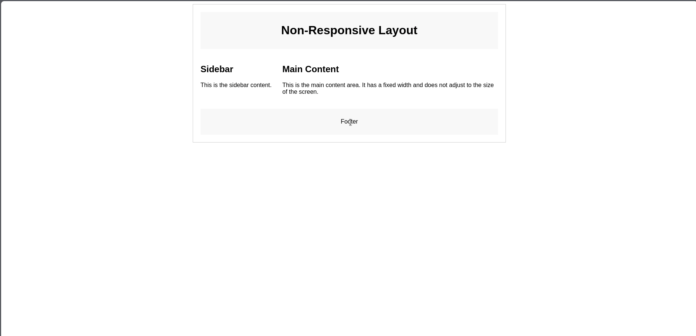

| **Author**       | **Editor** |
|------------------|------------|
| HasthoRahtomo    | Ifarra     |

---

- [Introduction to Bootstrap](#introduction-to-bootstrap)
  - [Instalasi Bootstrap](#instalasi-bootstrap)
  - [Penggunaan Bootstrap](#penggunaan-bootstrap)
  - [Contoh Penggunaan Slider Carousel](#contoh-penggunaan-slider-carousel)
  - [Contoh Penggunaan Cards](#contoh-penggunaan-cards)
  - [Kustomisasi Bootstrap](#kustomisasi-bootstrap)
    - [Mengubah Warna Background](#mengubah-warna-background)

# Introduction to Bootstrap

Bootstrap adalah salah satu framework CSS yang dapat digunakan untuk membuat tampilan dengan komponen yang sudah disediakan. Bootstrap berisi berbagai macam kode yang siap digunakan dimana kode yang disediakan oleh Bootstrap juga sudah bersifat responsif sehingga kita tidak perlu mengaturnya kembali.

Responsif adalah kondisi dimana komponen di dalam web harus menyesuaikan konten di dalamnya. Kamu dapat membandingkan dua kode yang ada di bawah ini:

Contoh kode web tidak responsif:

```html
<!DOCTYPE html>
<html lang="en">
<head>
    <meta charset="UTF-8">
    <meta name="viewport" content="width=device-width, initial-scale=1.0">
    <title>Non-Responsive Example</title>
    <style>
        body {
            font-family: Arial, sans-serif;
        }
        .container {
            width: 800px;
            margin: 0 auto;
            border: 1px solid #ccc;
            padding: 20px;
        }
        .header, .footer {
            background-color: #f8f8f8;
            text-align: center;
            padding: 10px 0;
        }
        .content {
            margin: 20px 0;
        }
        .sidebar {
            width: 200px;
            float: left;
            margin-right: 20px;
        }
        .main-content {
            width: 580px;
            float: left;
        }
        .clearfix::after {
            content: "";
            clear: both;
            display: table;
        }
    </style>
</head>
<body>
    <div class="container">
        <div class="header">
            <h1>Non-Responsive Layout</h1>
        </div>
        <div class="content clearfix">
            <div class="sidebar">
                <h2>Sidebar</h2>
                <p>This is the sidebar content.</p>
            </div>
            <div class="main-content">
                <h2>Main Content</h2>
                <p>This is the main content area. It has a fixed width and does not adjust to the size of the screen.</p>
            </div>
        </div>
        <div class="footer">
            <p>Footer</p>
        </div>
    </div>
</body>
</html>
```

Berikut hasilnya ketika dijalankan:


Sekarang kita bandingkan dengan web yang responsif.

```html
<!DOCTYPE html>
<html lang="en">
<head>
    <meta charset="UTF-8">
    <meta name="viewport" content="width=device-width, initial-scale=1.0">
    <title>Responsive Example</title>
    <style>
        body {
            font-family: Arial, sans-serif;
            margin: 0;
            padding: 0;
            box-sizing: border-box;
        }
        .container {
            max-width: 1200px;
            margin: 0 auto;
            padding: 20px;
        }
        .header, .footer {
            background-color: #f8f8f8;
            text-align: center;
            padding: 20px;
        }
        .content {
            display: flex;
            flex-wrap: wrap;
            margin: 20px 0;
        }
        .sidebar, .main-content {
            padding: 20px;
            box-sizing: border-box;
        }
        .sidebar {
            flex: 1 1 200px;
            background-color: #e8e8e8;
            margin-bottom: 20px;
        }
        .main-content {
            flex: 3 1 600px;
            background-color: #d8d8d8;
        }
        @media (max-width: 768px) {
            .sidebar, .main-content {
                flex: 1 1 100%;
            }
        }
    </style>
</head>
<body>
    <div class="container">
        <div class="header">
            <h1>Responsive Layout</h1>
        </div>
        <div class="content">
            <div class="sidebar">
                <h2>Sidebar</h2>
                <p>This is the sidebar content.</p>
            </div>
            <div class="main-content">
                <h2>Main Content</h2>
                <p>This is the main content area. It adjusts to the size of the screen.</p>
            </div>
        </div>
        <div class="footer">
            <p>Footer</p>
        </div>
    </div>
</body>
</html>
```


Sangat berbeda, bukan?

## Instalasi Bootstrap

Pertama, buka website resmi Bootstrap melalui [link ini](https://getbootstrap.com), lalu klik docs.

Kamu akan melihat cara menggunakan Bootstrap, kalau kamu masih bingung silahkan copy kode di bawah ini lalu tempelkan pada file html milikmu:

```html
<!doctype html>
<html lang="en">
  <head>
    <meta charset="utf-8">
    <meta name="viewport" content="width=device-width, initial-scale=1">
    <title>Bootstrap demo</title>
    <link href="https://cdn.jsdelivr.net/npm/bootstrap@5.3.3/dist/css/bootstrap.min.css" rel="stylesheet" integrity="sha384-QWTKZyjpPEjISv5WaRU9OFeRpok6YctnYmDr5pNlyT2bRjXh0JMhjY6hW+ALEwIH" crossorigin="anonymous">
  </head>
  <body>
    <h1>Hello, world!</h1>
    <script src="https://cdn.jsdelivr.net/npm/bootstrap@5.3.3/dist/js/bootstrap.bundle.min.js" integrity="sha384-YvpcrYf0tY3lHB60NNkmXc5s9fDVZLESaAA55NDzOxhy9GkcIdslK1eN7N6jIeHz" crossorigin="anonymous"></script>
  </body>
</html>
```

> [!NOTE]
> Penggunaan Bootstrap tanpa instalasi memerlukan koneksi internet. Pastikan perangkat Anda terhubung ke internet sebelum menggunakan Bootstrap.

## Penggunaan Bootstrap

Setelah Bootstrap terpasang, langkah selanjutnya adalah menggunakan kode-kode yang ada di dalam Bootstrap. Berikut adalah caranya:


Kita dapat mencari kode yang diinginkan pada search bar, atau mencarinya secara manual pada bagian kiri website.

## Contoh Penggunaan Slider Carousel

Ketik "slider" pada search bar, kemudian klik pada menu paling atas.


Pilih slider yang diinginkan. Bootstrap menyediakan berbagai macam slider yang dapat digunakan, seperti slider manual, slider otomatis, dll. Sebagai contoh, kita akan memilih slider manual.

Copy kode yang berada di bawah slider yang kita inginkan. Paste kode tersebut ke dalam file project kita. Pastikan kode tersebut berada di dalam `<body>`.


Contoh kode lengkapnya apabila ditambahkan dapat menjadi seperti ini:

```html
<!doctype html>
<html lang="en">
  <head>
    <meta charset="utf-8">
    <meta name="viewport" content="width=device-width, initial-scale=1">
    <title>Bootstrap Carousel Example</title>
    <link href="https://cdn.jsdelivr.net/npm/bootstrap@5.3.3/dist/css/bootstrap.min.css" rel="stylesheet" integrity="sha384-QWTKZyjpPEjISv5WaRU9OFeRpok6YctnYmDr5pNlyT2bRjXh0JMhjY6hW+ALEwIH" crossorigin="anonymous">
  </head>
  <body>
    <div class="container mt-5">
        <div id="carouselExampleControls" class="carousel slide" data-bs-ride="carousel">
            <div class="carousel-inner">
                <div class="carousel-item active">
                    
                </div>
                <div class="carousel-item">
                    
                </div>
                <div class="carousel-item">
                    
                </div>
            </div>
            <a class="carousel-control-prev" href="#carouselExampleControls" role="button" data-bs-slide="prev">
                <span class="carousel-control-prev-icon" aria-hidden="true"></span>
                <span class="visually-hidden">Previous</span>
            </a>
            <a class="carousel-control-next" href="#carouselExampleControls" role="button" data-bs-slide="next">
                <span class="carousel-control-next-icon" aria-hidden="true"></span>
                <span class="visually-hidden">Next</span>
            </a>
        </div>
    </div>

    <script src="https://cdn.jsdelivr.net/npm/bootstrap@5.3.3/dist/js/bootstrap.bundle.min.js" integrity="sha384-YvpcrYf0tY3lHB60NNkmXc5s9fDVZLESaAA55NDzOxhy9GkcIdslK1eN7N6jIeHz" crossorigin="anonymous"></script>
  </body>
</html>
```

Jalankan dan lihat hasilnya.

## Contoh Penggunaan Cards

Ketik "cards" pada search bar kemudian tekan ENTER.

Pilih model card yang diinginkan. Terdapat beragam variasi desain yang dapat digunakan.


Copy kode yang berada di bawah komponen yang diinginkan. Paste kode yang sudah dicopy tadi ke dalam project, lalu perhatikan hasilnya.

Contoh keseluruhan kode yang sudah ditambahkan akan menjadi seperti ini:

```html
<!doctype html>
<html lang="en">
  <head>
    <meta charset="utf-8">
    <meta name="viewport" content="width=device-width, initial-scale=1">
    <title>Bootstrap Cards Example</title>
    <link href="https://cdn.jsdelivr.net/npm/bootstrap@5.3.3/dist/css/bootstrap.min.css" rel="stylesheet" integrity="sha384-QWTKZyjpPEjISv5WaRU9OFeRpok6YctnYmDr5pNlyT2bRjXh0JMhjY6hW+ALEwIH" crossorigin="anonymous">
  </head>
  <body>
    <div class="container mt-5">
        <div class="row">
            <div class="col-md-4 mb-4">
                <div class="card">
                    
                    <div class="card-body">
                        <h5 class="card-title">Card 1</h5>
                        <p class="card-text">This is a description for card 1.</p>
                    </div>
                </div>
            </div>
            <div class="col-md-4 mb-4">
                <div class="card">
                    
                    <div class="card-body">
                        <h5 class="card-title">Card 2</h5>
                        <p class="card-text">This is a description for card 2.</p>
                    </div>
                </div>
            </div>
            <div class="col-md-4 mb-4">
                <div class="card">
                    
                    <div class="card-body">
                        <h5 class="card-title">Card 3</h5>
                        <p class="card-text">This is a description for card 3.</p>
                    </div>
                </div>
            </div>
            <div class="col-md-4 mb-4">
                <div class="card">
                    
                    <div class="card-body">
                        <h5 class="card-title">Card 4</h5>
                        <p class="card-text">This is a description for card 4.</p>
                    </div>
                </div>
            </div>
        </div>
    </div>

    <script src="https://cdn.jsdelivr.net/npm/bootstrap@5.3.3/dist/js/bootstrap.bundle.min.js" integrity="sha384-YvpcrYf0tY3lHB60NNkmXc5s9fDVZLESaAA55NDzOxhy9GkcIdslK1eN7N6jIeHz" crossorigin="anonymous"></script>
  </body>
</html>
```

## Kustomisasi Bootstrap

Meskipun kita hanya melakukan copy kode dari Bootstrap, kita tetap dapat mengatur elemen yang telah dicopy tersebut, seperti mengubah warna, background, dll.

### Mengubah Warna Background

Ketik "background color" pada search bar atau masuk ke [link ini](https://getbootstrap.com/docs/5.3/utilities/background/#background-color).

Bootstrap menyediakan class warna default, pilih warna yang diinginkan, lalu copy teks yang terdapat pada warna tersebut.


Ganti salah satu warna pada kode card di atas, misalnya perhatikan kode keseluruhan di bawah ini:

```html

<!doctype html>
<html lang="en">
  <head>
    <meta charset="utf-8">
    <meta name="viewport" content="width=device-width, initial-scale=1">
    <title>Bootstrap Cards Example</title>
    <link href="https://cdn.jsdelivr.net/npm/bootstrap@5.3.3/dist/css/bootstrap.min.css" rel="stylesheet" integrity="sha384-QWTKZyjpPEjISv5WaRU9OFeRpok6YctnYmDr5pNlyT2bRjXh0JMhjY6hW+ALEwIH" crossorigin="anonymous">
  </head>
  <body>
    <div class="container mt-5">
        <div class="row">
            <div class="col-md-4 mb-4">
                <div class="card bg-success">
                    
                    <div class="card-body">
                        <h5 class="card-title">Card 1</h5>
                        <p class="card-text">This is a description for card 1.</p>
                    </div>
                </div>
            </div>
            <div class="col-md-4 mb-4">
                <div class="card bg-primary">
                    
                    <div class="card-body">
                        <h5 class="card-title">Card 2</h5>
                        <p class="card-text">This is a description for card 2.</p>
                    </div>
                </div>
            </div>
            <div class="col-md-4 mb-4">
                <div class="card bg-danger">
                    
                    <div class="card-body">
                        <h5 class="card-title">Card 3</h5>
                        <p class="card-text">This is a description for card 3.</p>
                    </div>
                </div>
            </div>
            <div class="col-md-4 mb-4">
                <div class="card">
                    
                    <div class="card-body">
                        <h5 class="card-title">Card 4</h5>
                        <p class="card-text">This is a description for card 4.</p>
                    </div>
                </div>
            </div>
        </div>
    </div>

    <script src="https://cdn.jsdelivr.net/npm/bootstrap@5.3.3/dist/js/bootstrap.bundle.min.js" integrity="sha384-YvpcrYf0tY3lHB60NNkmXc5s9fDVZLESaAA55NDzOxhy9GkcIdslK1eN7N6jIeHz" crossorigin="anonymous"></script>
  </body>
</html>
```

Terdapat tiga warna yang ditambahkan setelah class `card`, yaitu, `bg-primary`, `bg-success`, dan `bg-danger`.

Untuk mengubah warna teks, caranya sama. Secara umum, cara mengubah style dari elemen Bootstrap adalah:

1. Cari elemen apa yang ingin diubah.
2. Copy kode warna yang diinginkan.
3. Letakkan kode yang telah dicopy pada bagian "class" dengan titik (.) yang sudah dihapus.
