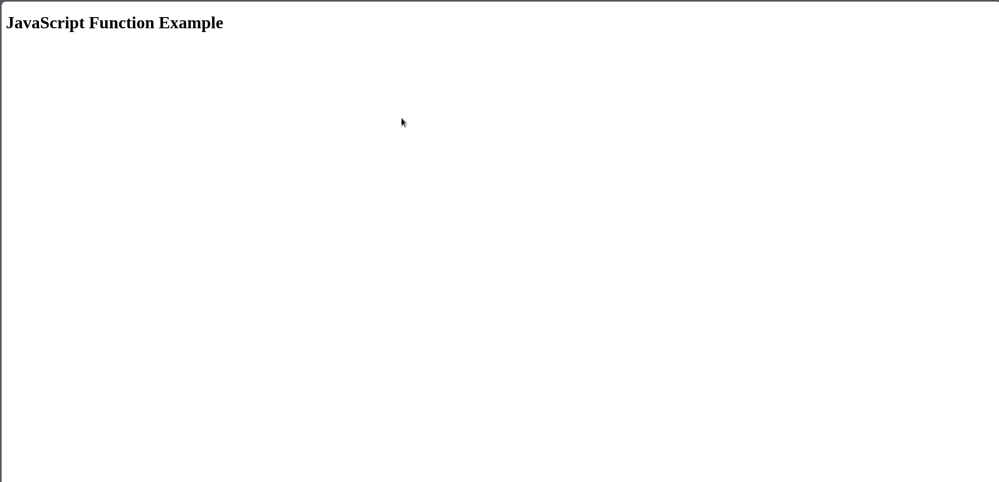

| Author          | Editor |
| --------------- | ------ |
| M.Fauzan Arrafi | Hudya  |
  
---  

- [Introduction to javascript](#introduction-to-javascript)
  - [Sintaks dasar](#sintaks-dasar)
  - [Bagaimana cara menjalankan Javascript?](#bagaimana-cara-menjalankan-javascript)
  - [Tipe Data](#tipe-data)
  - [Condition (Kondisi)](#condition-kondisi)
  - [Loop (Perulangan)](#loop-perulangan)
  - [Function  (Fungsi)](#function--fungsi)
    - [Anonymous Function](#anonymous-function)
    - [Arrow Function](#arrow-function)

# Introduction to javascript
  
JavaScript adalah bahasa pemrograman yang digunakan untuk membuat website menjadi interaktif dan dinamis, seperti menambahkan animasi, memvalidasi formulir, dan memperbarui konten tanpa harus memuat ulang halaman. Ini adalah salah satu bahasa utama yang digunakan dalam pengembangan web bersama dengan HTML dan CSS.

## Sintaks dasar  

Kode JavaScript biasanya disisipkan dalam dokumen HTML menggunakan tag `<script>` atau kode tersebut dapat ditulis dalam file terpisah dengan ekstensi `.js` dan dihubungkan dengan dokumen HTML.

Berikut merupakan contoh penggunaan variable pada javascript.

```javascript
// Mendeklarasikan variabel menggunakan var, let, dan const
var name = "John"; // var adalah cara lama, sebaiknya menggunakan let atau const
let age = 25; // let digunakan untuk variabel yang nilainya bisa berubah
const pi = 3.14; // const digunakan untuk variabel yang nilainya tetap
```

## Bagaimana cara menjalankan Javascript?

Buatlah sebuah file, misalnya bernama `index.html` lalu masukkan kode berikut:

```html
<!doctype html>
<html lang="en">
  <head>
    <meta charset="utf-8">
    <meta name="viewport" content="width=device-width, initial-scale=1">
    <title>Basic JavaScript Example</title>
  </head>
  <body>
    <h1>JavaScript Function Example</h1>
    
    <script>
      // Mendeklarasikan variabel menggunakan var, let, dan const
      var name = "John"; // var adalah cara lama, sebaiknya menggunakan let atau const
      let age = 25; // let digunakan untuk variabel yang nilainya bisa berubah
      const pi = 3.14; // const digunakan untuk variabel yang nilainya tetap

      console.log(name)
      console.log(age)
      console.log(pi)
    </script>
  </body>
</html>
```

Sekarang buka halaman tersebut pada browser, klik kanan > inspect element lalu cari tab console, kamu akan melihat ketiga nilai di atas dicetak pada tab tersebut.



## Tipe Data
  
JavaScript mendukung berbagai jenis tipe data, termasuk:
  
- **Number**: Mewakili nilai numerik.
- **String**: Mewakili data teks.
- **Boolean**: Mewakili nilai `true` atau `false`.
- **Array**: Mewakili kumpulan nilai yang terurut.
- **Object**: Mewakili kumpulan pasangan kunci-nilai.
- **Null**: Mewakili ketiadaan nilai apapun.
- **Undefined**: Mewakili variabel yang belum diinisialisasi.
  
## Condition (Kondisi)
  
Conditional statements memungkinkan kita menjalankan blok kode yang berbeda berdasarkan kondisi-kondisi tertentu. JavaScript menyediakan pernyataan kondisional berikut:
  
- **if statement**: Pernyataan `if` memungkinkan kita menjalankan blok kode jika kondisi tertentu adalah benar.
  
```html
if (condition) {  
  // Code to be executed if the condition is true  
}  
```  
  
- **else statement**: Pernyataan `else` digunakan bersama dengan pernyataan `if` dan memungkinkan kita untuk menentukan blok kode yang akan dieksekusi jika kondisinya adalah salah (false).
  
```html
if (condition) {  
  // Code to be executed if the condition is true  
} else {  
  // Code to be executed if the condition is false  
}  
```  
  
- **else if statement**: Pernyataan `else if` memungkinkan kita untuk memeriksa kondisi tambahan jika kondisi sebelumnya adalah salah `false`. Pernyataan ini dapat diantrekan beberapa kali.
  
```html
if (condition1) {  
  // Code to be executed if condition1 is true  
} else if (condition2) {  
  // Code to be executed if condition1 is false and condition2 is true  
} else {  
  // Code to be executed if both condition1 and condition2 are false  
}  
```

Contoh kode:

```html
<!doctype html>
<html lang="en">
  <head>
    <meta charset="utf-8">
    <meta name="viewport" content="width=device-width, initial-scale=1">
    <title>Basic JavaScript Example</title>
  </head>
  <body>
    <h1>JavaScript Function Example</h1>
    
    <script>
        let age = 20;
        
        if (age < 18) {
          console.log("Underage");
        } else if (age >= 18 && age < 65) {
          console.log("Adult");
        } else {
          console.log("Senior");
        }
    </script>
  </body>
</html>
```

> [!NOTE]
> Kamu dapat mencoba kode di atas dengan cara melihatnya pada tab `console`.

## Loop (Perulangan)
  
Loop memungkinkan kita untuk mengulang blok kode beberapa kali hingga kondisi tertentu terpenuhi. JavaScript menyediakan struktur perulangan berikut:  

- **for loop**: Pengulangan `for` digunakan ketika kalian sudah mengetahui sebelumnya jumlah iterasi yang ingin kalian lakukan.  
  
```html
for (initialization; condition; iteration) {  
  // Code to be executed in each iteration  
}  
```  
  
- **while loop**: Pernyataan `while` digunakan ketika jumlah iterasi tidak diketahui sebelumnya tetapi bergantung pada kondisi tertentu.
  
```html
while (condition) {  
  // Code to be executed while the condition is true  
}  
```  
  
- **do-while loop**: Pernyataan `do-while` mirip dengan perulangan `while`, tetapi menjamin bahwa blok kode dieksekusi setidaknya sekali sebelum memeriksa kondisi.
  
```html
do {  
  // Code to be executed at least once  
} while (condition);  
```  
  
Struktur kontrol ini memberikan fleksibilitas dan pengendalian terhadap alur program JavaScript kalian. Dengan memanfaatkan pernyataan kondisional dan perulangan secara efektif, kalian dapat menciptakan aplikasi yang dinamis dan responsif.

Contoh kode:

```html
<!doctype html>
<html lang="en">
  <head>
    <meta charset="utf-8">
    <meta name="viewport" content="width=device-width, initial-scale=1">
    <title>Basic JavaScript Example</title>
  </head>
  <body>
    <h1>JavaScript Function Example</h1>
    
    <script>
        // for loop
        for (let i = 0; i < 5; i++) {
          console.log("Iteration " + i);
        }
        
        // while loop
        let count = 0;
        while (count < 5) {
          console.log("Count " + count);
          count++;
        }
    </script>
  </body>
</html>
```

## Function  (Fungsi)
  
Fungsi (function/method) adalah blok kode yang dapat digunakan kembali yang melakukan tugas-tugas tertentu. Mereka dapat menerima parameter dan mengembalikan nilai.
  
```html
<!doctype html>
<html lang="en">
  <head>
    <meta charset="utf-8">
    <meta name="viewport" content="width=device-width, initial-scale=1">
    <title>Basic JavaScript Example</title>
  </head>
  <body>
    <h1>JavaScript Function Example</h1>
    <button onclick="greet('Student')">Greet</button>

    <script>
      // Example of a basic JavaScript function  
      function greet(name = "Anonymous") {  
        console.log("Hello, " + name + "!");  
      }  
    </script>
  </body>
</html>
```  
  
Dalam contoh ini, fungsi `greet` memiliki parameter default untuk `name` yang diatur sebagai "Anonymous". Jika tidak ada argumen yang diberikan, parameter tersebut akan menggunakan nilai default tersebut.
  
### Anonymous Function  
  
```html
<!doctype html>
<html lang="en">
  <head>
    <meta charset="utf-8">
    <meta name="viewport" content="width=device-width, initial-scale=1">
    <title>Anonymous Function Example</title>
  </head>
  <body>
    <h1>Anonymous Function Example</h1>
    <button id="helloButton" onclick="sayHello()">Say Hello</button>

    <script>
      // Anonymous function assigned to a variable
      const sayHello = function() {
        console.log("Hello!");
      };
    </script>
  </body>
</html>

```  
  
Fungsi anonim adalah fungsi tanpa nama. Mereka dapat ditetapkan ke variabel dan dipanggil sama seperti fungsi bernama.  
  
### Arrow Function  
  
```html
<!doctype html>
<html lang="en">
  <head>
    <meta charset="utf-8">
    <meta name="viewport" content="width=device-width, initial-scale=1">
    <title>Arrow Function Example</title>
  </head>
  <body>
    <h1>Arrow Function Example</h1>
    <button id="multiplyButton" onclick="multiplyAndLog()">Multiply 2 and 3</button>

    <script>
      // Arrow function
      const multiply = (a, b) => a * b;

      // Function to call multiply and log the result
      const multiplyAndLog = () => {
        const result = multiply(2, 3);
        console.log(result); // Output: 6
      };
    </script>
  </body>
</html>
```  
  
Arrow functions menyediakan syntax yang ringkas untuk menulis fungsi. Mereka sangat berguna untuk menulis fungsi satu baris.
