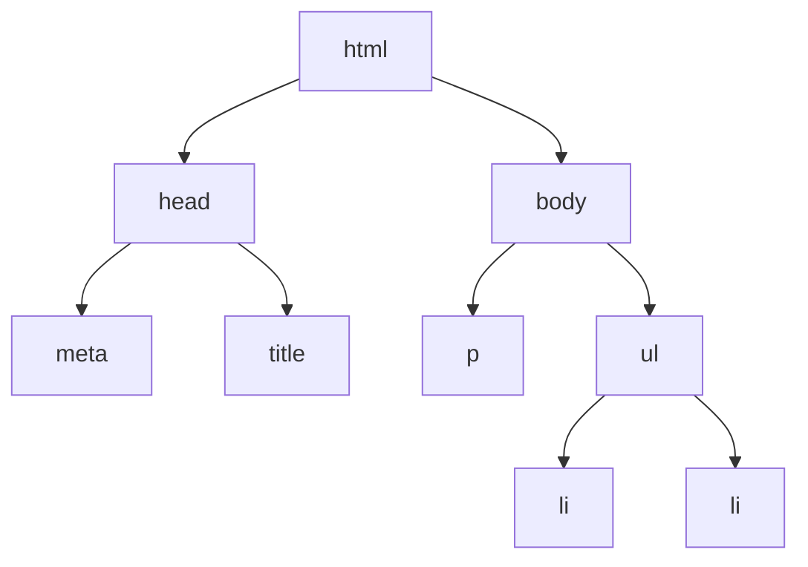

| Author | Editor |
| ------ | ------ |
| Ihza   | Ifarra |

---

- [Document Object Model](#document-object-model)
  - [Contoh Pertama: Mengganti Setiap Elemen](#contoh-pertama-mengganti-setiap-elemen)
  - [Contoh Kedua: Menambahkan Elemen](#contoh-kedua-menambahkan-elemen)
  - [Contoh Ketiga: Menghandle Events](#contoh-ketiga-menghandle-events)
  - [Contoh Keempat: Menerima submisi](#contoh-keempat-menerima-submisi)
  - [Contoh Kelima: Mendeteksi Mouse](#contoh-kelima-mendeteksi-mouse)
  - [Contoh Keenam: Mendeteksi Input Keyboard](#contoh-keenam-mendeteksi-input-keyboard)
  - [Error Handling di Javascript](#error-handling-di-javascript)


# Document Object Model

Document Object Model (DOM) adalah struktur data yang merepresentasikan konten dari halaman web sebagai pohon objek yang dapat dimanipulasi dengan JavaScript. DOM memungkinkan pengembang untuk mengakses dan mengubah elemen HTML dan CSS secara dinamis, sehingga interaksi pengguna dengan halaman web menjadi lebih interaktif dan responsif.


  
JavaScript memungkinkan manipulasi dari Document Object Model (DOM) untuk secara dinamis mengubah elemen-elemen HTML dan properti-propertinya, misalnya kita mengubah setiap tag paragraf teksnya menjadi warna hijau, kita mengubah setiap tag header background colornya menjadi biru.
  
## Contoh Pertama: Mengganti Setiap Elemen

Dengan menggunakan DOM pada Javascript, kita dapat memanipulasi setiap paragraf ataupun heading. Contoh kode:

```html
<!DOCTYPE html>
<html lang="en">
<head>
    <meta charset="UTF-8">
    <meta name="viewport" content="width=device-width, initial-scale=1.0">
    <title>Document Object Model Example</title>
    <style>
        .myParagraph {
            font-size: 16px;
        }
    </style>
</head>
<body>
    <h1 id="myHeading">Original Heading</h1>
    <p class="myParagraph">Paragraph 1</p>
    <p class="myParagraph">Paragraph 2</p>
    <p class="myParagraph">Paragraph 3</p>

    <script>
        // Memilih elemen dengan ID "myHeading".
        const heading = document.getElementById("myHeading");
        
        // Mengubah konten teks dari elemen heading menjadi "New Heading".
        heading.textContent = "New Heading";

        // Memilih semua elemen dengan kelas "myParagraph".
        const paragraphs = document.getElementsByClassName("myParagraph");
        
        // Mengubah warna teks dari semua elemen paragraf yang dipilih menjadi biru dengan looping.
        for (let i = 0; i < paragraphs.length; i++) {
            paragraphs[i].style.color = "blue";
        }
    </script>
</body>
</html>
```

Dalam contoh ini, kita memilih elemen dengan ID "myHeading" dan mengubah konten teksnya. Kemudian, kita memilih elemen-elemen dengan nama kelas "myParagraph" dan mengubah gaya mereka dengan mengubah warnanya.

## Contoh Kedua: Menambahkan Elemen

```html
<!DOCTYPE html>
<html lang="en">
<head>
    <meta charset="UTF-8">
    <meta name="viewport" content="width=device-width, initial-scale=1.0">
    <title>Document Object Model Example</title>
    <style>
        .myParagraph {
            font-size: 16px;
        }
    </style>
</head>
<body>
    <h1 id="myHeading">Original Heading</h1>
    <div id="myDiv">
        <p class="myParagraph">Paragraph 1</p>
        <p class="myParagraph">Paragraph 2</p>
        <p class="myParagraph">Paragraph 3</p>
    </div>

    <script>
        // Membuat elemen paragraf baru
        const newParagraph = document.createElement("p");
        
        // Menambahkan teks ke paragraf baru
        newParagraph.textContent = "This is a new paragraph.";
        
        // Memilih elemen div yang sudah ada dengan ID "myDiv"
        const existingDiv = document.getElementById("myDiv");
        
        // Menambahkan paragraf baru ke dalam div yang sudah ada
        existingDiv.appendChild(newParagraph);
    </script>
</body>
</html>
```  
  
Di sini, kita membuat elemen baru `<p>`, mengatur konten teksnya, dan kemudian menambahkannya ke elemen `<div>` yang sudah ada dengan ID "myDiv".
  
## Contoh Ketiga: Menghandle Events
  
```html
<!DOCTYPE html>
<html lang="en">
<head>
    <meta charset="UTF-8">
    <meta name="viewport" content="width=device-width, initial-scale=1.0">
    <title>Document Object Model Example</title>
    <style>
        .myParagraph {
            font-size: 16px;
        }
    </style>
</head>
<body>
    <h1 id="myHeading">Original Heading</h1>
    <div id="myDiv">
        <p class="myParagraph">Paragraph 1</p>
        <p class="myParagraph">Paragraph 2</p>
        <p class="myParagraph">Paragraph 3</p>
    </div>
    <button id="myButton">Click Me!</button>

    <script>

        // Memilih elemen tombol dengan ID "myButton"
        const myButton = document.getElementById("myButton");

        // Menambahkan event listener untuk tombol yang akan menampilkan alert saat diklik dan menambahkan paragraf baru
        myButton.addEventListener("click", function() {
            alert("Button clicked!");

            // Membuat elemen paragraf baru
            const newParagraph = document.createElement("p");
            
            // Menambahkan teks ke paragraf baru
            newParagraph.textContent = "This is a new paragraph.";
            
            // Memilih elemen div yang sudah ada dengan ID "myDiv"
            const existingDiv = document.getElementById("myDiv");
            
            // Menambahkan paragraf baru ke dalam div yang sudah ada
            existingDiv.appendChild(newParagraph);

        });
    </script>
</body>
</html>
```  
  
Dalam contoh ini, kita menambahkan `event listener` ke elemen tombol dengan ID "myButton". Ketika tombol diklik, akan ditampilkan pesan peringatan (alert) "Button clicked!" lalu menambahkan paragraf baru.

## Contoh Keempat: Menerima submisi
  
```html
<!DOCTYPE html>
<html lang="en">
<head>
    <meta charset="UTF-8">
    <meta name="viewport" content="width=device-width, initial-scale=1.0">
    <title>Form Submission Example</title>
</head>
<body>
    <h1>Form Submission Example</h1>
    <form id="myForm">
        <label for="myInput">Enter something:</label>
        <input type="text" id="myInput" name="myInput">
        <button type="submit">Submit</button>
    </form>

    <script>
        // Memilih elemen formulir dengan ID "myForm"
        const form = document.getElementById("myForm");
        
        // Menambahkan event listener untuk acara submit pada formulir
        form.addEventListener("submit", function(event) {
            // Mencegah pengiriman formulir
            event.preventDefault();
            
            // Memilih elemen input dengan ID "myInput"
            const input = document.getElementById("myInput");
            
            // Menampilkan nilai input ke dalam konsol
            console.log("Input value: " + input.value);
        });
    </script>
</body>
</html> 
```  
  
Dalam contoh ini, kita menangani acara pengiriman formulir (form submission) dan mencegah perilaku pengiriman formulir default. Kemudian, kita mengakses elemen input dan mencatat nilainya ke konsol.
  
## Contoh Kelima: Mendeteksi Mouse
  
```html
<!DOCTYPE html>
<html lang="en">
<head>
    <meta charset="UTF-8">
    <meta name="viewport" content="width=device-width, initial-scale=1.0">
    <title>Mouse Events Example</title>
    <style>
        #myElement {
            width: 200px;
            height: 100px;
            background-color: lightblue;
            text-align: center;
            line-height: 100px;
            margin: 20px;
        }
    </style>
</head>
<body>
    <h1>Mouse Events Example</h1>
    <div id="myElement">Hover over me!</div>

    <script>
        // Memilih elemen dengan ID "myElement"
        const element = document.getElementById("myElement");
        
        // Menambahkan event listener untuk acara mouseover pada elemen
        element.addEventListener("mouseover", function() {
            alert("Mouse over!");
        });
    </script>
</body>
</html>
```  
  
Di sini, kita menangani acara mouse over dan mouse out pada elemen dengan ID "myElement". Ketika kursor mouse masuk elemen tersebut, fungsi penangan acara yang sesuai akan dijalankan, dan pesan akan ditampilkan.

Apabila kamu ingin mengganti ketika mouse keluar dari kotak ganti saja `mouseover` dengan `mouseout`.
  
## Contoh Keenam: Mendeteksi Input Keyboard
  
```html
<!DOCTYPE html>
<html lang="en">
<head>
    <meta charset="UTF-8">
    <meta name="viewport" content="width=device-width, initial-scale=1.0">
    <title>Keydown Event Example</title>
</head>
<body>
    <h1>Keydown Event Example</h1>
    <p>Press any key on your keyboard to see the alert.</p>

    <script>
        // Menambahkan event listener untuk acara keydown pada seluruh dokumen
        document.addEventListener("keydown", function(event) {
            alert("Key pressed: " + event.key);
        });
    </script>
</body>
</html>

```  
  
Dalam contoh ini, kita menangani acara keydown pada seluruh dokumen. Ketika tombol apa pun ditekan, fungsi penangan acara akan mencatat tombol yang ditekan dan menampilkannay dengan alert.
  
## Error Handling di Javascript
  
JavaScript menyediakan mekanisme penanganan kesalahan untuk menangkap dan menangani pengecualian yang mungkin terjadi selama eksekusi program.
  
```html
<!DOCTYPE html>
<html lang="en">
<head>
    <meta charset="UTF-8">
    <meta name="viewport" content="width=device-width, initial-scale=1.0">
    <title>Try-Catch Example</title>
</head>
<body>
    <h1>Try-Catch Example</h1>
    <button id="triggerError">Trigger Error</button>

    <script>
        // Menambahkan event listener untuk tombol dengan ID "triggerError"
        document.getElementById("triggerError").addEventListener("click", function() {
            try {
                // Kode yang mungkin melemparkan kesalahan
                throw new Error("Something went wrong!");
            } catch (error) {
                // Menangkap dan menampilkan kesalahan menggunakan console.error
                console.error("An error occurred:", error);
                alert("An error occurred: " + error.message);
            }
        });
    </script>
</body>
</html>
```  
