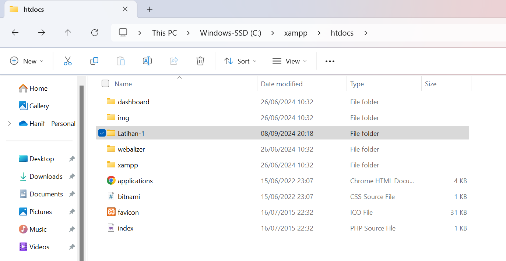

# Part 1 - Pengenalan PHP NATIVE

# Overview
Materi kita kali ini akan berfokus pada dasar-dasar dalam PHP, materi ini akan berisi strukur dasar yang akan menjadi fondasi untuk materi kedepannya.

# Instalasi
Untuk mempermudah materi, kita akan menggunakan XAMPP

1. Download XAMPP dari [Apache Friends](https://www.apachefriends.org/index.html)

<!-- Untuk pengguna linux(ubuntu) bisa menggunakan [Install XAMPP di Ubuntu 18.04](https://medium.com/@avinriyan/install-xampp-di-ubuntu-18-04-33661b62dad5) -->

2. Download Tools tambahan bernama [Visual Studio Code - Code Editing.](https://code.visualstudio.com/) untuk membantu kita dalam mengoding 

3. Install dan jalankan `Apache` serta `MySQL` dari XAMPP Control Panel.

# Membuat Projek PHP
Setelah XAMPP terinstal, buat folder di htdocs (lokasi default XAMPP untuk proyek web).



kita akan membuat folder bernama `Latihan-1`, dan didalam folder tersebut kita akan membuat file baru bernama `index.php`

# Struktur PHP
Sekarang kita akan masuk ke sintaks Dasar PHP

Contoh skrip PHP sederhana:

```php
<?php
echo "Hello, World!";
?>
```

Ini masih terlalu sederhana, mari kita tambahkan sedikit detail

```php

<?php
  $name = "Hanif"; // String
  $age = 12; // Integer
  $height = 1.65; // Float
  $isStudent = true; // Boolean
  $hobbies = ["Membaca", "Berenang", "Bermain bola"]; // Array
?>

<html>
    <head>
        <title>Hello World</title>
    </head>
    <body>
        <p>Halo, nama saya <?= $name ?></p>
        <p>Usia saya adalah <?php echo $age ?> tahun</p>
        <p>Tinggi saya adalah <?php echo $height ?> meter</p>
        <p>Saya adalah pelajar: <?php echo $isStudent ? 'Ya' : 'Tidak'; ?></p>
        <p>Hobi saya adalah:</p>
        <ul>
            <?php 
            foreach ($hobbies as $hobby) {
                echo "<li>$hobby</li>";
            }
            ?>
        </ul>
    </body>
</html>
```
Berikut hasilnya : 


Kesimpulan :
- Kita menggabungkan PHP dan HTML pada satu file
- `<?= ... ?>`: Ini adalah versi singkat dari `<?php echo ... ?>`, digunakan untuk langsung mencetak hasil ke dalam HTML. Jadi, `<?=` sama dengan `<?php echo.`
- Ternary Operator `(? :)` : Sama seperti sebelumnya, `?` memeriksa apakah kondisi benar atau salah, lalu memilih salah satu nilai:

Jika `$isStudent` bernilai true, akan mencetak "Ya".

Jika `$isStudent` bernilai false, akan mencetak "Tidak".

---
Author : Irza dan Hanif.