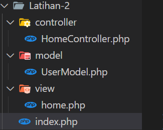

# part 2 - Pengenalan MVC Pada PHP
# Overview 
MVC (Model-View-Controller) adalah arsitektur perangkat lunak yang memisahkan aplikasi menjadi tiga komponen utama.

Mari kita pahami lebih lanjut peran dari setiap komponen.
- Model: Berisi logika bisnis, melakukan operasi pada data, misalnya CRUD (Create, Read, Update, Delete) dari database.

- View: Bertanggung jawab menampilkan informasi kepada pengguna. View hanya menangani tampilan, tanpa logika bisnis.

- Controller: Bertugas menerima input dari pengguna, mengirimkan ke Model untuk diproses, dan memutuskan data mana yang dikirim ke View untuk ditampilkan.

# Struktur MVC 
Perhatikan struktur pada folder `Latihan-2` 



Penjelasan
- Folder `controller` Akan berisi semua file controller.
- Folder `model` Berisi semua file model yang menghubungkan dengan database atau data lainnya.
- Folder `view` Berisi file view (HTML atau template file).
- Folder `Public` untuk file publik seperti index.php, asset CSS, JS, dan gambar.


# Membuat Controller
Controller bertugas memproses permintaan dari pengguna, menggunakan model untuk mengambil atau mengolah data, lalu memutuskan view mana yang akan ditampilkan.

#### Contoh `HomeController.php`:
```php
<?php
class HomeController {
    public function index() {
        // Menghubungi model untuk mendapatkan data
        $userModel = new UserModel();
        $users = $userModel->getUsers();

        // Mengirim data ke view untuk ditampilkan
        require_once "../Latihan-2/view/home.php";
    }
}
?>
```

# Membuat Model
Model berisi logika bisnis dan berinteraksi dengan database untuk mengambil, menyimpan, atau mengubah data.

#### Contoh `UserModel.php`:
```php
<?php
class UserModel {
    private $db;

    public function __construct() {
        // Koneksi ke database
        $this->db = new mysqli("localhost", "root", "", "mvc_php");
    }

    public function getUsers() {
        $result = $this->db->query("SELECT * FROM users");
        return $result->fetch_all(MYSQLI_ASSOC);
    }
}

?>
```

# Membuat View
View adalah file HTML yang digunakan untuk menampilkan data kepada pengguna.

#### Contoh `home.php`:
```php
<!DOCTYPE html>
<html lang="en">
<head>
    <meta charset="UTF-8">
    <meta name="viewport" content="width=device-width, initial-scale=1.0">
    <title>Home Page</title>
</head>
<body>
    <header>
        <h1>Welcome to the Home Page</h1>
    </header>
    <main>
        <h2>User List</h2>
        <ul>
            <?php foreach ($users as $user): ?>
                <li><?php echo $user['name']; ?></li>
            <?php endforeach; ?>
        </ul>
    </main>
    <footer>
        <p>&copy; 2024 Website MVC PHP</p>
    </footer>
</body>
</html>

```

# Routing dalam MVC PHP
Routing bertanggung jawab untuk menentukan URL mana yang akan memanggil Controller tertentu. Biasanya, file index.php di folder `/public` digunakan untuk menangani routing.

#### Contoh `index.php`:
```php
<<?php
require_once '../Latihan-2/controller/HomeController.php';
require_once '../Latihan-2/model/UserModel.php';

// Memeriksa URL yang diakses
$url = isset($_GET['url']) ? $_GET['url'] : 'home/index';
$url = explode('/', $url);

// Ambil controller dan method
$controllerName = ucfirst($url[0]) . 'Controller';
$methodName = $url[1];

// Membuat instance controller
$controller = new $controllerName();

// Memanggil method dari controller
$controller->$methodName();

?>
```

# Penjelasan
- UserModel.php adalah kelas yang mewakili model data pengguna, dengan properti id, name, dan email.
- UserController.php adalah kelas presenter yang menerima model dan view, dan bertanggung jawab untuk menghubungkan keduanya.
- user_view.php adalah kelas yang bertanggung jawab untuk menampilkan informasi pengguna.
- index.php adalah file utama yang menginisialisasi model, view, dan presenter, serta memanggil metode showUserInfo() dari presenter.
