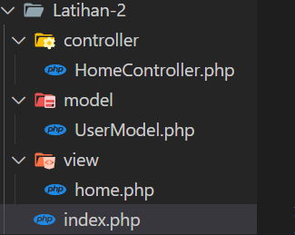

# Part 2 — Templating
# Overview
Templating adalah proses memisahkan kode logika dari tampilan (view) dalam aplikasi web. Tujuannya adalah untuk membuat kode lebih terstruktur, mudah dipelihara, dan meningkatkan kolaborasi antara pengembang dan desainer.

# Penggunaan Include/Require
Untuk memulai materi ini mari kita membuat beberapa file untuk pembelajaran kita

1. `header.php `
```php
<!DOCTYPE html>
<html lang="en">
<head>
    <meta charset="UTF-8">
    <meta name="viewport" content="width=device-width, initial-scale=1.0">
    <title>Website Templating</title>
</head>
<body>
    <header>
        <h1>Header Website</h1>
        <nav>
            <ul>
                <li><a href="index.php">Home</a></li>
                <li><a href="about.php">About</a></li>
                <li><a href="contact.php">Contact</a></li>
            </ul>
        </nav>
    </header>
```
pada file header akan berisi navigasi bar dan header/judul halaman web kita

2. `footer.php`
```php
<footer>
    <p>&copy; 2024 Website Templating. All rights reserved.</p>
</footer>
</body>
</html>
```
file footer akan menjadi bagian akhir pada halaman web kita

3. `index.php (konten utama)`
```php
<?php include 'header.php'; ?>
    <main>
        <h2>Welcome to our website!</h2>
        <p>Ini adalah konten utama halaman home.</p>
    </main>
<?php include 'footer.php'; ?>
```
dan yang terakhir file index akan menjadi halaman utama dan akan memanggil file header dan footer agar menjadi satu file

mari kita lihat hasilnya



memang masih sederhana tapi kamu sudah mengetahui dasar dari templating.
---
Author : Hanif.