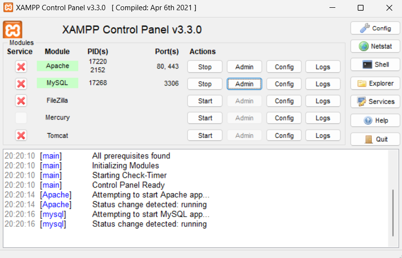
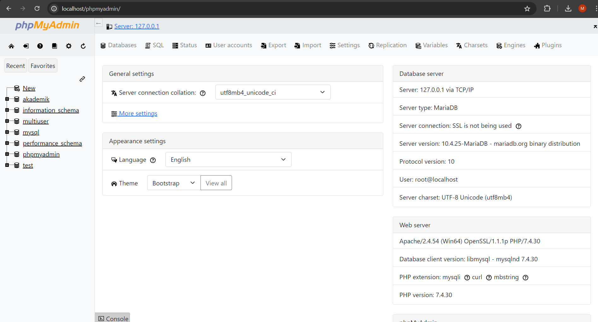
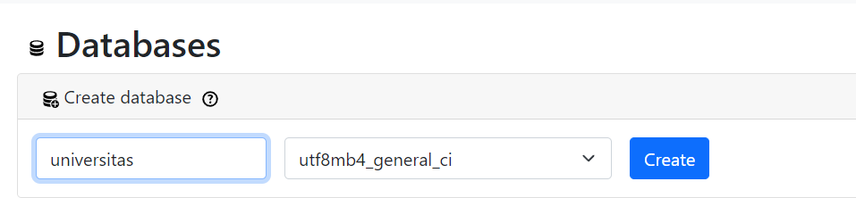
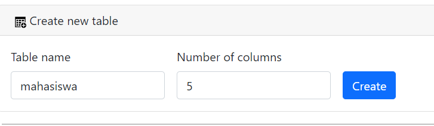
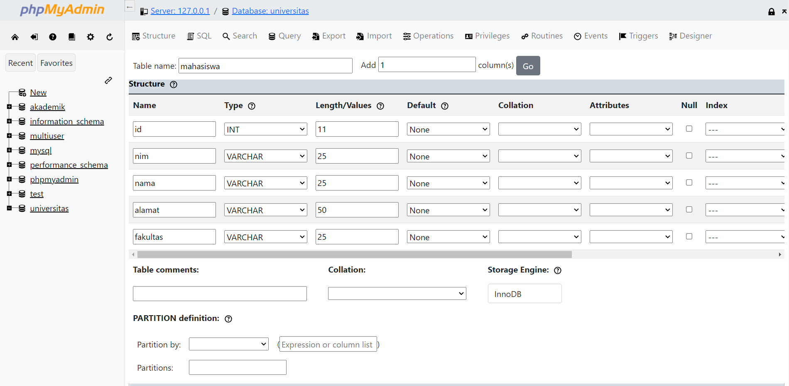
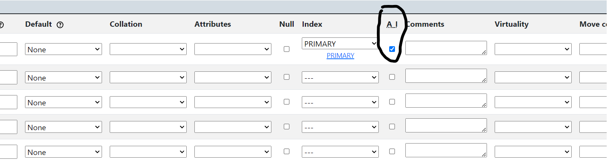
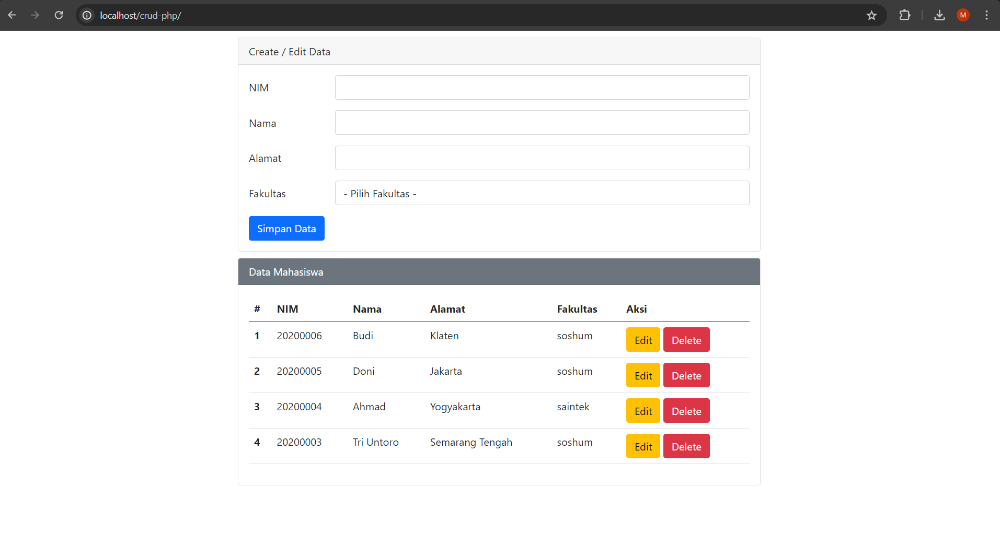

# Belajar CRUD di PHP!

Pernahkah kamu membayangkan bagaimana data di website disimpan, diubah, atau dihapus? Proses itu disebut CRUD, singkatan dari **Create, Read, Update, Delete**. CRUD adalah operasi dasar untuk mengelola data pada aplikasi web, termasuk yang dibuat dengan PHP. 

**Sebelum mulai, mari kita bahas beberapa hal penting:**

* **Database**: Bayangkan sebuah lemari besar tempat menyimpan data secara terstruktur. Di dalam database, data diatur dalam tabel-tabel, seperti laci-laci di lemari. Setiap tabel berisi data tentang satu jenis entitas, misalnya "mahasiswa" atau "buku".
* **PHP**: Bahasa pemrograman yang digunakan untuk membuat website dinamis. PHP akan "berbicara" dengan database untuk melakukan operasi CRUD.

**Siap belajar CRUD? Ayo kita buat aplikasi sederhana untuk mengelola data mahasiswa!**


**Penting!**

Sebelum memulai, untuk membuat database dengan PHP (phpmyadmin), kita perlu memiliki sebuah aplikasi bernama [XAMPP](https://www.apachefriends.org).


Jika sudah di unduh dan install, aktifkan XAMPP dengan menyalakan `Apache` dan `MySQL`.



Jika semua langkah pembuka di atas sudah dijalankan maka kamu sudah siap untuk memulai membuat programnya!

### Langkah 1: Membuat Database dan Tabel

Pertama, kita perlu membuat database dan tabel untuk menyimpan data mahasiswa. Kita akan menggunakan phpMyAdmin, alat yang mudah digunakan untuk mengelola database MySQL. 

1. **Buka phpMyAdmin:** Kamu bisa mengaksesnya melalui browser dengan mengetikkan "localhost/phpmyadmin".



2. **Buat Database Baru:**
    * Klik menu "Databases" di bagian atas.
    * Beri nama database-nya, misalnya "universitas", lalu klik tombol "Create".



3. **Buat Tabel:**
    * Setelah database "universitas" terbuat, klik namanya di daftar database.
    * Pada halaman baru, masukkan "mahasiswa" di kolom "Table name" dan "5" di kolom "Number of columns", lalu klik tombol "Go".



4. **Definisikan Kolom:**
    * Pada halaman selanjutnya, kita akan mendefinisikan kolom-kolom pada tabel "mahasiswa". Isi kolom-kolom seperti berikut:
    
        | Name | Type | Length/Values |
        |---|---|---|
        | id | INT | 11 |
        | nim | VARCHAR | 25 |
        | nama | VARCHAR | 25 |
        | alamat | VARCHAR | 50 |
        | fakultas | VARCHAR | 25 |

    * Pastikan "Index" pada kolom "id" di-set ke "Primary" dan dicentang "A_I" (Auto Increment). Ini akan menjadikan kolom "id" sebagai kunci utama yang unik dan bertambah otomatis.
    *  Klik tombol "Save" untuk menyimpan tabel.




Selamat! Kamu telah berhasil membuat database dan tabel untuk menyimpan data mahasiswa. 

### Langkah 2: Membuat File PHP

Sekarang kita akan membuat file PHP yang berisi kode untuk melakukan operasi CRUD. 

1. **Buat Folder Proyek:** Buat folder baru di dalam folder "htdocs" pada direktori instalasi XAMPP (biasanya `C:\xampp\htdocs`). Beri nama folder ini sesuai keinginanmu, misalnya "crud-php".
2. **Buat File `index.php`:** Di dalam folder "crud-php", buat file baru bernama "index.php". File ini akan menjadi halaman utama aplikasi kita.

### Langkah 3: Menulis Kode PHP

Buka file `index.php` yang telah kamu buat dan masukkan kode berikut:

```php
<?php
// Koneksi ke Database
$host       = "localhost:3306"; // Ganti dengan host dan port database kamu jika berbeda, untuk port ikuti yang ada di XAMPP.
$user       = "root"; // Ganti dengan username database kamu jika berbeda
$pass       = ""; // Ganti dengan password database Anda (default kosong)
$db         = "universitas"; // Ganti dengan nama database yang Anda buat

$koneksi    = mysqli_connect($host, $user, $pass, $db);
if (!$koneksi) { 
    die("Tidak bisa terkoneksi ke database: " . mysqli_connect_error());
} 
// Kode di atas mencoba menghubungkan ke database. 
// Jika gagal, pesan error akan ditampilkan.

// Inisialisasi Variabel
$nim        = ""; 
$nama       = ""; 
$alamat     = ""; 
$fakultas   = ""; 
$sukses     = ""; 
$error      = "";

// Variabel di atas diinisialisasi sebagai string kosong. 
// Nanti, variabel-variabel ini akan digunakan untuk menyimpan data mahasiswa. 
// Variabel $sukses dan $error akan digunakan untuk menampilkan pesan sukses atau error.

// Operasi CRUD
if (isset($_GET['op'])) { 
    $op = $_GET['op']; // Mengambil nilai 'op' dari URL
} else {
    $op = ""; // Jika tidak ada 'op', set variabel $op kosong.
}

// Blok kode ini akan menentukan operasi CRUD mana yang akan dijalankan berdasarkan nilai 'op' pada URL. 

// Delete Data
if($op == 'delete'){ 
    $id         = $_GET['id']; 
    $sql1       = "delete from mahasiswa where id = '$id'"; // Query untuk menghapus data berdasarkan 'id'
    $q1         = mysqli_query($koneksi,$sql1); // Menjalankan query delete

    if($q1){ 
        $sukses = "Berhasil hapus data"; // Pesan sukses jika data berhasil dihapus.
    }else{
        $error  = "Gagal melakukan delete data"; // Pesan error jika gagal menghapus data
    }
}

// Mengambil Data untuk Edit
if ($op == 'edit') { 
    $id         = $_GET['id']; // Mengambil 'id' dari URL
    $sql1       = "select * from mahasiswa where id = '$id'"; // Query untuk memilih data berdasarkan 'id'
    $q1         = mysqli_query($koneksi, $sql1); // Menjalankan query
    $r1         = mysqli_fetch_array($q1); // Mengambil data hasil query dan menyimpannya dalam array $r1

    // Mengisi variabel dengan data dari database
    $nim        = $r1['nim'];
    $nama       = $r1['nama'];
    $alamat     = $r1['alamat'];
    $fakultas   = $r1['fakultas'];

    if ($nim == '') { // Jika 'nim' kosong (data tidak ditemukan)
        $error = "Data tidak ditemukan";
    }
}

// Menyimpan Data (Create & Update)
if (isset($_POST['simpan'])) { // Memeriksa apakah tombol 'simpan' ditekan
    $nim        = $_POST['nim']; 
    $nama       = $_POST['nama']; 
    $alamat     = $_POST['alamat']; 
    $fakultas   = $_POST['fakultas'];

    // Mengambil data dari form dan menyimpannya ke dalam variabel.

    if ($nim && $nama && $alamat && $fakultas) { // Memastikan semua field terisi
        if ($op == 'edit') { // Jika 'op' adalah 'edit', lakukan update data
            $sql1       = "update mahasiswa set nim = '$nim',nama='$nama',alamat = '$alamat',fakultas='$fakultas' where id = '$id'";
            $q1         = mysqli_query($koneksi, $sql1); 

            if ($q1) {
                $sukses = "Data berhasil diupdate"; 
            } else {
                $error  = "Data gagal diupdate"; 
            }
        } else { // Jika 'op' bukan 'edit', lakukan insert data baru
            $sql1   = "insert into mahasiswa(nim,nama,alamat,fakultas) values ('$nim','$nama','$alamat','$fakultas')";
            $q1     = mysqli_query($koneksi, $sql1);

            if ($q1) {
                $sukses     = "Berhasil memasukkan data baru"; 
            } else {
                $error      = "Gagal memasukkan data"; 
            }
        }
    } else { 
        $error = "Silakan masukkan semua data"; 
    }
}
?> 
```

###  Langkah 4: Membuat Tampilan HTML

Sekarang tambahkan kode HTML di bawah kode PHP yang sudah di tulis:

```html
<!DOCTYPE html>
<html lang="en">
<head>
    <meta charset="UTF-8">
    <meta http-equiv="X-UA-Compatible" content="IE=edge">
    <meta name="viewport" content="width=device-width, initial-scale=1.0">
    <title>Data Mahasiswa</title>
    <link href="https://cdn.jsdelivr.net/npm/bootstrap@5.0.0-beta2/dist/css/bootstrap.min.css" rel="stylesheet" integrity="sha384-BmbxuPwQa2lc/FVzBcNJ7UAyJxM6wuqIj61tLrc4wSX0szH/Ev+nYRRuWlolflfl" crossorigin="anonymous">
    <style>
        .mx-auto {
            width: 800px
        }
        .card {
            margin-top: 10px;
        }
    </style>
</head>
<body>
    <div class="mx-auto">
        <!-- Form Input Data -->
        <div class="card">
            <div class="card-header">
                Create / Edit Data
            </div>
            <div class="card-body">
                <!-- Menampilkan pesan sukses atau error -->
                <?php
                if ($error) { 
                ?>
                    <div class="alert alert-danger" role="alert"> 
                        <?php echo $error ?> 
                    </div>
                <?php
                    header("refresh:5;url=index.php"); // Refresh halaman setelah 5 detik
                }
                ?>
                <?php
                if ($sukses) { 
                ?>
                    <div class="alert alert-success" role="alert"> 
                        <?php echo $sukses ?>
                    </div>
                <?php
                    header("refresh:5;url=index.php"); // Refresh halaman setelah 5 detik
                }
                ?>

                <!-- Form untuk input data mahasiswa -->
                <form action="" method="POST"> 
                    <div class="mb-3 row">
                        <label for="nim" class="col-sm-2 col-form-label">NIM</label>
                        <div class="col-sm-10">
                            <input type="text" class="form-control" id="nim" name="nim" value="<?php echo $nim ?>"> 
                        </div>
                    </div>
                    <div class="mb-3 row">
                        <label for="nama" class="col-sm-2 col-form-label">Nama</label>
                        <div class="col-sm-10">
                            <input type="text" class="form-control" id="nama" name="nama" value="<?php echo $nama ?>">
                        </div>
                    </div>
                    <div class="mb-3 row">
                        <label for="alamat" class="col-sm-2 col-form-label">Alamat</label>
                        <div class="col-sm-10">
                            <input type="text" class="form-control" id="alamat" name="alamat" value="<?php echo $alamat ?>">
                        </div>
                    </div>
                    <div class="mb-3 row">
                        <label for="fakultas" class="col-sm-2 col-form-label">Fakultas</label>
                        <div class="col-sm-10">
                            <select class="form-control" name="fakultas" id="fakultas">
                                <option value="">- Pilih Fakultas -</option>
                                <option value="saintek" <?php if ($fakultas == "saintek") echo "selected" ?>>saintek</option>
                                <option value="soshum" <?php if ($fakultas == "soshum") echo "selected" ?>>soshum</option>
                            </select>
                        </div>
                    </div>
                    <div class="col-12">
                        <input type="submit" name="simpan" value="Simpan Data" class="btn btn-primary" /> 
                    </div>
                </form>
            </div>
        </div>

        <!-- Tabel Data Mahasiswa -->
        <div class="card">
            <div class="card-header text-white bg-secondary">
                Data Mahasiswa
            </div>
            <div class="card-body">
                <table class="table">
                    <thead>
                        <tr>
                            <th scope="col">#</th>
                            <th scope="col">NIM</th>
                            <th scope="col">Nama</th>
                            <th scope="col">Alamat</th>
                            <th scope="col">Fakultas</th>
                            <th scope="col">Aksi</th> 
                        </tr>
                    </thead>
                    <tbody> 
                        <?php
                        $sql2   = "select * from mahasiswa order by id desc"; // Query untuk mengambil semua data mahasiswa
                        $q2     = mysqli_query($koneksi, $sql2); 
                        $urut   = 1; 

                        // Loop untuk menampilkan setiap data mahasiswa
                        while ($r2 = mysqli_fetch_array($q2)) { 
                            $id         = $r2['id'];
                            $nim        = $r2['nim'];
                            $nama       = $r2['nama'];
                            $alamat     = $r2['alamat'];
                            $fakultas   = $r2['fakultas'];

                        ?>
                            <tr>
                                <th scope="row"><?php echo $urut++ ?></th> 
                                <td scope="row"><?php echo $nim ?></td> 
                                <td scope="row"><?php echo $nama ?></td> 
                                <td scope="row"><?php echo $alamat ?></td> 
                                <td scope="row"><?php echo $fakultas ?></td>
                                <td scope="row">
                                    <a href="index.php?op=edit&id=<?php echo $id ?>"><button type="button" class="btn btn-warning">Edit</button></a> 
                                    <a href="index.php?op=delete&id=<?php echo $id?>" onclick="return confirm('Yakin mau delete data?')"><button type="button" class="btn btn-danger">Delete</button></a> 
                                </td>
                            </tr>
                        <?php
                        } 
                        ?>
                    </tbody>
                </table>
            </div>
        </div>
    </div>
</body>
</html>
```
### Langkah 5: Menjalankan Kode

1. Simpan file `index.php`.
2. Buka browser dan akses alamat "localhost/crud-php/". 



Sekarang kamu akan melihat tabel data mahasiswa dan form untuk menambah, mengedit, dan menghapus data!

Kamu bisa menambahkan, menghapus, ataupun mengupdate (edit) seluruh data yang ada pada tabel, dan nanti datanya akan tersimpan juga pada database.

**Selamat!** Kamu telah berhasil membuat aplikasi CRUD dengan PHP dan MySQL. Untuk tampilan, kamu bisa berkreasi lebih lagi dengan menggunakan [Bootstrap](https://getbootstrap.com/).
