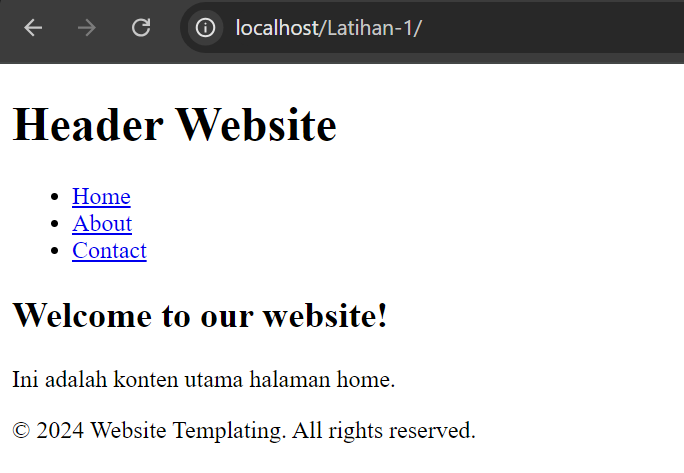

# part 3 - Pengenalan MVC Pada PHP
# Overview 
MVC (Model-View-Controller) adalah arsitektur perangkat lunak yang memisahkan aplikasi menjadi tiga komponen utama.

Mari kita pahami lebih lanjut peran dari setiap komponen.
- Model: Berisi logika bisnis, melakukan operasi pada data, misalnya CRUD (Create, Read, Update, Delete) dari database.

- View: Bertanggung jawab menampilkan informasi kepada pengguna. View hanya menangani tampilan, tanpa logika bisnis.

- Controller: Bertugas menerima input dari pengguna, mengirimkan ke Model untuk diproses, dan memutuskan data mana yang dikirim ke View untuk ditampilkan.

# projek MVC 
1. Siapkan folder baru bernama Latihan-2, dan tambahkan 3 folder untuk materi mvc kita: `controller`, `model`, dan `view`

2. Kemudian kita tambahkan file untuk masing-masing folder




3. `UserController.php`
```php
<?php
class UserPresenter
{
    private $model;
    private $view;

    public function __construct(UserModel $model, UserView $view)
    {
        $this->model = $model;
        $this->view = $view;
    }

    public function showUserInfo()
    {
        $this->view->displayUserInfo(
            $this->model->getId(),
            $this->model->getName(),
            $this->model->getEmail()
        );
    }
}
?>
```

4. `UserModel.php`
```php
<?php
class UserModel
{
    private $id;
    private $name;
    private $email;

    public function __construct($id, $name, $email)
    {
        $this->id = $id;
        $this->name = $name;
        $this->email = $email;
    }

    public function getId()
    {
        return $this->id;
    }

    public function getName()
    {
        return $this->name;
    }

    public function getEmail()
    {
        return $this->email;
    }
}

?>
```

5. `UserView.php`
```php
<?php
    class UserView
    {
        public function displayUserInfo($id, $name, $email)
        {
            echo "User ID: " . $id . "<br>";
            echo "Name: " . $name . "<br>";
            echo "Email: " . $email . "<br>";
        }
    }
?>
```

6. `index.php`
```php
<?php
require_once './model/UserModel.php';
require_once './controller/UserController.php';
require_once './view/UserView.php';

$user = new UserModel(1, 'John Doe', 'john.doe@example.com');
$userView = new UserView();
$userPresenter = new UserPresenter($user, $userView);

$userPresenter->showUserInfo();
?>
```

# Penjelasan
- UserModel.php adalah kelas yang mewakili model data pengguna, dengan properti id, name, dan email.
- UserController.php adalah kelas presenter yang menerima model dan view, dan bertanggung jawab untuk menghubungkan keduanya.
- user_view.php adalah kelas yang bertanggung jawab untuk menampilkan informasi pengguna.
- index.php adalah file utama yang menginisialisasi model, view, dan presenter, serta memanggil metode showUserInfo() dari presenter.
