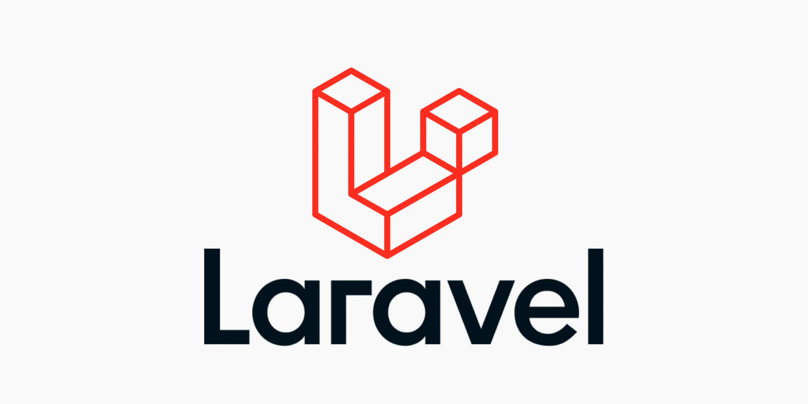
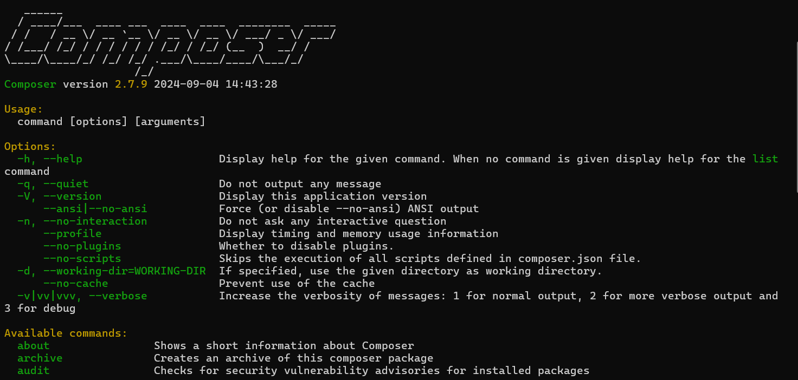
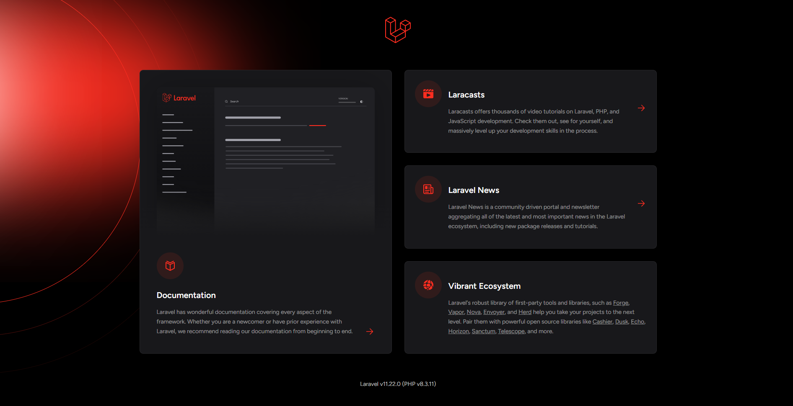
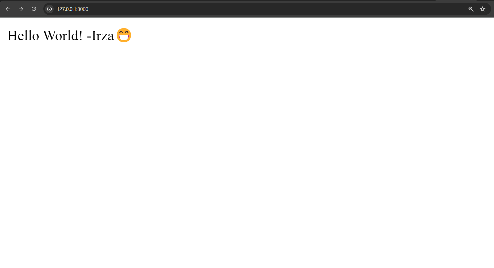

# 1 - Pengenalan Laravel: Apasih Laravel itu?

- [1. Apa sih Laravel itu?](#1-apa-sih-laravel-itu)
- [2. Persyaratan](#2-persyaratan)
- [3. Hello World Laravel](#3-hello-world-laravel)

Author: Muhammad Irza Arifin (@rifinsra_05)

---

**Pendahuluan**

Selamat datang di modul pembelajaran Laravel yang di susun oleh Tim Pendidikan Web Komandro! Modul ini dirancang untuk membawa Kamu dari nol hingga mahir dalam menggunakan Laravel, framework PHP yang populer dan powerful. Sebelum kita masuk ke dalam topik-topik yang lebih kompleks, mari kita mulai dengan pengenalan dasar tentang Laravel. Dalam bagian ini, kita akan menjelajahi apa itu Laravel, sejarahnya, dan mengapa Kamu harus memilihnya sebagai pilihan utama untuk pengembangan aplikasi web Kamu😁

### 1. Apa sih Laravel itu?



Laravel adalah framework PHP open-source yang dirancang untuk pengembangan aplikasi web modern dengan sintaks yang elegan dan ekspresif. Diciptakan oleh Taylor Otwell dan pertama kali dirilis pada Juni 2011, Laravel telah berkembang menjadi salah satu framework PHP paling populer di dunia, dikenal dengan kemudahan penggunaan, fitur yang kaya, dan skalabilitasnya.

**Sejarah dan Evolusi Laravel:**

- **Laravel 1 (Juni 2011):**  Versi awal Laravel yang masih sederhana, belum menyertakan fitur-fitur seperti ORM, routing yang fleksibel, dan sistem templating.
- **Laravel 2 (September 2011):** Memperkenalkan controller, sistem templating Blade, dan dukungan IoC (Inversion of Control).
- **Laravel 3 (Februari 2012):** Menambahkan fitur Artisan CLI, Eloquent ORM, sistem Bundles untuk modularitas, dan unit testing.
- **Laravel 4 (Mei 2013):** Mengadopsi Composer untuk manajemen dependensi, struktur folder yang lebih terorganisir, database migration, dan queue.
- **Laravel 5 (Februari 2015):** Pengenalan Scheduler untuk penjadwalan tugas, Elixir untuk manajemen aset, dan struktur direktori yang direvisi. 
- **Laravel 5.1 (Juni 2015):** Versi LTS (Long Term Support) pertama, memberikan dukungan bug fix selama 2 tahun dan pembaruan keamanan selama 3 tahun.
- **Laravel 5.5 (Agustus 2017):** Memperkenalkan fitur-fitur seperti package auto-discovery, pengecualian laporan yang lebih baik, dan peningkatan pada frontend scaffolding.
- **Laravel 6 (September 2019):**  Perubahan besar pada struktur front-end dengan penghapusan Vue.js sebagai default dan pengenalan Laravel UI.  
- **Laravel 7 (Maret 2020):** Menambahkan fitur seperti Blade component tags, HTTP Client, dan custom casting di Eloquent.
- **Laravel 8 (September 2020):** Memperkenalkan Laravel Jetstream, model factories kelas, migration squashing, dan peningkatan pada queue batching.
- **Laravel 9 (Februari 2022):**  Beralih ke minimum PHP v8.0, menggunakan Symfony Mailer,  Flysystem 3.0, dan peningkatan pada routes:list CLI output.
- **Laravel 10 (Februari 2023):** Memperkenalkan Laravel Pennant untuk feature flagging, proses scaffolding yang disederhanakan, native type declarations, dan peningkatan performa.
- **Laravel 11 (Q2 2023):** Laravel 11 memperkenalkan beberapa perubahan penting seperti struktur aplikasi minimal yang lebih sederhana, di mana beberapa komponen default seperti kernel HTTP dan Console dihapus untuk membuat aplikasi lebih ringan. Fitur lain yang diperkenalkan termasuk Laravel Reverb untuk komunikasi WebSocket real-time yang cepat dan skalabel, serta penggunaan SQLite sebagai basis data default. Laravel 11 juga memperkenalkan rotasi kunci enkripsi yang lebih halus untuk menjaga sesi pengguna tetap berjalan meskipun kunci enkripsi dirotasi​

**Keunggulan Laravel:**

Laravel menjadi populer karena berbagai keunggulan yang ditawarkannya, antara lain:

- **Sintaks yang Elegan:** Laravel memiliki sintaks yang mudah dibaca dan dipahami, sehingga memudahkan pengembang dalam menulis kode yang bersih dan terstruktur.
- **Fitur yang Kaya:** Laravel menyediakan berbagai fitur built-in seperti routing, templating, ORM, authentication, authorization, queue, dan banyak lagi, yang mempercepat proses pengembangan.
- **Eloquent ORM:** Eloquent ORM memungkinkan interaksi dengan database yang mudah dan intuitif. Pengembang dapat melakukan query database dengan menggunakan sintaks PHP yang elegan, tanpa perlu menulis query SQL secara manual.
- **Artisan CLI:** Laravel menyediakan command-line interface (CLI) yang disebut Artisan yang membantu dalam otomatisasi berbagai tugas seperti pembuatan controller, model, migration, dan seeder.
- **Komunitas yang Besar dan Aktif:** Laravel memiliki komunitas yang besar dan aktif yang menyediakan banyak dukungan, tutorial, dan package.
- **Keamanan:** Laravel menyediakan berbagai fitur keamanan bawaan seperti proteksi CSRF, validasi input, dan enkripsi password, yang membantu melindungi aplikasi dari serangan.
- **Skalabilitas:** Laravel dirancang untuk dapat di-scale dengan mudah, sehingga dapat menangani beban trafik yang tinggi.

### 2. Persyaratan

Sebelum memulai, Kamu perlu memastikan bahwa Kamu telah memenuhi persyaratan berikut:

- **PHP:** Laravel 10 membutuhkan minimal PHP v8.0. ([Download disini](https://www.php.net/downloads.php))
- **Composer:** Composer adalah dependency manager untuk PHP yang digunakan untuk menginstal Laravel dan package-package yang dibutuhkan. ([Download disini](https://getcomposer.org/download/))
- **Web Server:** Kamu membutuhkan web server seperti Apache atau Nginx untuk menjalankan aplikasi Laravel.
- **Database:** Laravel mendukung berbagai database seperti MySQL, PostgreSQL, SQLite, dan SQL Server.

**Instalasi Composer:**

1. **Download Composer:** Unduh Composer dari situs resminya ([Download disini](https://getcomposer.org/download/)). Simpan file "composer.phar" ke direktori yang diinginkan.
2. **Tambahkan Composer ke PATH:** Tambahkan direktori tempat file "composer.phar" disimpan ke variabel lingkungan PATH. Ini memungkinkan kamu untuk menjalankan Composer dari direktori mana pun tanpa harus mengetikkan path lengkap ke file "composer.phar". 

   **Cara menambahkan Composer ke PATH:**

   - **Windows:**
     1. Cari "Edit the system environment variables" di menu Start.
     2. Klik "Environment Variables...".
     3. Di bagian "System variables", cari variabel bernama "Path". Jika sudah ada, pilih dan klik "Edit...". Jika belum ada, klik "New...".
     4. Di jendela "Edit environment variable" (atau "New system variable"), klik "New" dan tambahkan path ke direktori tempat "composer.phar" berada. Misalnya: `C:\path\to\composer`.
     5. Klik "OK" pada semua jendela yang terbuka.

   - **macOS/Linux:**
        1. Buka aplikasi Terminal.
        2. Temukan Lokasi File `composer.phar`:  Biasanya, file ini terletak di direktori `/usr/local/bin` atau di direktori `$HOME/.composer/vendor/bin`.
        3. Edit File `.bashrc` atau `.zshrc`:
            * Gunakan editor teks untuk membuka file `.bashrc` atau `.zshrc` di direktori home Anda:
            ```bash
            nano ~/.bashrc 
            ```
             Atau:
             ```bash
             nano ~/.zshrc
             ```
        4. Tambahkan Baris Berikut ke Akhir File:
            ```bash
            export PATH="$HOME/.composer/vendor/bin:$PATH"
            ```
            Ganti `/usr/local/bin` jika `composer.phar` berada di direktori yang berbeda.
        5. Simpan dan Tutup File: Tekan `Ctrl + X`, lalu `Y`, lalu `Enter` untuk menyimpan dan menutup file.
        6. Muat Ulang Konfigurasi Shell: Jalankan perintah berikut di Terminal:
            ```bash
            source ~/.bashrc
            ```
            Atau:
            ```bash
            source ~/.zshrc
            ```

3. **Verifikasi Instalasi:** Buka command prompt atau terminal dan jalankan perintah berikut untuk memastikan Composer telah terinstal dengan benar:
    ```bash
    composer --version
    ```
    Jika Composer telah terinstal dengan benar, versi Composer akan ditampilkan seperti berikut

    

>Kamu juga dapat menginstal Composer menggunakan Windows Installer jika kamu menggunakan sistem operasi Windows.

**Instalasi Laravel:**

Berikut adalah panduan instalasi Laravel di berbagai sistem operasi:

**Windows:**

1. **Instalasi XAMPP:**  Download dan instal XAMPP yang sudah menyertakan PHP, Apache, dan MySQL.

2. **Instalasi Composer:** Download dan instal Composer dari situs resminya. Pastikan Composer telah ditambahkan ke PATH environment variable agar dapat diakses dari command prompt.

3. **Instalasi Laravel:** Buka command prompt dan jalankan perintah berikut:
   ```bash
   composer global require laravel/installer
   laravel new nama_project
   ```
    *Jangan lupa ganti "nama_project" dengan nama project Kamu.*

4. **Jalankan Aplikasi:**  Navigasi ke direktori project melalui command prompt dan jalankan perintah:
   ```bash
   php artisan serve 
   ```
   Buka browser dan akses `http://localhost:8000` untuk melihat aplikasi Laravel Kamu.

**macOS:**

1. **Instalasi Homebrew:** Jika belum terinstall, install Homebrew dengan mengikuti instruksi di situs resminya.

2. **Instalasi PHP dan Composer:**
   ```bash
   brew install php
   brew install composer
   ```

3. **Instalasi Laravel:**
   ```bash
   composer global require laravel/installer
   laravel new nama_project
   ```
   *Jangan lupa ganti "nama_project" dengan nama project Kamu.*

4. **Jalankan Aplikasi:**
   ```bash
   cd nama_project
   php artisan serve
   ```

**Linux (Ubuntu):**

1. **Instalasi PHP dan Composer:**
   ```bash
   sudo apt update
   sudo apt install php php-mbstring php-xml php-zip php-gd php-curl php-mysql
   sudo apt install composer
   ```

2. **Instalasi Laravel:**
   ```bash
   composer global require laravel/installer
   laravel new nama_project
   ```
   *Jangan lupa ganti "nama_project" dengan nama project Kamu.*

3. **Jalankan Aplikasi:**
   ```bash
   cd nama_project
   php artisan serve
   ```

>**Troubleshooting:**
>
>- **PHP versi tidak sesuai:** Pastikan PHP versi yang terinstall sesuai dengan persyaratan Laravel. 
>- **Composer tidak terinstall dengan benar:** Periksa apakah Composer telah ditambahkan ke PATH environment variable.
>- **Error saat menjalankan `php artisan serve`:** Pastikan port 8000 tidak digunakan oleh aplikasi lain. 
>- **Updating dependencies Your requirements could not be resolved to an installable set of packages:** Ketika muncul seperti ini, coba untuk `Aktifkan Ekstensi fileinfo di PHP` dengan cara menambahkan `extension=php_fileinfo.dll` di file `php.ini` yang terletak di direktori PHP

Ketika sukses maka akan muncul seperti ini



### 3. Hello World Laravel

Mari kita buat aplikasi Laravel sederhana untuk menampilkan "Hello World!".

1. **Buat Project Baru:** Jika belum, buat project Laravel baru dengan perintah `laravel new hello-world`.
2. **Buka File `routes/web.php`:** File ini berisi definisi route untuk aplikasi Kamu.
3. **Tambahkan Route Baru:** 
   ```php
   Route::get('/', function () {
       return 'Hello World!';
   });
   ```
   Kode ini mendefinisikan route `/` yang akan menampilkan "Hello World!" ketika diakses.
4. **Jalankan Aplikasi:**  Jalankan `php artisan serve` dan buka browser di `http://localhost:8000`. Kamu akan melihat "Hello World!" ditampilkan.

**Penjelasan Kode:**

- `Route::get('/', ...)`: Mendefinisikan route GET untuk URL `/`.
- `function () { ... }`: Closure atau anonymous function yang akan dijalankan ketika route diakses.
- `return 'Hello World!';`: Mengembalikan string "Hello World!" yang akan ditampilkan di browser.



**Kesimpulan:**

Pada bagian ini, kita telah membahas pengenalan Laravel, persyaratan instalasi, dan cara membuat aplikasi "Hello World!" sederhana. 

**Langkah Selanjutnya:**

Pada bagian selanjutnya, kita akan membahas konsep dasar Laravel yang lebih mendalam, seperti struktur folder, routing, controller, dan views. 

---
_(Bersambung ke Bagian 2: Konsep Dasar Laravel)_