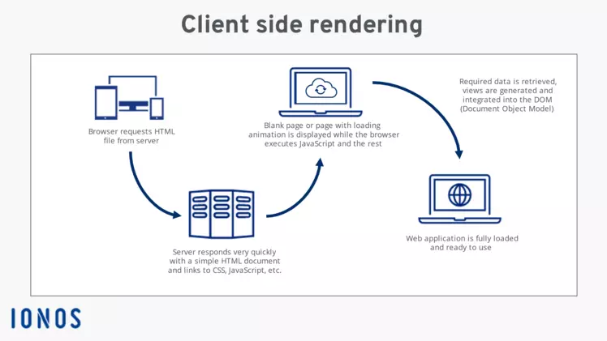
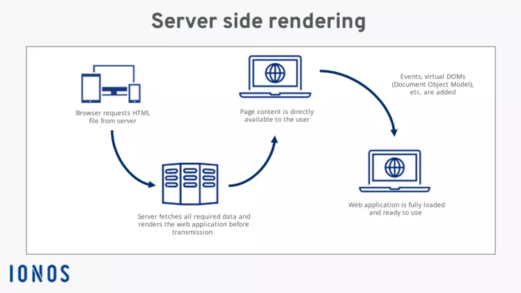

# Panduan Dasar Untuk PHP

## Pengenalan PHP

PHP, singkatan dari Hypertext Preprocessor, merupakan bahasa pemrograman yang dirancang khusus untuk pengembangan web. Bersifat _server-side_, PHP dieksekusi di komputer server, bukan di komputer client (seperti browser pengguna).  Bayangkan seperti ini: ketika kita mengakses situs web, browser kita mengirimkan permintaan ke server. Server kemudian menjalankan kode PHP dan mengirimkan hasilnya kembali ke browser, yang kemudian menampilkannya kepada kita.

### Client Side

### Server Side


PHP berperan penting dalam membangun situs web dinamis dan interaktif. Situs-situs populer seperti WordPress, Joomla, Facebook, Twitter, dan Wikipedia dibangun menggunakan PHP. 

### Fungsi atau Kegunaan PHP

Untuk memahami fungsi PHP, mari kita gunakan analogi membangun rumah. 

* **HTML:**  Ibarat struktur dasar rumah: tiang, atap, dinding, dan lantai. HTML menentukan konten dan struktur dasar situs web.
* **CSS:** Seperti cat, dekorasi, dan desain interior. CSS membuat rumah (situs web) terlihat menarik dan nyaman.
* **PHP:**  Seperti sistem keamanan, kunci, dan akses kontrol. PHP menentukan bagaimana situs web berinteraksi dengan pengguna, memproses data, dan mengatur akses ke berbagai bagian situs web. 

PHP memungkinkan kita untuk:

* **Membuat situs web dinamis:**  Konten situs web dapat berubah berdasarkan input pengguna, waktu, atau faktor lainnya.
* **Memproses data formulir:** Mengumpulkan data dari pengguna, memvalidasinya, dan menyimpannya di database.
* **Berinteraksi dengan database:** Menyimpan, mengambil, memperbarui, dan menghapus informasi dari database.
* **Mengelola sesi dan cookies:** Melacak pengguna yang masuk, menyimpan preferensi pengguna, dan menyesuaikan pengalaman pengguna.
* **Membangun aplikasi web yang kompleks:** Dari situs web e-commerce hingga sistem manajemen konten yang canggih.

Menarik bukan? Nah berikutnya mari kita belajar mengenai penulisan Syntax PHP.

### Penulisan Syntax PHP

Kode PHP ditulis di dalam tag pembuka `<?php` dan tag penutup `?>`. Kode ini dapat disisipkan di antara kode HTML. Setiap baris kode PHP diakhiri dengan tanda titik koma (`;`).

Berikut contoh penulisan syntax PHP yang benar:

```php
<?php
echo "Belajar PHP dasar";
?>
```

Penjelasan code contoh di atas:

* `<?php` : Tag pembuka yang menandakan dimulainya blok kode PHP.
* `echo "Belajar PHP dasar";`: Perintah `echo` digunakan untuk menampilkan teks "Belajar PHP dasar" di halaman web. 
* `?>`: Tag penutup yang menandakan berakhirnya blok kode PHP.
* `;`: Titik koma digunakan untuk mengakhiri setiap baris kode PHP.

Output dari kode PHP di atas adalah tulisan "Belajar PHP dasar" yang ditampilkan di halaman web. 

## Instalasi PHP

Berikut ini panduan instalasi PHP untuk Windows, MacOS, dan Linux, baik menggunakan XAMPP maupun cara lainnya:

**A. Instalasi PHP Menggunakan XAMPP**

XAMPP adalah paket perangkat lunak open-source yang berisi Apache, MySQL, PHP, dan Perl. Cara ini adalah yang paling mudah untuk menginstal PHP, terutama bagi pemula.

**1. Windows**

* Unduh installer XAMPP dari website resmi Apache Friends: [https://www.apachefriends.org/index.html](https://www.apachefriends.org/index.html)
* Jalankan installer dan ikuti instruksi yang diberikan.
* Pada pilihan komponen, pastikan Anda memilih Apache, MySQL, dan PHP.
* Setelah instalasi selesai, buka XAMPP Control Panel dan jalankan Apache dan MySQL.
* Buka browser dan kunjungi `http://localhost/` untuk memastikan XAMPP berjalan dengan baik.

**2. MacOS**

* Unduh installer XAMPP dari website resmi Apache Friends.
* Buka file DMG yang diunduh dan seret ikon XAMPP ke folder Applications.
* Buka folder Applications dan jalankan XAMPP.
* Pada XAMPP Control Panel, klik tombol "Start" untuk Apache dan MySQL.
* Buka browser dan kunjungi `http://localhost/` untuk memastikan XAMPP berjalan dengan baik.

**3. Linux**

* Buka terminal dan jalankan perintah berikut untuk mengunduh XAMPP:
  ```bash
  wget https://www.apachefriends.org/xampp-files/8.1.6/xampp-linux-x64-8.1.6-0-installer.run
  ```
* Ubah permission file installer menjadi executable:
  ```bash
  chmod +x xampp-linux-x64-8.1.6-0-installer.run
  ```
* Jalankan installer dengan perintah:
  ```bash
  sudo ./xampp-linux-x64-8.1.6-0-installer.run
  ```
* Ikuti instruksi yang diberikan selama proses instalasi.
* Setelah instalasi selesai, buka terminal dan jalankan perintah berikut untuk memulai XAMPP:
  ```bash
  sudo /opt/lampp/lampp start
  ```
* Buka browser dan kunjungi `http://localhost/` untuk memastikan XAMPP berjalan dengan baik.

**B. Instalasi PHP Manual (Tanpa XAMPP)**

Ketika menggunakan metode ini kita dapat mengatur sendiri penginstallan secara bebas, tetapi lebih disarankan untuk orang yang sudah lebih paham mengenai PHP.

**1. Windows**

* Unduh file PHP dari website resmi PHP: [https://www.php.net/downloads.php](https://www.php.net/downloads.php)
* Ekstrak file ZIP ke direktori yang Anda inginkan (misalnya `C:\php`).
* Buka Control Panel > System > Advanced System Settings > Environment Variables.
* Pada "System variables", cari variabel "Path" dan klik "Edit".
* Tambahkan path direktori PHP (misalnya `C:\php`) ke nilai variabel Path.
* Unduh dan instal web server seperti Apache atau Nginx.
* Konfigurasi web server untuk menggunakan PHP dengan mengikuti panduan konfigurasi di website resmi web server.

**2. MacOS**

* MacOS sudah memiliki PHP terinstal secara default. Anda dapat memeriksa versinya dengan membuka terminal dan menjalankan perintah `php -v`.
* Jika Anda ingin menginstal versi PHP yang berbeda, Anda dapat menggunakan package manager Homebrew. 
* Install Homebrew jika belum terinstall: `/bin/bash -c "$(curl -fsSL https://raw.githubusercontent.com/Homebrew/install/HEAD/install.sh)"`
* Setelah Homebrew terinstal, jalankan perintah `brew install php` untuk menginstal PHP.

**3. Linux**

* Sebagian besar distribusi Linux sudah memiliki PHP terinstal secara default. Anda dapat memeriksa versinya dengan membuka terminal dan menjalankan perintah `php -v`.
* Anda dapat menginstal PHP menggunakan package manager distribusi Linux Anda.
* Contoh untuk Ubuntu/Debian: 
    ```bash
    sudo apt update
    sudo apt install php
    ```
* Contoh untuk Fedora/CentOS:
    ```bash
    sudo dnf update
    sudo dnf install php
    ```

**Penting!!!**

*  Setelah menginstal PHP secara manual, kita perlu mengkonfigurasi web server kita sendiri untuk menggunakan PHP. 
* Panduan konfigurasi dapat ditemukan di website resmi web server yang digunakan.
*  Pastikan untuk memilih versi PHP yang sesuai dengan kebutuhan dan sistem operasi.

Oleh karena itulah di awal disebutkan bahwa cara ini lebih di sarankan untuk seseorang yang lebih paham.

## Variabel PHP: Menyimpan dan Mengolah Informasi

Dalam pemrograman, variabel berfungsi sebagai wadah untuk menyimpan informasi. Bayangkan seperti kotak yang dapat diberi label dan diisi dengan berbagai macam barang. Di dalam PHP, variabel memungkinkan kita untuk menyimpan data, seperti angka, teks, atau bahkan data yang lebih kompleks, untuk kemudian digunakan dan dimanipulasi dalam program kita. 

### Mendeklarasikan Variabel

Mendeklarasikan variabel di PHP sangatlah mudah. Setiap variabel di PHP diawali dengan simbol dolar ($) diikuti dengan nama variabel.  Tidak seperti beberapa bahasa pemrograman lain, PHP tidak memerlukan deklarasi tipe data secara eksplisit. Tipe data variabel akan ditentukan secara otomatis berdasarkan nilai yang diberikan.

Contoh deklarasi variabel:

```php
<?php
  $nama = "Budi";
  $umur = 25;
  $tinggi_badan = 175.5;
  $sudah_menikah = false;
?>
```

Pada contoh diatas, kita telah mendeklarasikan empat variabel:

* `$nama`: Menyimpan data teks (string) dengan nilai "Budi".
* `$umur`: Menyimpan data angka bulat (integer) dengan nilai 25.
* `$tinggi_badan`: Menyimpan data angka desimal (float) dengan nilai 175.5.
* `$sudah_menikah`: Menyimpan data boolean dengan nilai false.


### Menggunakan Variabel

Setelah variabel dideklarasikan, kita dapat menggunakannya dalam berbagai operasi, seperti menampilkan nilainya, menggabungkannya dengan teks lain, atau menggunakannya dalam perhitungan.

Contoh penggunaan variabel:

```php
<?php
  $nama = "Budi";
  $umur = 25;

  echo "Halo, nama saya " . $nama . ". Umur saya " . $umur . " tahun."; 
?>
```

Kode diatas akan menampilkan teks: "Halo, nama saya Budi. Umur saya 25 tahun."

### Tipe Data pada PHP

PHP mendukung berbagai tipe data yang dapat disimpan dalam variabel. Berikut adalah beberapa tipe data yang umum digunakan:

1. **String:**  Data tekstual, seperti nama, kalimat, atau paragraf. String diapit oleh tanda kutip tunggal (') atau tanda kutip ganda (").

    ```php
    $nama = 'Ani';
    $pesan = "Selamat datang!";
    ```

2. **Integer:** Bilangan bulat, seperti 10, 25, atau -5.

    ```php
    $jumlah_barang = 100;
    $tahun_lahir = 1998;
    ```

3. **Float:** Bilangan desimal, seperti 3.14, 2.7, atau -1.5.

    ```php
    $berat = 60.5;
    $suhu = 25.8;
    ```

4. **Boolean:** Nilai kebenaran, yaitu `true` atau `false`. Boolean sering digunakan untuk pengambilan keputusan dalam program.

    ```php
    $is_active = true;
    $is_admin = false;
    ```

5. **Array:**  Struktur data yang dapat menyimpan banyak nilai dalam satu variabel.

    ```php
    $buah = array("Apel", "Jeruk", "Mangga");
    ```

6. **Object:**  Struktur data yang lebih kompleks, mewakili objek dalam pemrograman berorientasi objek.

### Penamaan Variabel

Berikut aturan penamaan variabel di PHP:

* Nama variabel harus diawali dengan simbol dolar ($).
* Nama variabel hanya boleh berisi huruf, angka, dan garis bawah (_).
* Nama variabel tidak boleh diawali dengan angka.
* Nama variabel bersifat case-sensitive, artinya `$nama` berbeda dengan `$Nama`.
* Sebaiknya gunakan nama variabel yang deskriptif dan mudah dipahami.

Menguasai penggunaan variabel adalah langkah penting dalam belajar PHP.  Pemahaman yang baik tentang tipe data dan bagaimana menggunakan variabel dalam berbagai operasi akan membuka jalan untuk membangun program yang lebih kompleks dan dinamis.


## Array: Mengelola Kumpulan Data

Bayangkan Anda memiliki daftar belanjaan. Dari pada menulis setiap item pada baris terpisah, kita dapat mengelompokkannya dalam satu wadah, yaitu daftar belanjaan. Di dunia pemrograman, wadah ini disebut _array_.

Array adalah struktur data yang memungkinkan Anda untuk menyimpan beberapa nilai dalam satu variabel. Nilai-nilai ini dapat berupa tipe data apapun, seperti string, integer, boolean, bahkan array lain.

### Membuat Array

Ada dua cara umum untuk membuat array di PHP:

1. **Menggunakan fungsi `array()`:**

    ```php
    $buah = array("Apel", "Jeruk", "Mangga");
    $harga = array(10000, 15000, 20000);
    ```

2. **Menggunakan sintaks singkat:**

    ```php
    $buah = ["Apel", "Jeruk", "Mangga"];
    $harga = [10000, 15000, 20000];
    ```

### Mengakses Elemen Array

Setiap elemen dalam array memiliki _index_ yang menunjukkan posisinya. Index array di PHP dimulai dari 0. Untuk mengakses elemen array, gunakan nama variabel array diikuti index elemen dalam tanda kurung siku (`[]`).

```php
$buah = ["Apel", "Jeruk", "Mangga"];

echo $buah[0]; // Output: Apel
echo $buah[1]; // Output: Jeruk
echo $buah[2]; // Output: Mangga
```

### Array Asosiatif

Selain array dengan index numerik, PHP juga mendukung _array asosiatif_. Array asosiatif menggunakan _key_ berupa string untuk mengakses elemennya. 

```php
$nilai = [
  "Matematika" => 80,
  "Fisika" => 90,
  "Kimia" => 75
];

echo $nilai["Matematika"]; // Output: 80
echo $nilai["Fisika"];  // Output: 90
```

## If Else: Pengambilan Keputusan (Kondisional)

Seperti dalam kehidupan nyata, program seringkali perlu membuat keputusan berdasarkan kondisi tertentu. Di sinilah pernyataan `if else` berperan. 

Pernyataan `if else` memungkinkan program untuk mengeksekusi blok kode tertentu hanya jika suatu kondisi terpenuhi. 

### Struktur `if else`

```php
if (kondisi) {
  // Kode yang akan dieksekusi jika kondisi bernilai true
} else {
  // Kode yang akan dieksekusi jika kondisi bernilai false
}
```

Anda juga dapat menambahkan blok `elseif` untuk menguji beberapa kondisi:

```php
if (kondisi1) {
  // Kode yang akan dieksekusi jika kondisi1 bernilai true
} elseif (kondisi2) {
  // Kode yang akan dieksekusi jika kondisi2 bernilai true
} else {
  // Kode yang akan dieksekusi jika semua kondisi bernilai false
}
```

### Operator Perbandingan

Untuk mengevaluasi kondisi, `if else` menggunakan operator perbandingan:

* `==`: Sama dengan
* `!=`: Tidak sama dengan
* `>` : Lebih besar dari
* `<` : Lebih kecil dari
* `>=`: Lebih besar dari atau sama dengan
* `<=`: Lebih kecil dari atau sama dengan

### Contoh Penggunaan `if else`

1. **Memeriksa apakah suatu angka genap atau ganjil:**

    ```php
    $angka = 10;

    if ($angka % 2 == 0) {
        echo "Angka genap";
    } else {
        echo "Angka ganjil";
    }
    ```

2. **Menentukan grade berdasarkan nilai:**

    ```php
    $nilai = 85;

    if ($nilai >= 90) {
        $grade = "A";
    } elseif ($nilai >= 80) {
        $grade = "B";
    } elseif ($nilai >= 70) {
        $grade = "C";
    } else {
        $grade = "D";
    }

    echo "Grade: " . $grade;
    ```

3. **Memeriksa apakah suatu string kosong:**

    ```php
    $nama = "";

    if (empty($nama)) {
        echo "Nama tidak boleh kosong";
    } else {
        echo "Halo, " . $nama;
    }
    ```

## Contoh Kasus: Menggabungkan Array dan If Else

**Kasus:**  Anto memiliki array berisi data siswa dan ingin menampilkan siswa yang lulus dengan nilai rata-rata di atas 75.

```php
$siswa = [
    ["nama" => "Andi", "nilai" => [80, 85, 90]],
    ["nama" => "Budi", "nilai" => [70, 75, 80]],
    ["nama" => "Cindy", "nilai" => [90, 95, 85]]
];

foreach ($siswa as $s) {
    $total_nilai = array_sum($s["nilai"]);
    $rata_rata = $total_nilai / count($s["nilai"]);

    if ($rata_rata > 75) {
        echo $s["nama"] . " lulus dengan rata-rata " . $rata_rata . "<br>";
    }
}
```

Pada contoh ini, kita menggunakan `foreach` untuk mengakses setiap elemen array `$siswa`. Kemudian, kita menghitung rata-rata nilai setiap siswa menggunakan `array_sum` dan `count`.  Terakhir, kita menggunakan `if` untuk menampilkan siswa yang lulus dengan rata-rata di atas 75.

## **While**

Loop `while` adalah struktur kontrol yang memungkinkan Anda untuk mengeksekusi blok kode selama suatu kondisi tertentu benar `true`. Loop ini berguna ketika Anda tidak tahu sebelumnya berapa kali kode harus dieksekusi dan bergantung pada kondisi yang dievaluasi selama eksekusi.

perhatikan contoh berikut

```php
<?php
$i = 1;

while ($i <= 5) {
    echo $i . " ";
    $i++;
}
?>
```

Perintah `while` di gunakan untuk melakukan perulangan, variabel x memiliki nilai 1. kemudian pada kondisi `while` kita memberikan nilai variabel x lebih kecil dan sama dengan 5. jadi hasil yang muncul adalah 1 sampai 5. perintah `++` pada variabel x untuk memberitahukan perulangan untuk melakukan perulangan terus menerus sampil menambah nilai awal variabel x secara terus menerus.

## **Switch Case**

Perintah `Switch` di gunakan untuk memeriksa kebenaran suatu nilai dengan memiliki banyak pemilihan atau nilai pengecekannya. Ini mirip dengan `if-else`, namun lebih mudah dibaca dan ringkas ketika Anda memiliki beberapa kondisi untuk diperiksa terhadap satu nilai.

Berikut adalah contoh sintaks dasar dari pernyataan switch dalam PHP:

```PHP
<?php
$day = "Tuesday";

switch ($day) {
    case "Monday":
        echo "Today is Monday.";
        break;
    case "Tuesday":
        echo "Today is Tuesday.";
        break;
    case "Wednesday":
        echo "Today is Wednesday.";
        break;
    case "Thursday":
        echo "Today is Thursday.";
        break;
    case "Friday":
        echo "Today is Friday.";
        break;
    case "Saturday":
        echo "Today is Saturday.";
        break;
    case "Sunday":
        echo "Today is Sunday.";
        break;
    default:
        echo "Invalid day.";
}
?>

```

Variabel `$day` dievaluasi dalam pernyataan `switch`, kode akan memeriksa setiap kasus untuk menemukan kecocokan. Ketika `$day` sama dengan “Tuesday”, blok yang sesuai akan dieksekusi, dan "Today is Tuesday." akan dicetak. Pernyataan `break` menghentikan perbandingan lebih lanjut dan keluar dari blok `switch`.

## **Function**

Dalam PHP, `Function` adalah blok kode yang dapat dipanggil berulang kali dalam skrip. `Function` membantu mengatur dan memodulasi kode Anda, membuatnya lebih mudah dibaca dan digunakan kembali.

Agar lebih jelas perhatikan contoh Function berikut:

```php
    <?php
    function hallo($nama = "Teman") {
        return "Hallo, $nama!";
    }

    echo hallo("Alice"); // Outputs: Hallo, Alice!
    echo hallo();        // Outputs: Hallo, Teman!
    ?>
```

Dalam contoh ini, function `hallo` memiliki parameter default untuk `nama` yang diatur sebagai "Teman". Jika tidak ada argumen yang diberikan, `nama` akan menggunakan nilai "Teman" sebagai default.

## **For-Loop**

Perulangan `For` digunakan untuk membuat sebuah perulangan (Loop), hampir sama dengan perulangan `While`. Hanya saja perulangan `while` memliki jumlah batas yang tidak di ketahui. sedangkan perulangan `for` memiliki batas, dan batas dari perulangannya sudah di tentukan pada kondisi perulangan `for`.

```php
    for (initialization; condition; increment) {
        // Code to be executed for each iteration
    }
```

1. **initialization** : Bagian ini menyiapkan variabel yang akan digunakan dalam perulangan, variabel akan dieksekusi sekali saat pertama kali dipanggil
2. **condition** : Bagian ini merupakan kondisi yang bernilai `true` atau `false`. Jika bernilai `true`, perulangan akan berlanjut. Jika bernilai `false`, perulangan berakhir.
3. **Increment** : Bagian ini merupakan perubahan nilai pada variabel dan akan dieksekusi pada akhir iteration

Sebagai contoh

```php
    <?php
    for ($i = 1; $i <= 5; $i++) {
        echo $i . " ";
    }
    ?>
```

Dari perulangan diatas akan didapatkan hasil berupa `1 2 3 4 5`

1. **Initialization** : `$i = 1` menyiapkan variabel `$i` sehingga bernilai 1.
2. **Condition** : `$i <= 5` memastikan perulangan berjalan selama nilai variabel `$i` kurang dari atau sama dengan 5.
3. **Increment** : `$i++` menambahkan nilai dari variabel `$i` sebanyak 1 pada akhir iteration.

## **Foreach**

Dalam PHP, perulangan `foreach` dirancang secara khusus untuk mengulang `array` dan `object`. Ini menyederhanakan proses bekerja dengan setiap elemen dalam `array` atau setiap properti dalam `object` tanpa perlu mengelola penghitung perulangan.

Sebagai perbandingan

1. **Perulangan For**

```php
    <?php
    $data = array("Andi", "Budi", "Caca");

    for($x=0;$x<count($data);$x++){
        echo $data[$x]."<br/>";
    }
    ?>
```

2. **Perulangan Foreach**

```php
    <?php
    $data = array("Andi", "Budi", "Caca");

    foreach($data as $d){
        echo $d."<br/>";
    }
    ?>
```

Jika kita menggunakan perulangan `for` untuk menampilkan data `array`, kita perlu menggunakan variabel `counter` untuk menampilkan data berurutan dengan angka yang dihasilkan oleh perulangan `for`. Namun, jika kita menggunakan `foreach`, kita tidak perlu lagi menggunakan variabel `counter` untuk menampilkan data berbentuk `array`.

---

Author : Irza dan Hanif.
