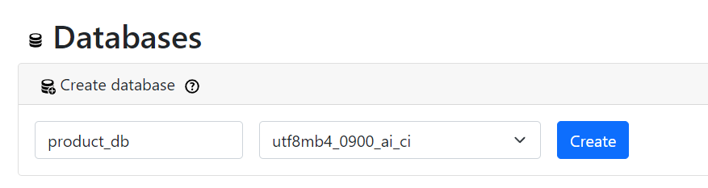
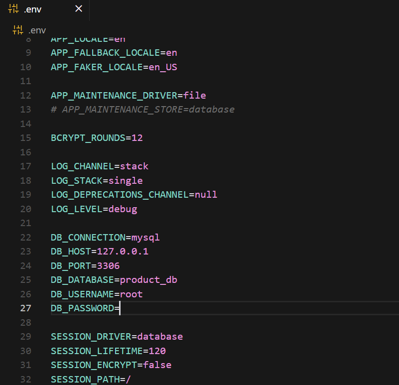
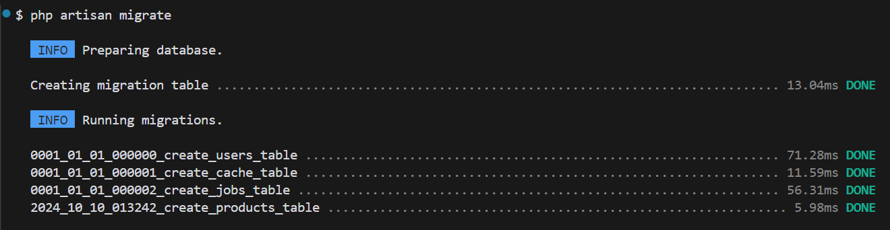
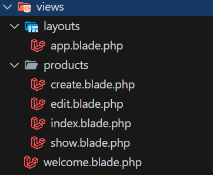
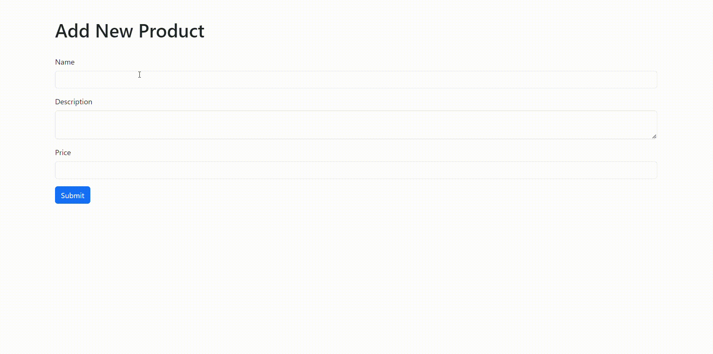

# 4 - Praktek Membuat Web dengan Operasi CRUD Sederhana

## Daftar Isi
  - [Persiapan](#persiapan)
  - [Setup Database](#setup-database)
  - [Membuat Model dan Migrasi](#membuat-model-dan-migrasi)
  - [Membuat Controller](#membuat-controller)
  - [Membuat Route](#membuat-route)
  - [Membuat View](#membuat-view)
  - [Implementasi CRUD](#implementasi-crud)
  - [Menjalankan Aplikasi](#menjalankan-aplikasi)
  - [Troubleshooting](#troubleshooting)
  - [Kesimpulan](#kesimpulan)

Author: Muhammad Irza Arifin (@rifinsra_05)

---

Pada bagian ini, kita akan membangun aplikasi web sederhana dengan operasi CRUD (Create, Read, Update, Delete) menggunakan Laravel. Aplikasi ini akan mengelola data produk, di mana pengguna dapat menambahkan, melihat, mengedit, dan menghapus data produk.

## Persiapan

1. **Buat Project Baru:**
   - Buka terminal dan jalankan perintah berikut untuk membuat project Laravel baru:
     ```bash
     composer create-project laravel/laravel product-app
     ```
   - Perintah ini akan membuat folder baru bernama `product-app` dengan struktur project Laravel di dalamnya.

2. **Masuk ke Direktori Project:**
   ```bash
   cd product-app
   ```

## Setup Database

1. **Buat Database:**
   - Buka phpMyAdmin (biasanya di `http://localhost/phpmyadmin`).
   - Klik tab "Databases".
   - Buat database baru dengan nama `product_db`.

   

2. **Konfigurasi Database:**
   - Buka file `.env` di root project dengan text editor.
   - Ubah konfigurasi database seperti berikut:
     ```
     DB_CONNECTION=mysql
     DB_HOST=127.0.0.1
     DB_PORT=3306
     DB_DATABASE=product_db
     DB_USERNAME=root
     DB_PASSWORD=
     ```
   - Sesuaikan `DB_USERNAME` dan `DB_PASSWORD` dengan kredensial MySQL Kamu.

   

## Membuat Model dan Migrasi

1. **Buat Model dan Migrasi:**
   - Jalankan perintah berikut di terminal:
     ```bash
     php artisan make:model Product -m
     ```
   - Perintah ini membuat file model `Product.php` di `app/Models` dan file migrasi di `database/migrations`.

2. **Edit Model:**
   - Buka `app/Models/Product.php` dan tambahkan kode berikut:
     ```php
     <?php

     namespace App\Models;

     use Illuminate\Database\Eloquent\Factories\HasFactory;
     use Illuminate\Database\Eloquent\Model;

     class Product extends Model
     {
         use HasFactory;

         protected $fillable = ['name', 'description', 'price'];
     }
     ```
   - `$fillable` mendefinisikan kolom yang dapat diisi secara massal.

3. **Edit Migrasi:**
   - Buka file migrasi terbaru di `database/migrations` dan edit metode `up()`:
     ```php
     public function up()
     {
         Schema::create('products', function (Blueprint $table) {
             $table->id();
             $table->string('name');
             $table->text('description');
             $table->decimal('price', 8, 2);
             $table->timestamps();
         });
     }
     ```

4. **Jalankan Migrasi:**
   ```bash
   php artisan migrate
   ```
   - Perintah ini membuat tabel `products` di database.

   

## Membuat Controller

1. **Buat Controller:**
   ```bash
   php artisan make:controller ProductController --resource
   ```
   - Perintah ini membuat `ProductController.php` di `app/Http/Controllers` dengan metode CRUD.

2. **Edit Controller:**
   - Buka `app/Http/Controllers/ProductController.php` dan isi dengan kode berikut:
     ```php
     <?php

     namespace App\Http\Controllers;

     use App\Models\Product;
     use Illuminate\Http\Request;

     class ProductController extends Controller
     {
         public function index()
         {
             $products = Product::all();
             return view('products.index', compact('products'));
         }

         public function create()
         {
             return view('products.create');
         }

         public function store(Request $request)
         {
             $request->validate([
                 'name' => 'required',
                 'description' => 'required',
                 'price' => 'required|numeric',
             ]);

             Product::create($request->all());
             return redirect()->route('products.index')->with('success', 'Product created successfully.');
         }

         public function show(Product $product)
         {
             return view('products.show', compact('product'));
         }

         public function edit(Product $product)
         {
             return view('products.edit', compact('product'));
         }

         public function update(Request $request, Product $product)
         {
             $request->validate([
                 'name' => 'required',
                 'description' => 'required',
                 'price' => 'required|numeric',
             ]);

             $product->update($request->all());
             return redirect()->route('products.index')->with('success', 'Product updated successfully.');
         }

         public function destroy(Product $product)
         {
             $product->delete();
             return redirect()->route('products.index')->with('success', 'Product deleted successfully.');
         }
     }
     ```

## Membuat Route

1. **Edit Route:**
   - Buka `routes/web.php` dan tambahkan kode berikut:
     ```php
     <?php

     use App\Http\Controllers\ProductController;
     use Illuminate\Support\Facades\Route;

     Route::get('/', function () {
         return view('welcome');
     });

     Route::resource('products', ProductController::class);
     ```
   - `Route::resource()` secara otomatis membuat route untuk semua operasi CRUD.

## Membuat View

1. **Buat Folder:**
   - Buat folder `products` di dalam `resources/views`.

2. **Buat File View:**
   - Buat file-file berikut di `resources/views/products`:
     - `index.blade.php`
     - `create.blade.php`
     - `show.blade.php`
     - `edit.blade.php`

     

3. **Buat Layout:**
   - Buat file `app.blade.php` di `resources/views/layouts`:
     ```html
     <!DOCTYPE html>
     <html lang="en">
     <head>
         <meta charset="UTF-8">
         <meta name="viewport" content="width=device-width, initial-scale=1.0">
         <title>Product App</title>
         <link href="https://cdn.jsdelivr.net/npm/bootstrap@5.3.0/dist/css/bootstrap.min.css" rel="stylesheet">
     </head>
     <body>
         <div class="container">
             @yield('content')
         </div>
         <script src="https://cdn.jsdelivr.net/npm/bootstrap@5.3.0/dist/js/bootstrap.bundle.min.js"></script>
     </body>
     </html>
     ```

## Implementasi CRUD

1. **Edit `index.blade.php`:**
   ```html
   @extends('layouts.app')

   @section('content')
       <h1>Products</h1>
       <a href="{{ route('products.create') }}" class="btn btn-primary mb-3">Add New Product</a>
       
       @if (session('success'))
           <div class="alert alert-success">
               {{ session('success') }}
           </div>
       @endif

       <table class="table">
           <thead>
               <tr>
                   <th>Name</th>
                   <th>Description</th>
                   <th>Price</th>
                   <th>Actions</th>
               </tr>
           </thead>
           <tbody>
               @foreach ($products as $product)
                   <tr>
                       <td>{{ $product->name }}</td>
                       <td>{{ $product->description }}</td>
                       <td>Rp.{{ $product->price }}</td>
                       <td>
                           <a href="{{ route('products.show', $product->id) }}" class="btn btn-info btn-sm">View</a>
                           <a href="{{ route('products.edit', $product->id) }}" class="btn btn-primary btn-sm">Edit</a>
                           <form action="{{ route('products.destroy', $product->id) }}" method="POST" style="display:inline">
                               @csrf
                               @method('DELETE')
                               <button type="submit" class="btn btn-danger btn-sm" onclick="return confirm('Are you sure?')">Delete</button>
                           </form>
                       </td>
                   </tr>
               @endforeach
           </tbody>
       </table>
   @endsection
   ```

2. **Edit `create.blade.php`:**
   ```html
   @extends('layouts.app')

   @section('content')
       <h1>Add New Product</h1>
       <form action="{{ route('products.store') }}" method="POST">
           @csrf
           <div class="mb-3">
               <label for="name" class="form-label">Name</label>
               <input type="text" class="form-control" id="name" name="name" required>
           </div>
           <div class="mb-3">
               <label for="description" class="form-label">Description</label>
               <textarea class="form-control" id="description" name="description" required></textarea>
           </div>
           <div class="mb-3">
               <label for="price" class="form-label">Price</label>
               <input type="number" class="form-control" id="price" name="price" step="0.01" required>
           </div>
           <button type="submit" class="btn btn-primary">Submit</button>
       </form>
   @endsection
   ```

3. **Edit `show.blade.php`:**
   ```html
   @extends('layouts.app')

   @section('content')
       <h1>{{ $product->name }}</h1>
       <p><strong>Description:</strong> {{ $product->description }}</p>
       <p><strong>Price:</strong> Rp.{{ $product->price }}</p>
       <a href="{{ route('products.index') }}" class="btn btn-secondary">Back to List</a>
   @endsection
   ```

4. **Edit `edit.blade.php`:**
   ```html
   @extends('layouts.app')

   @section('content')
       <h1>Edit Product</h1>
       <form action="{{ route('products.update', $product->id) }}" method="POST">
           @csrf
           @method('PUT')
           <div class="mb-3">
               <label for="name" class="form-label">Name</label>
               <input type="text" class="form-control" id="name" name="name" value="{{ $product->name }}" required>
           </div>
           <div class="mb-3">
               <label for="description" class="form-label">Description</label>
               <textarea class="form-control" id="description" name="description" required>{{ $product->description }}</textarea>
           </div>
           <div class="mb-3">
               <label for="price" class="form-label">Price</label>
               <input type="number" class="form-control" id="price" name="price" step="0.01" value="{{ $product->price }}" required>
           </div>
           <button type="submit" class="btn btn-primary">Update</button>
       </form>
   @endsection
   ```

## Menjalankan Aplikasi

1. **Start Server:**
   ```bash
   php artisan serve
   ```

2. **Akses Aplikasi:**
   - Buka browser dan kunjungi `http://localhost:8000/products`.

3. **Hasil**


## Troubleshooting

1. **Error 404 (Not Found):**
   - Pastikan route sudah didefinisikan dengan benar di `routes/web.php`.
   - Periksa URL yang diakses, pastikan sesuai dengan yang didefinisikan.

2. **Error 500 (Internal Server Error):**
   - Periksa log error di `storage/logs/laravel.log`.
   - Pastikan konfigurasi database di `.env` benar.
   - Periksa sintaks PHP di controller dan model.

3. **Data Tidak Tersimpan/Terupdate/Terhapus:**
   - Periksa metode `store()`, `update()`, dan `destroy()` di `ProductController`.
   - Pastikan nama kolom di database sesuai dengan yang digunakan di kode.
   - Gunakan `dd()` untuk debugging data yang dikirim ke database.

4. **Bootstrap Tidak Ter-load:**
   - Pastikan koneksi internet aktif karena Bootstrap diload via CDN.
   - Periksa Console di browser untuk melihat error terkait loading CSS/JS.

5. **Migrasi Gagal:**
   - Pastikan database sudah dibuat dan konfigurasi di `.env` benar.
   - Jalankan `php artisan config:clear` sebelum mencoba migrasi ulang.

## Kesimpulan

Dalam tutorial ini, kita telah berhasil membuat aplikasi CRUD sederhana menggunakan Laravel. Kita telah mempelajari:
- Membuat dan mengkonfigurasi project Laravel
- Membuat model dan migrasi database
- Membuat controller dengan operasi CRUD
- Membuat route untuk menghubungkan URL dengan controller
- Membuat view menggunakan Blade template engine
- Mengintegrasikan Bootstrap untuk styling
- Menjalankan dan men-debug aplikasi Laravel

Praktek ini memberikan dasar yang kuat untuk pengembangan aplikasi web yang lebih kompleks menggunakan Laravel.