# 4 - Praktek Membuat Web dengan Operasi CRUD Sederhana


- [4 - Praktek Membuat Web dengan Operasi CRUD Sederhana](#4---praktek-membuat-web-dengan-operasi-crud-sederhana)
  - [Persiapan](#persiapan)
    - [Menginstal Bootstrap:](#menginstal-bootstrap)
    - [Membuat Base Layout](#membuat-base-layout)
  - [Menjalankan Aplikasi](#menjalankan-aplikasi)
  - [Troubleshooting](#troubleshooting)
  - [Kesimpulan](#kesimpulan)

Author: Muhammad Irza Arifin (@rifinsra_05)

---

Pada bagian ini, kita akan mempraktekkan konsep-konsep yang telah dipelajari sebelumnya dengan membangun aplikasi web sederhana yang memiliki operasi CRUD (Create, Read, Update, Delete). Aplikasi ini akan mengelola data "produk", dimana user dapat menambahkan, melihat, mengedit, dan menghapus data produk. Melalui pembuatan aplikasi ini, Kamu akan memperoleh pemahaman yang lebih mendalam tentang bagaimana berbagai komponen Laravel, seperti routing, controller, model, view, dan database, bekerja sama untuk menciptakan fungsionalitas aplikasi.

## Persiapan

Langkah pertama adalah menyiapkan lingkungan pengembangan dan dasar-dasar aplikasi kita. Ini meliputi pembuatan project baru, pengaturan database, dan pembuatan model serta migrasi untuk tabel produk yang akan kita gunakan.

1. **Buat Project Baru:** 
   - Jika Kamu belum memiliki project Laravel, buatlah project baru dengan menggunakan command-line interface (CLI) Laravel. Buka terminal atau command prompt Kamu dan jalankan perintah berikut:
     ```bash
     laravel new product-app
     ```
   - Perintah ini akan membuat direktori baru bernama `product-app` yang berisi semua file dan struktur direktori yang diperlukan untuk project Laravel Kamu.
2. **Buat Database:** 
   - Kita membutuhkan database untuk menyimpan data produk. Kamu dapat menggunakan MySQL, PostgreSQL, SQLite, atau database lain yang didukung Laravel. 
   - **Langkah-langkah menggunakan MySQL melalui phpMyAdmin:**
     - Buka phpMyAdmin di browser Kamu (biasanya diakses melalui `http://localhost/phpmyadmin`).
     - Klik tab "Databases" di sidebar.
     - Masukkan nama database baru, misalnya `product_db`, di field "Create database".
     - Pilih collation yang sesuai (misalnya `utf8mb4_general_ci`) dan klik tombol "Create".
     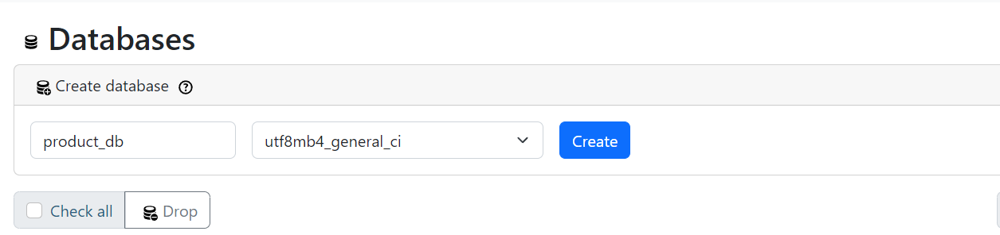
3. **Konfigurasi Database:** 
   - Laravel menyimpan konfigurasi database di file `.env` yang terletak di root project. Buka file `.env` dan update konfigurasi database dengan informasi database yang telah Kamu buat:
     ```
     DB_CONNECTION=mysql
     DB_HOST=127.0.0.1
     DB_PORT=3306
     DB_DATABASE=product_db 
     DB_USERNAME=root  
     DB_PASSWORD= 
     ```

     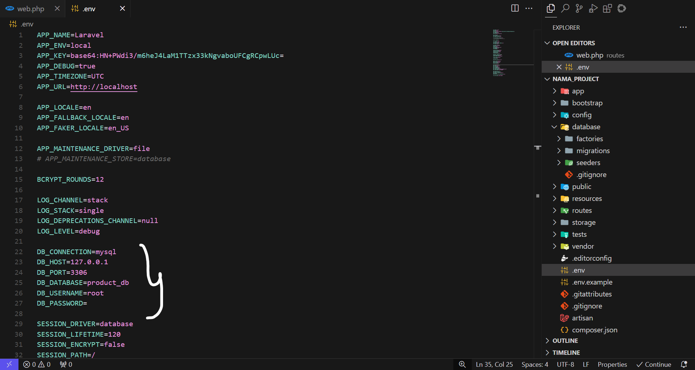
   - **Penjelasan:**
     - `DB_CONNECTION`: Menentukan jenis database yang digunakan (dalam contoh ini, MySQL).
     - `DB_HOST`: Alamat host database. `127.0.0.1` menunjukkan bahwa database berjalan di localhost.
     - `DB_PORT`: Port database. Port default MySQL adalah 3306.
     - `DB_DATABASE`: Nama database yang telah Kamu buat (`product_db`).
     - `DB_USERNAME`: Username untuk mengakses database. Untuk XAMPP, biasanya username default adalah `root`.
     - `DB_PASSWORD`: Password untuk mengakses database. Untuk XAMPP, biasanya password default kosong.
4. **Buat Model dan Migrasi:**
   - Model di Laravel merepresentasikan tabel database dan memungkinkan kita untuk berinteraksi dengan data menggunakan objek PHP. Migrasi adalah cara untuk mengelola struktur database (membuat dan memodifikasi tabel) menggunakan kode PHP.
   - Kita akan membuat model `Product` dan migrasi untuk tabel `products` secara bersamaan dengan menggunakan Artisan command berikut:
     ```bash
     php artisan make:model Product -m
     ```
   - Perintah ini akan membuat file model `Product.php` di direktori `app/Models` dan file migrasi di direktori `database/migrations`.
   - Kemudian isi `Product.php` dengan kode berikut
   ```php
    <?php

    namespace App\Models;
    
    use Illuminate\Database\Eloquent\Factories\HasFactory;
    use Illuminate\Database\Eloquent\Model;
    
    class Product extends Model
    {
        use HasFactory;
    
        protected $fillable = ['name', 'description', 'price'];
    }
    
    ```

   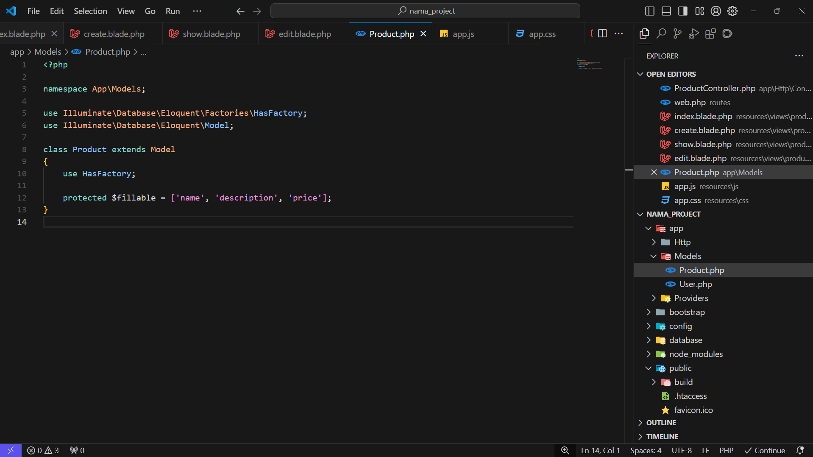
5. **Edit File Migrasi:** 
   - Buka file migrasi yang baru dibuat (nama filenya akan diawali dengan timestamp). File ini terletak di direktori `database/migrations`.
   - File migrasi mendefinisikan struktur tabel `products`. Kita akan menambahkan kolom-kolom yang dibutuhkan untuk menyimpan informasi produk:
     ```php
     // database/migrations/timestamp_create_products_table.php

     use Illuminate\Database\Migrations\Migration;
     use Illuminate\Database\Schema\Blueprint;
     use Illuminate\Support\Facades\Schema;

     return new class extends Migration
     {
         /**
          * Run the migrations.
          */
         public function up(): void
         {
             Schema::create('products', function (Blueprint $table) {
                 $table->id(); 
                 $table->string('name'); 
                 $table->text('description'); 
                 $table->decimal('price', 8, 2);  
                 $table->timestamps(); 
             });
         }

         /**
          * Reverse the migrations.
          */
         public function down(): void
         {
             Schema::dropIfExists('products');
         }
     };
     ```

    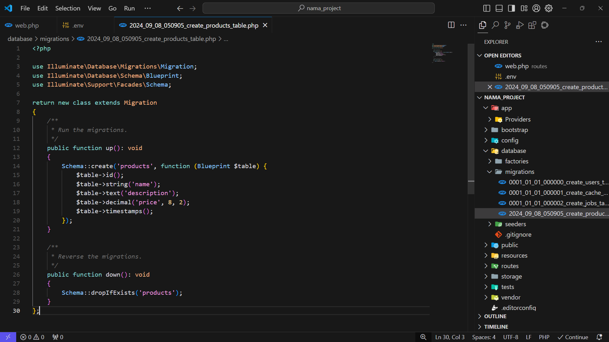

   - **Penjelasan:**
     - `Schema::create('products', ...)`: Membuat tabel baru bernama `products`.
     - `$table->id();`: Menambahkan kolom `id` sebagai primary key auto-increment.
     - `$table->string('name');`: Menambahkan kolom `name` untuk menyimpan nama produk (tipe data string).
     - `$table->text('description');`: Menambahkan kolom `description` untuk menyimpan deskripsi produk (tipe data text).
     - `$table->decimal('price', 8, 2);`: Menambahkan kolom `price` untuk menyimpan harga produk (tipe data decimal dengan total 8 digit dan 2 digit di belakang koma).
     - `$table->timestamps();`: Menambahkan kolom `created_at` dan `updated_at` untuk menyimpan timestamp pembuatan dan pembaruan produk.
     - `Schema::dropIfExists('products');`: Menghapus tabel `products` jika migrasi di-rollback.
6. **Jalankan Migrasi:**
   - Setelah mendefinisikan struktur tabel di file migrasi, kita perlu menjalankan migrasi untuk membuat tabel di database. Jalankan perintah berikut di terminal:
     ```bash
     php artisan migrate
     ```
   - Perintah ini akan membaca semua file migrasi yang belum dijalankan dan mengeksekusinya, sehingga tabel `products` akan dibuat di database.

   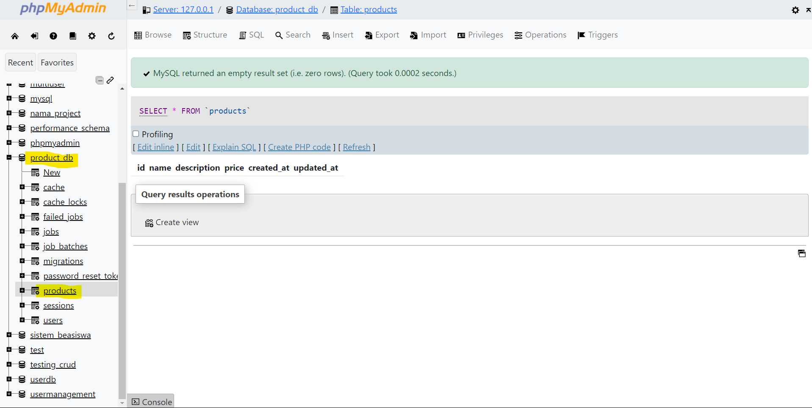

## Membuat Controller

Controller bertanggung jawab untuk menangani request HTTP, memproses data, dan mengembalikan response. Kita akan membuat controller `ProductController` yang akan menangani semua operasi CRUD untuk produk.

1. **Buat Controller dengan Artisan:**
   - Laravel menyediakan Artisan command untuk membuat controller dengan mudah. Jalankan perintah berikut di terminal:
     ```bash
     php artisan make:controller ProductController --resource
     ```
   - **Penjelasan:**
     - `php artisan make:controller`: Perintah untuk membuat controller baru.
     - `ProductController`: Nama controller yang akan dibuat.
     - `--resource`: Opsi ini akan membuat controller dengan method-method dasar untuk operasi CRUD (index, create, store, show, edit, update, destroy).
   - Perintah ini akan membuat file `ProductController.php` di direktori `app/Http/Controllers`.

   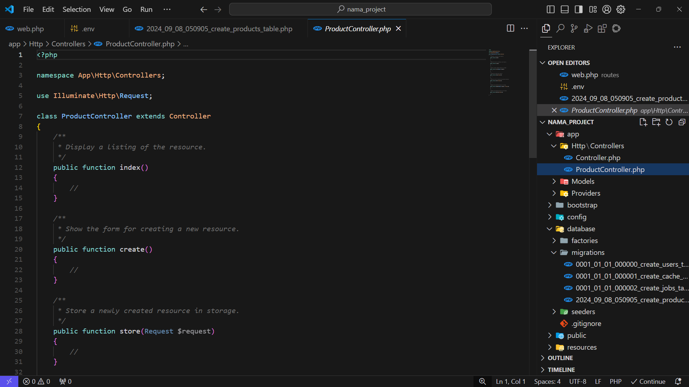

## Menulis Route

Route mendefinisikan URL aplikasi dan menghubungkannya dengan controller atau closure yang akan menangani request. Kita akan mendefinisikan route untuk semua operasi CRUD pada resource `products`.

1. **Tambahkan Route Resource:**
   - Buka file `routes/web.php` yang terletak di direktori `routes`.
   - Tambahkan baris kode berikut di dalam file:
     ```php
     Route::resource('products', ProductController::class);
     ```
   - **Penjelasan:**
     - `Route::resource()`: Method ini digunakan untuk mendefinisikan route untuk resource controller.
     - `'products'`: URI untuk resource. Ini berarti URL yang berhubungan dengan produk akan diawali dengan `/products` (misalnya, `/products`, `/products/create`, `/products/1`, dll.).
     - `ProductController::class`: Menentukan controller yang akan menangani route untuk resource `products`.

     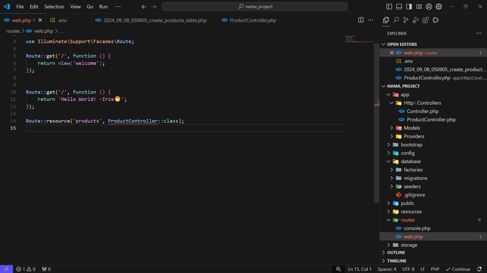

## Membuat View

View adalah bagian dari aplikasi yang bertanggung jawab untuk menampilkan data ke user. Laravel menggunakan Blade template engine, yang memungkinkan kita untuk menulis template HTML dengan sintaks yang elegan dan mudah dipahami. Kita akan membuat beberapa view untuk operasi CRUD pada produk.

1. **Buat Direktori `products`:**
   - Buat direktori baru bernama `products` di dalam direktori `resources/views`. Direktori ini akan berisi semua view yang berhubungan dengan produk.
2. **Buat File View:**
   - Buat file-file berikut di dalam direktori `resources/views/products`:
     - `index.blade.php` (untuk menampilkan daftar produk)
     - `create.blade.php` (untuk form tambah produk)
     - `show.blade.php` (untuk menampilkan detail produk)
     - `edit.blade.php` (untuk form edit produk)

    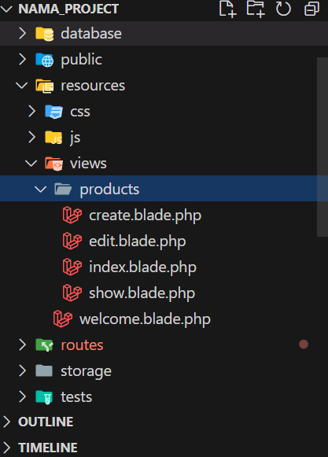

## Implementasi Controller dan View

Sekarang kita akan mengimplementasikan logika di controller `ProductController` dan membuat tampilan di view yang telah kita buat.

**`ProductController.php`:**

```php
// app/Http/Controllers/ProductController.php

namespace App\Http\Controllers;

use App\Models\Product;
use Illuminate\Http\Request;

class ProductController extends Controller
{
    /**
     * Display a listing of the resource.
     */
    public function index()
    {
        // Mengambil semua data produk dari database
        $products = Product::all();

        // Mengembalikan view 'products.index' dan mengirimkan data produk ke view
        return view('products.index', compact('products'));
    }

    /**
     * Show the form for creating a new resource.
     */
    public function create()
    {
        // Mengembalikan view 'products.create' untuk form tambah produk
        return view('products.create');
    }

    /**
     * Store a newly created resource in storage.
     */
    public function store(Request $request)
    {
        // Validasi data yang dikirim dari form
        $request->validate([
            'name' => 'required',
            'description' => 'required',
            'price' => 'required|numeric',
        ]);

        // Menyimpan data produk baru ke database
        Product::create($request->all());

        // Redirect ke halaman daftar produk dengan pesan sukses
        return redirect()->route('products.index')
            ->with('success', 'Produk berhasil ditambahkan.');
    }

    /**
     * Display the specified resource.
     */
    public function show(Product $product)
    {
        // Mengembalikan view 'products.show' dan mengirimkan data produk ke view
        return view('products.show', compact('product'));
    }

    /**
     * Show the form for editing the specified resource.
     */
    public function edit(Product $product)
    {
        // Mengembalikan view 'products.edit' dan mengirimkan data produk ke view
        return view('products.edit', compact('product'));
    }

    /**
     * Update the specified resource in storage.
     */
    public function update(Request $request, Product $product)
    {
        // Validasi data yang dikirim dari form
        $request->validate([
            'name' => 'required',
            'description' => 'required',
            'price' => 'required|numeric',
        ]);

        // Mengupdate data produk di database
        $product->update($request->all());

        // Redirect ke halaman daftar produk dengan pesan sukses
        return redirect()->route('products.index')
            ->with('success', 'Produk berhasil diupdate.');
    }

    /**
     * Remove the specified resource from storage.
     */
    public function destroy(Product $product)
    {
        // Menghapus data produk dari database
        $product->delete();

        // Redirect ke halaman daftar produk dengan pesan sukses
        return redirect()->route('products.index')
            ->with('success', 'Produk berhasil dihapus.');
    }
}
```


Penjelasan `ProductController.php`:

- **`index()`:** 
    - Method ini dipanggil ketika user mengakses route `/products`. 
    - `Product::all();`: Mengambil semua data produk dari tabel `products` menggunakan model `Product`.
    - `return view('products.index', compact('products'));`: Mengembalikan view `products.index` dan mengirimkan data produk yang telah diambil ke view. `compact('products')` adalah cara singkat untuk membuat array asosiatif dengan key `products` dan value variabel `$products`.
- **`create()`:**
    - Method ini dipanggil ketika user mengakses route `/products/create`. 
    - `return view('products.create');`: Mengembalikan view `products.create` yang berisi form untuk menambahkan produk baru.
- **`store(Request $request)`:**
    - Method ini dipanggil ketika user mengirimkan form tambah produk (melalui request POST ke `/products`).
    - `$request->validate([...]);`: Melakukan validasi data yang dikirim dari form. 
    - `Product::create($request->all());`: Membuat data produk baru di database menggunakan model `Product`. `$request->all()` mengambil semua data yang dikirim dari form.
    - `return redirect()->route('products.index')...`: Redirect ke route `products.index` (halaman daftar produk) dan mengirimkan pesan sukses menggunakan `with('success', ...)`.
- **`show(Product $product)`:**
    - Method ini dipanggil ketika user mengakses route `/products/{id}` (misalnya, `/products/1`). 
    - `return view('products.show', compact('product'));`: Mengembalikan view `products.show` dan mengirimkan data produk yang sesuai dengan ID ke view. Laravel secara otomatis akan mencari data produk berdasarkan ID di database menggunakan model `Product`.
- **`edit(Product $product)`:**
    - Method ini dipanggil ketika user mengakses route `/products/{id}/edit` (misalnya, `/products/1/edit`).
    - `return view('products.edit', compact('product'));`: Mengembalikan view `products.edit` yang berisi form untuk mengedit produk dan mengirimkan data produk yang sesuai dengan ID ke view.
- **`update(Request $request, Product $product)`:**
    - Method ini dipanggil ketika user mengirimkan form edit produk (melalui request PUT ke `/products/{id}`).
    - `$request->validate([...]);`: Melakukan validasi data yang dikirim dari form.
    - `$product->update($request->all());`: Mengupdate data produk di database.
    - `return redirect()->route('products.index')...`: Redirect ke halaman daftar produk dengan pesan sukses.
- **`destroy(Product $product)`:**
    - Method ini dipanggil ketika user mengirimkan request DELETE ke `/products/{id}`.
    - `$product->delete();`: Menghapus data produk dari database.
    - `return redirect()->route('products.index')...`: Redirect ke halaman daftar produk dengan pesan sukses.

Kemudian sekarang kita akan membuat tampilan untuk setiap fungsi yang ada di `ProductController.php` yaitu `index`, `create`, `show`, `edit`, dan `destroy`.

`index.blade.php`:

```blade
@extends('layouts.app') 

@section('content')
    <div class="container">
        <h1>Daftar Produk</h1>

        @if (session('success'))
            <div class="alert alert-success">
                {{ session('success') }}
            </div>
        @endif

        <a href="{{ route('products.create') }}" class="btn btn-primary">Tambah Produk</a>
        <table class="table">
            <thead>
                <tr>
                    <th>Nama</th>
                    <th>Deskripsi</th>
                    <th>Harga</th>
                    <th>Aksi</th>
                </tr>
            </thead>
            <tbody>
                @foreach ($products as $product)
                    <tr>
                        <td>{{ $product->name }}</td>
                        <td>{{ $product->description }}</td>
                        <td>{{ $product->price }}</td>
                        <td>
                            <a href="{{ route('products.show', $product->id) }}" class="btn btn-info">Lihat</a>
                            <a href="{{ route('products.edit', $product->id) }}" class="btn btn-warning">Edit</a>
                            <form action="{{ route('products.destroy', $product->id) }}" method="POST" style="display: inline-block;">
                                @csrf 
                                @method('DELETE') 
                                <button type="submit" class="btn btn-danger" onclick="return confirm('Apakah Kamu yakin ingin menghapus produk ini?')">Hapus</button>
                            </form>
                        </td>
                    </tr>
                @endforeach
            </tbody>
        </table>
    </div>
@endsection
```

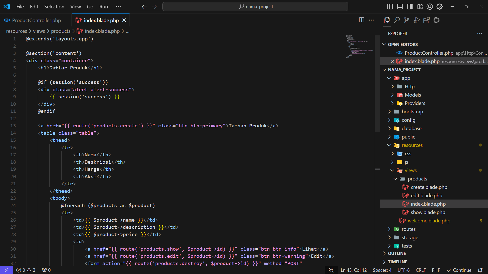

Penjelasan `index.blade.php`:

- **`@extends('layouts.app')`:** View ini mewarisi layout `layouts.app.blade.php`. 
- **`@section('content')`:** Mendefinisikan section `content` yang akan ditampilkan di layout.
- **`@if (session('success')) ... @endif`:** Menampilkan pesan sukses jika ada (pesan sukses dikirim dari controller menggunakan `with('success', ...)`).
- **`<a href="{{ route('products.create') }}">Tambah Produk</a>`:** Menampilkan link untuk menambahkan produk baru. `route('products.create')` akan menghasilkan URL `/products/create`.
- **`<table> ... </table>`:** Menampilkan tabel daftar produk.
- **`@foreach ($products as $product)`:** Melakukan loop untuk menampilkan setiap produk. 
- **`{{ $product->name }}`, `{{ $product->description }}`, `{{ $product->price }}`:** Menampilkan data produk.
- **`<a href="{{ route('products.show', $product->id) }}">Lihat</a>`:** Menampilkan link untuk melihat detail produk.
- **`<a href="{{ route('products.edit', $product->id) }}">Edit</a>`:** Menampilkan link untuk mengedit produk.
- **`<form action="{{ route('products.destroy', $product->id) }}" ...>`:**  Form untuk menghapus produk.
    - `@csrf`: Menambahkan token CSRF untuk keamanan.
    - `@method('DELETE')`: Menentukan method HTTP sebagai DELETE karena form HTML hanya mendukung method GET dan POST.
    - `<button type="submit" ...>Hapus</button>`: Tombol untuk mengirimkan form dan menghapus produk.


`create.blade.php`:

```blade
@extends('layouts.app')

@section('content')
    <div class="container">
        <h1>Tambah Produk</h1>

        @if ($errors->any())
            <div class="alert alert-danger">
                <ul>
                    @foreach ($errors->all() as $error)
                        <li>{{ $error }}</li>
                    @endforeach
                </ul>
            </div>
        @endif

        <form action="{{ route('products.store') }}" method="POST">
            @csrf 
            <div class="form-group">
                <label for="name">Nama:</label>
                <input type="text" name="name" id="name" class="form-control" value="{{ old('name') }}" required>
            </div>
            <div class="form-group">
                <label for="description">Deskripsi:</label>
                <textarea name="description" id="description" class="form-control" required>{{ old('description') }}</textarea>
            </div>
            <div class="form-group">
                <label for="price">Harga:</label>
                <input type="number" name="price" id="price" class="form-control" value="{{ old('price') }}" required>
            </div>
            <button type="submit" class="btn btn-primary">Simpan</button>
        </form>
    </div>
@endsection
```

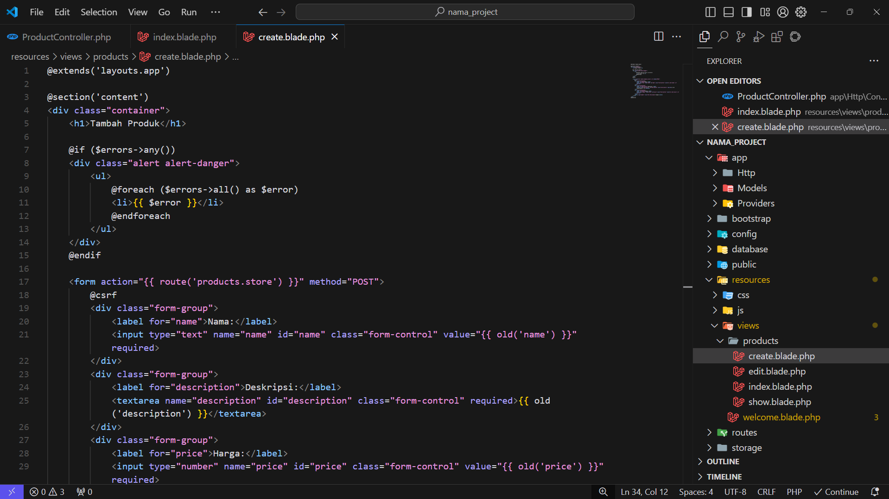

Penjelasan `create.blade.php`:

- **`@extends('layouts.app')`:** View ini mewarisi layout `layouts.app.blade.php`.
- **`@section('content')`:** Mendefinisikan section `content`.
- **`@if ($errors->any()) ... @endif`:** Menampilkan pesan error validasi jika ada.
- **`<form action="{{ route('products.store') }}" method="POST">`:** Form untuk menambahkan produk baru.
    - `@csrf`: Menambahkan token CSRF.
    - `<input type="text" name="name" ...>`: Input field untuk nama produk. `value="{{ old('name') }}"` akan menampilkan nilai input sebelumnya jika terjadi error validasi.
    - `<textarea name="description" ...>`: Textarea untuk deskripsi produk.
    - `<input type="number" name="price" ...>`: Input field untuk harga produk.
    - `<button type="submit" ...>Simpan</button>`: Tombol untuk mengirimkan form.


**`show.blade.php`:**

```blade
@extends('layouts.app')

@section('content')
    <div class="container">
        <h1>{{ $product->name }}</h1>
        <p>Deskripsi: {{ $product->description }}</p>
        <p>Harga: {{ $product->price }}</p>
        <a href="{{ route('products.index') }}" class="btn btn-secondary">Kembali</a>
    </div>
@endsection
```

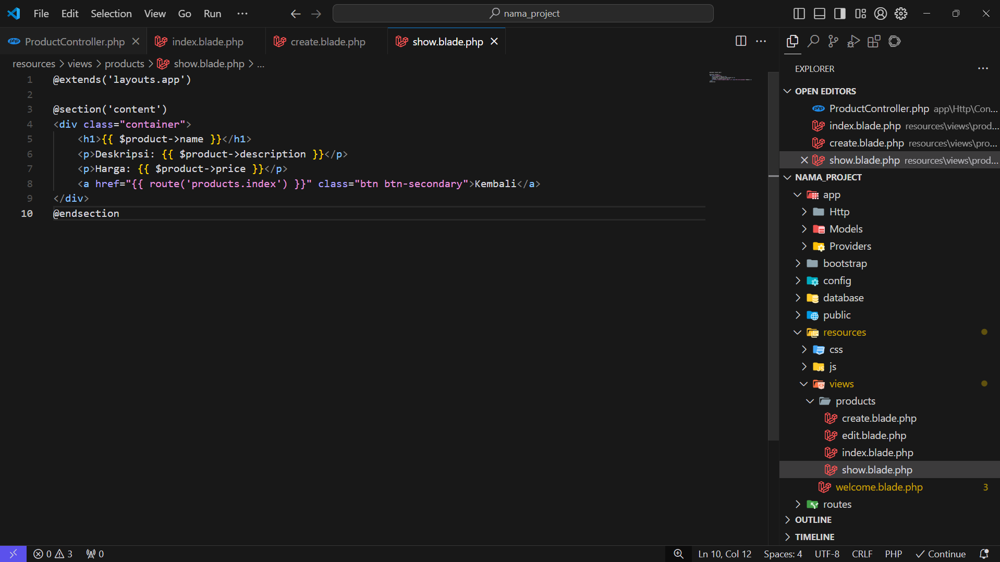

Penjelasan `show.blade.php`:

- **`@extends('layouts.app')`:** View ini mewarisi layout `layouts.app.blade.php`.
- **`@section('content')`:** Mendefinisikan section `content`.
- **`<h1>{{ $product->name }}</h1>`:** Menampilkan nama produk.
- **`<p>Deskripsi: {{ $product->description }}</p>`:** Menampilkan deskripsi produk.
- **`<p>Harga: {{ $product->price }}</p>`:** Menampilkan harga produk.
- **`<a href="{{ route('products.index') }}">Kembali</a>`:** Menampilkan link untuk kembali ke halaman daftar produk.


**`edit.blade.php`:**

```blade
@extends('layouts.app')

@section('content')
    <div class="container">
        <h1>Edit Produk</h1>

        @if ($errors->any())
            <div class="alert alert-danger">
                <ul>
                    @foreach ($errors->all() as $error)
                        <li>{{ $error }}</li>
                    @endforeach
                </ul>
            </div>
        @endif

        <form action="{{ route('products.update', $product->id) }}" method="POST">
            @csrf 
            @method('PUT') 
            <div class="form-group">
                <label for="name">Nama:</label>
                <input type="text" name="name" id="name" class="form-control" value="{{ old('name', $product->name) }}" required>
            </div>
            <div class="form-group">
                <label for="description">Deskripsi:</label>
                <textarea name="description" id="description" class="form-control" required>{{ old('description', $product->description) }}</textarea>
            </div>
            <div class="form-group">
                <label for="price">Harga:</label>
                <input type="number" name="price" id="price" class="form-control" value="{{ old('price', $product->price) }}" required>
            </div>
            <button type="submit" class="btn btn-primary">Update</button>
        </form>
    </div>
@endsection
```

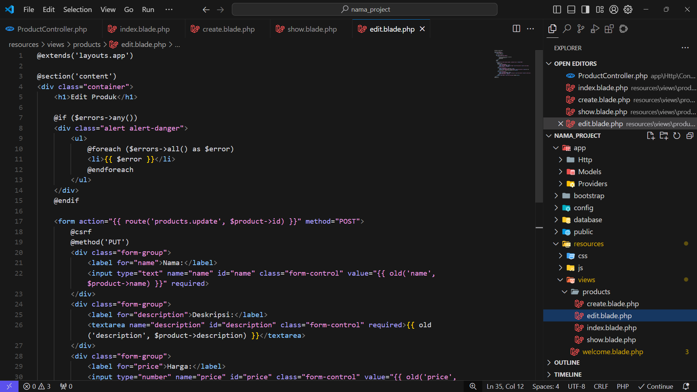

Penjelasan `edit.blade.php`:

- **`@extends('layouts.app')`:** View ini mewarisi layout `layouts.app.blade.php`.
- **`@section('content')`:** Mendefinisikan section `content`.
- **`@if ($errors->any()) ... @endif`:** Menampilkan pesan error validasi jika ada.
- **`<form action="{{ route('products.update', $product->id) }}" method="POST">`:** Form untuk mengedit produk.
    - `@csrf`: Menambahkan token CSRF.
    - `@method('PUT')`: Menentukan method HTTP sebagai PUT.
    - `<input type="text" name="name" ...>`: Input field untuk nama produk. `value="{{ old('name', $product->name) }}"` akan menampilkan nilai input sebelumnya jika terjadi error validasi, atau nilai dari database jika tidak ada error.
    - `<textarea name="description" ...>`: Textarea untuk deskripsi produk.
    - `<input type="number" name="price" ...>`: Input field untuk harga produk.
    - `<button type="submit" ...>Update</button>`: Tombol untuk mengirimkan form.

### Menginstal Bootstrap:

Kita akan menggunakan Bootstrap, framework CSS populer, untuk styling aplikasi kita. 

1. **Menggunakan NPM:**
   - Bootstrap dapat diinstal melalui NPM (Node Package Manager). Buka terminal di root project Laravel dan jalankan perintah berikut:
     ```bash
     npm install bootstrap
     ```
   - Perintah ini akan mendownload dan menginstal Bootstrap beserta dependensi-nya di direktori `node_modules`.
2. **Menambahkan Bootstrap ke `resources/js/app.js`:**
   - Buka file `resources/js/app.js`.
   - Tambahkan baris kode berikut untuk mengimport Bootstrap:
     ```javascript
     // resources/js/app.js

     import './bootstrap'; 
     import 'bootstrap/dist/css/bootstrap.min.css';

     ```

    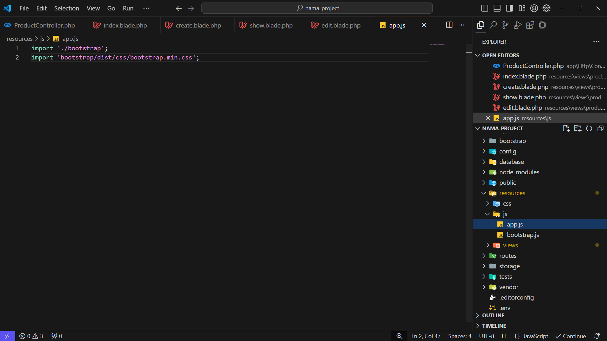

3. **Mengkompilasi Aset:**
   - Laravel Mix adalah tool yang digunakan untuk mengkompilasi aset (CSS, JavaScript) menggunakan Webpack. 
   - Jalankan perintah berikut di terminal untuk mengkompilasi aset:
     ```bash
     npm run dev 
     ```
   - Perintah ini akan mengkompilasi file `resources/js/app.js` dan `resources/css/app.css` (jika ada) dan menyimpan hasilnya di direktori `public/js` dan `public/css`.
4. **Menambahkan Link CSS di Layout:**
   - Buat file layout `resources/views/layouts/app.blade.php`. File ini akan menjadi layout dasar untuk semua view di aplikasi kita.
   - Tambahkan link CSS Bootstrap di bagian `<head>`:
     ```blade
     <link rel="stylesheet" href="{{ asset('css/app.css') }}"> 
     ```
   - **Penjelasan:**
     - `asset('css/app.css')` akan menghasilkan URL ke file `public/css/app.css` yang berisi CSS Bootstrap yang telah dikompilasi.


### Membuat Base Layout

```blade
<!DOCTYPE html>
<html lang="en">

<head>
    <meta charset="UTF-8">
    <meta name="viewport" content="width=device-width, initial-scale=1.0">
    <title>Product App</title>
    @vite(['resources/css/app.css', 'resources/js/app.js'])
</head>

<body>
    <div class="container">
        @yield('content')
    </div>
</body>
</html>

```

Penjelasan `layouts/app.blade.php`:

- **`<!DOCTYPE html>`, `<html>`, `<head>`, `<body>`:** Tag-tag HTML standar.
- **`<link rel="stylesheet" href="{{ asset('css/app.css') }}">`:** Menambahkan link CSS Bootstrap.
- **`<div class="container">`:** Menambahkan container Bootstrap untuk mengatur layout konten.
- **`@yield('content')`:** Mendefinisikan section `content` yang akan diisi oleh view lain.
- **`<script src="{{ asset('js/app.js') }}"></script>`:** Menambahkan link JavaScript (jika dibutuhkan).


## Menjalankan Aplikasi

Setelah semua konfigurasi dan implementasi selesai, kita dapat menjalankan aplikasi.

1. **Jalankan Artisan Serve:**
   - Buka terminal di root project Laravel dan jalankan perintah berikut:
     ```bash
     php artisan serve
     ```
   - Perintah ini akan menjalankan development server bawaan Laravel.
2. **Akses Aplikasi di Browser:**
   - Buka browser dan akses URL `http://localhost:8000/products`. 
   - Kamu akan melihat halaman daftar produk. Kamu dapat mencoba menambahkan, melihat, mengedit, dan menghapus produk.

   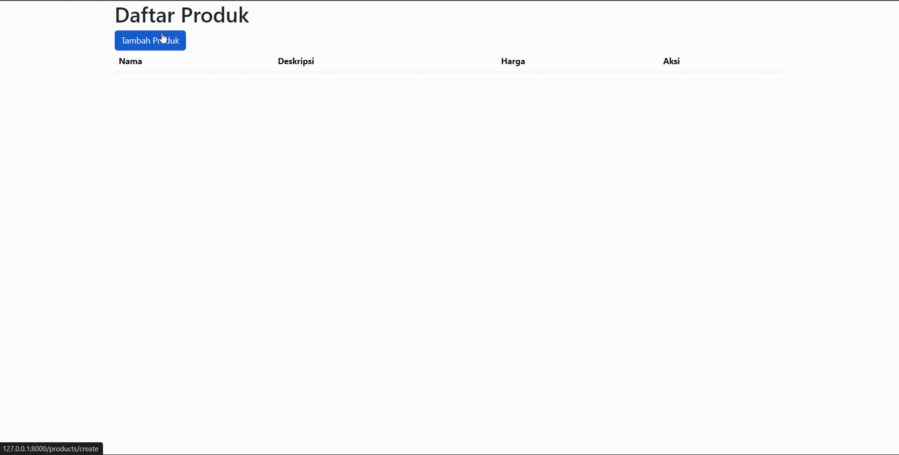

## Troubleshooting

Berikut adalah beberapa masalah umum yang mungkin Kamu temui dan cara mengatasinya:

- **Error 404 (Not Found):**
   - **Kemungkinan Penyebab:** Route tidak didefinisikan dengan benar di `routes/web.php`.
   - **Solusi:** 
      - Pastikan route untuk resource `products` telah didefinisikan dengan benar (`Route::resource('products', ProductController::class);`).
      - Periksa URL yang Kamu akses di browser.
- **Error 500 (Internal Server Error):**
   - **Kemungkinan Penyebab:** Error di kode PHP, kesalahan konfigurasi, atau masalah database.
   - **Solusi:**
      - Periksa log error di `storage/logs/laravel.log` untuk melihat detail error.
      - Pastikan konfigurasi database di file `.env` benar.
      - Periksa kode di controller dan model untuk mencari error.
- **Data tidak tersimpan/terupdate/terhapus:**
   - **Kemungkinan Penyebab:** Kesalahan query database di controller.
   - **Solusi:**
      - Periksa method `store()`, `update()`, dan `destroy()` di `ProductController.php`. 
      - Pastikan query database (create, update, delete) dijalankan dengan benar. 
      - Gunakan `dd()` atau `dump()` untuk debugging dan melihat data yang dikirim ke database.


## Kesimpulan

Pada bagian ini, kita telah membangun aplikasi web sederhana dengan operasi CRUD menggunakan Laravel. Kita telah mempraktekkan penggunaan controller, model, view, route, Eloquent ORM, dan Bootstrap. 