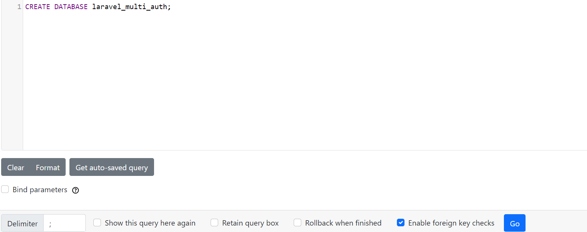
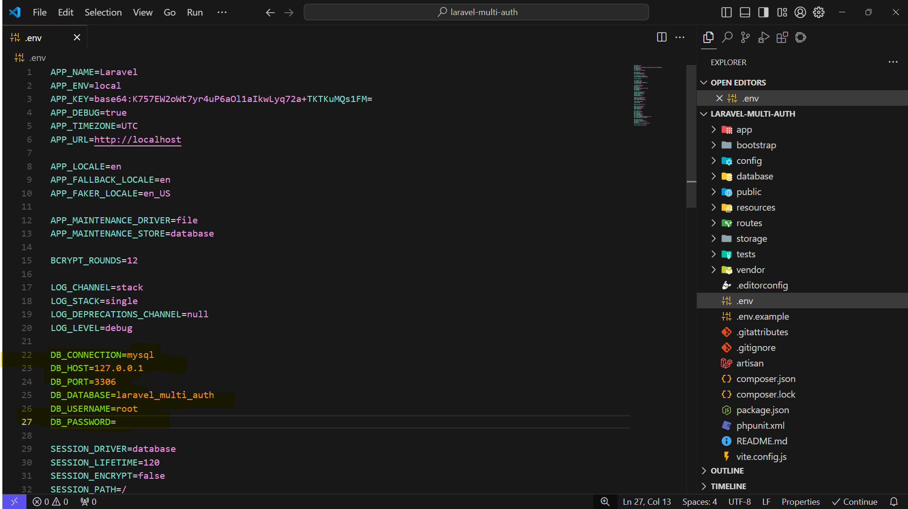

# Implementasi Multi-Auth di Laravel 11 dengan Breeze

## Daftar Isi
- [Persiapan](#persiapan)
- [Setup Proyek Laravel 11](#setup-proyek-laravel-11)
- [Konfigurasi Database](#konfigurasi-database)
- [Instalasi Laravel Breeze](#instalasi-laravel-breeze)
- [Implementasi Multi-Auth](#implementasi-multi-auth)
- [Kustomisasi Proses Registrasi](#kustomisasi-proses-registrasi)
- [Implementasi Middleware untuk Role-Based Access](#implementasi-middleware-untuk-role-based-access)
- [Kustomisasi Routes dan Controllers](#kustomisasi-routes-dan-controllers)
- [Membuat Views untuk Dashboard](#membuat-views-untuk-dashboard)
- [Menjalankan Aplikasi](#menjalankan-aplikasi)
- [Troubleshooting](#troubleshooting)
- [Kesimpulan](#kesimpulan)

Author: @rifinsra_05

---

Dalam tutorial ini, kita akan mengimplementasikan sistem multi-auth di Laravel 11 menggunakan Laravel Breeze. Sistem ini akan memungkinkan pengguna untuk mendaftar dan masuk sebagai user biasa atau admin, dengan akses yang berbeda untuk setiap peran.

## Persiapan

Pastikan Kamu telah menginstal:
- PHP 8.1 atau lebih tinggi
- Composer
- Node.js dan NPM

## Setup Proyek Laravel 11

1. Buka terminal dan jalankan perintah berikut untuk membuat proyek Laravel baru:
   ```bash
   composer create-project laravel/laravel laravel-multi-auth
   ```

2. Masuk ke direktori proyek:
   ```bash
   cd laravel-multi-auth
   ```

## Konfigurasi Database

1. Buat database baru di MySQL:
   ```sql
   CREATE DATABASE laravel_multi_auth;
   ```

   

2. Edit file `.env` di root proyek:
   ```
   DB_CONNECTION=mysql
   DB_HOST=127.0.0.1
   DB_PORT=3306
   DB_DATABASE=laravel_multi_auth
   DB_USERNAME=root
   DB_PASSWORD=
   ```
   Sesuaikan `DB_USERNAME` dan `DB_PASSWORD` dengan kredensial MySQL Kamu.

   

## Instalasi Laravel Breeze

1. Install Laravel Breeze:
   ```bash
   composer require laravel/breeze --dev
   ```

2. Instal Breeze dengan stack default (Blade):
   ```bash
   php artisan breeze:install
   composer require laravel/sanctum
   ```

3. Install dependencies frontend dan build assets:
   ```bash
   npm install
   npm run dev
   ```

## Implementasi Multi-Auth

1. Buat migrasi untuk menambah kolom role:
   ```bash
   php artisan make:migration add_role_to_users_table --table=users
   ```

2. Edit file migrasi yang baru dibuat di `database/migrations`:
   ```php
   <?php

   use Illuminate\Database\Migrations\Migration;
   use Illuminate\Database\Schema\Blueprint;
   use Illuminate\Support\Facades\Schema;

   return new class extends Migration
   {
       public function up(): void
       {
           Schema::table('users', function (Blueprint $table) {
               $table->enum('role', ['user', 'admin'])->default('user');
           });
       }

       public function down(): void
       {
           Schema::table('users', function (Blueprint $table) {
               $table->dropColumn('role');
           });
       }
   };
   ```

3. Jalankan migrasi:
   ```bash
   php artisan migrate
   ```

4. Edit model `User` di `app/Models/User.php`:
   ```php
   <?php

   namespace App\Models;

   use Illuminate\Database\Eloquent\Factories\HasFactory;
   use Illuminate\Foundation\Auth\User as Authenticatable;
   use Illuminate\Notifications\Notifiable;
   use Laravel\Sanctum\HasApiTokens;

   class User extends Authenticatable
   {
       use HasApiTokens, HasFactory, Notifiable;

       protected $fillable = [
           'name',
           'email',
           'password',
           'role',
       ];

       protected $hidden = [
           'password',
           'remember_token',
       ];

       protected $casts = [
           'email_verified_at' => 'datetime',
           'password' => 'hashed',
       ];

       public function isAdmin()
       {
           return $this->role === 'admin';
       }
   }
   ```

## Kustomisasi Proses Registrasi

1. Edit `resources/views/auth/register.blade.php`:
   ```html
   <x-guest-layout>
       <form method="POST" action="{{ route('register') }}">
           @csrf

           <!-- Name -->
           <div>
               <x-input-label for="name" :value="__('Name')" />
               <x-text-input id="name" class="block mt-1 w-full" type="text" name="name" :value="old('name')" required autofocus autocomplete="name" />
               <x-input-error :messages="$errors->get('name')" class="mt-2" />
           </div>

           <!-- Email Address -->
           <div class="mt-4">
               <x-input-label for="email" :value="__('Email')" />
               <x-text-input id="email" class="block mt-1 w-full" type="email" name="email" :value="old('email')" required autocomplete="username" />
               <x-input-error :messages="$errors->get('email')" class="mt-2" />
           </div>

           <!-- Password -->
           <div class="mt-4">
               <x-input-label for="password" :value="__('Password')" />

               <x-text-input id="password" class="block mt-1 w-full"
                             type="password"
                             name="password"
                             required autocomplete="new-password" />

               <x-input-error :messages="$errors->get('password')" class="mt-2" />
           </div>

           <!-- Confirm Password -->
           <div class="mt-4">
               <x-input-label for="password_confirmation" :value="__('Confirm Password')" />

               <x-text-input id="password_confirmation" class="block mt-1 w-full"
                             type="password"
                             name="password_confirmation" required autocomplete="new-password" />

               <x-input-error :messages="$errors->get('password_confirmation')" class="mt-2" />
           </div>

           <!-- Role Selection -->
           <div class="mt-4">
               <x-input-label for="role" :value="__('Role')" />
               <select id="role" name="role" class="block mt-1 w-full border-gray-300 focus:border-indigo-500 focus:ring-indigo-500 rounded-md shadow-sm">
                   <option value="user">User</option>
                   <option value="admin">Admin</option>
               </select>
               <x-input-error :messages="$errors->get('role')" class="mt-2" />
           </div>

           <div class="flex items-center justify-end mt-4">
               <a class="underline text-sm text-gray-600 hover:text-gray-900 rounded-md focus:outline-none focus:ring-2 focus:ring-offset-2 focus:ring-indigo-500" href="{{ route('login') }}">
                   {{ __('Already registered?') }}
               </a>

               <x-primary-button class="ms-4">
                   {{ __('Register') }}
               </x-primary-button>
           </div>
       </form>
   </x-guest-layout>
   ```

2. Edit `app/Http/Controllers/Auth/RegisteredUserController.php`:
   ```php
   <?php

   namespace App\Http\Controllers\Auth;

   use App\Http\Controllers\Controller;
   use App\Models\User;
   use App\Providers\RouteServiceProvider;
   use Illuminate\Auth\Events\Registered;
   use Illuminate\Http\RedirectResponse;
   use Illuminate\Http\Request;
   use Illuminate\Support\Facades\Auth;
   use Illuminate\Support\Facades\Hash;
   use Illuminate\Validation\Rules;
   use Illuminate\View\View;

   class RegisteredUserController extends Controller
   {
       public function create(): View
       {
           return view('auth.register');
       }

       public function store(Request $request): RedirectResponse
       {
           $request->validate([
               'name' => ['required', 'string', 'max:255'],
               'email' => ['required', 'string', 'email', 'max:255', 'unique:'.User::class],
               'password' => ['required', 'confirmed', Rules\Password::defaults()],
               'role' => ['required', 'in:user,admin'],
           ]);

           $user = User::create([
               'name' => $request->name,
               'email' => $request->email,
               'password' => Hash::make($request->password),
               'role' => $request->role,
           ]);

           event(new Registered($user));

           Auth::login($user);

           return redirect('/dashboard');
       }
   }
   ```

## Implementasi Middleware untuk Role-Based Access

1. Buat middleware baru:
   ```bash
   php artisan make:middleware CheckRole
   ```

2. Edit `app/Http/Middleware/CheckRole.php`:
   ```php
   <?php

   namespace App\Http\Middleware;

   use Closure;
   use Illuminate\Http\Request;
   use Symfony\Component\HttpFoundation\Response;

   class CheckRole
   {
       public function handle(Request $request, Closure $next, ...$roles): Response
       {
           if (!$request->user() || !in_array($request->user()->role, $roles)) {
               abort(403, 'Unauthorized action.');
           }

           return $next($request);
       }
   }
   ```

3. Daftarkan middleware di `bootstrap/app.php`:
   ```php
   ->withMiddleware(function (Middleware $middleware) {
       $middleware->alias([
           'check.role' => \App\Http\Middleware\CheckRole::class,
       ]);
   })
   ```

## Kustomisasi Routes dan Controllers

1. Buat controller baru:
   ```bash
   php artisan make:controller DashboardController
   ```

2. Edit `app/Http/Controllers/DashboardController.php`:
   ```php
   <?php

   namespace App\Http\Controllers;

   use Illuminate\Http\Request;

   class DashboardController extends Controller
   {
       public function userDashboard()
       {
           return view('dashboard.user');
       }

       public function adminDashboard()
       {
           return view('dashboard.admin');
       }
   }
   ```

3. Edit `routes/web.php`:
   ```php
   <?php

   use Illuminate\Support\Facades\Auth;
   use Illuminate\Support\Facades\Route;
   use App\Http\Controllers\ProfileController;
   use App\Http\Controllers\DashboardController;

   Route::get('/', function () {
       return view('welcome');
   });

   Route::middleware(['auth'])->group(function () {
       Route::get('/dashboard', function () {
           if (Auth::user()->role === 'admin') {
                return redirect()->route('admin.dashboard');
            }
           return redirect()->route('user.dashboard');
       })->name('dashboard');

       Route::get('/user/dashboard', [DashboardController::class, 'userDashboard'])
           ->name('user.dashboard')
           ->middleware('check.role:user');

       Route::get('/admin/dashboard', [DashboardController::class, 'adminDashboard'])
           ->name('admin.dashboard')
           ->middleware('check.role:admin');
   });

   Route::middleware('auth')->group(function () {
       Route::get('/profile', [ProfileController::class, 'edit'])->name('profile.edit');
       Route::patch('/profile', [ProfileController::class, 'update'])->name('profile.update');
       Route::delete('/profile', [ProfileController::class, 'destroy'])->name('profile.destroy');
   });

   require __DIR__.'/auth.php';
   ```

## Membuat Views untuk Dashboard

1. Buat file `resources/views/dashboard/user.blade.php`:
   ```html
   <x-app-layout>
       <x-slot name="header">
           <h2 class="font-semibold text-xl text-gray-800 leading-tight">
               {{ __('User Dashboard') }}
           </h2>
       </x-slot>

       <div class="py-12">
           <div class="max-w-7xl mx-auto sm:px-6 lg:px-8">
               <div class="bg-white overflow-hidden shadow-sm sm:rounded-lg">
                   <div class="p-6 text-gray-900">
                       {{ __("Welcome to the User Dashboard!") }}
                   </div>
               </div>
           </div>
       </div>
   </x-app-layout>
   ```

2. Buat file `resources/views/dashboard/admin.blade.php`:
   ```html
   <x-app-layout>
       <x-slot name="header">
           <h2 class="font-semibold text-xl text-gray-800 leading-tight">
               {{ __('Admin Dashboard') }}
           </h2>
       </x-slot>

       <div class="py-12">
           <div class="max-w-7xl mx-auto sm:px-6 lg:px-8">
               <div class="bg-white overflow-hidden shadow-sm sm:rounded-lg">
                   <div class="p-6 text-gray-900">
                       {{ __("Welcome to the Admin Dashboard!") }}
                   </div>
               </div>
           </div>
       </div>
   </x-app-layout>
   ```

## Menjalankan Aplikasi

1. Start server Laravel:
   ```bash
   php artisan serve
   ```

2. Di terminal terpisah, jalankan Vite untuk kompilasi asset:
   ```bash
   npm run dev
   ```

3. Akses aplikasi di browser: `http://localhost:8000`

**Demo Registrasi, Login, dan Akses Dashboard:**
- Registrasi sebagai user dan admin
    
- Login sebagai user dan admin
    

## Troubleshooting

1. **Error 404 (Not Found):**
   - Pastikan semua route telah didefinisikan dengan benar di `routes/web.php`.
   - Periksa nama route yang digunakan dalam view dan controller.

2. **Error 500 (Internal Server Error):**
   - Periksa log error di `storage/logs/laravel.log`.
   - Pastikan konfigurasi database di `.env` benar.
   - Verifikasi sintaks PHP di semua file yang telah dimodifikasi.

3. **Middleware Tidak Berfungsi:**
   - Pastikan middleware telah didaftarkan dengan benar di `bootstrap/app.php`.
   - Periksa penulisan nama middleware dalam route.

4. **Masalah dengan Tampilan:**
   - Jalankan `npm run dev` untuk memastikan semua asset terkompilasi dengan benar.
   - Periksa Console browser untuk error JavaScript.

5. **Masalah Autentikasi:**
   - Pastikan tabel `users` memiliki kolom `role`.
   - Verifikasi logika di `RegisteredUserController` untuk menyimpan role.

## Kesimpulan

Dalam tutorial ini, kita telah berhasil mengimplementasikan sistem multi-auth di Laravel 11 menggunakan Breeze. Kita telah mempelajari:
- Cara menginstal dan mengkonfigurasi Laravel Breeze
- Menambahkan kolom role ke tabel users
- Kustomisasi proses registrasi untuk memilih role
- Implementasi middleware untuk kontrol akses berbasis role
- Membuat dashboard terpisah untuk user dan admin

Praktek ini memberikan dasar yang kuat untuk pengembangan aplikasi web dengan sistem autentikasi dan otorisasi yang lebih kompleks menggunakan Laravel.