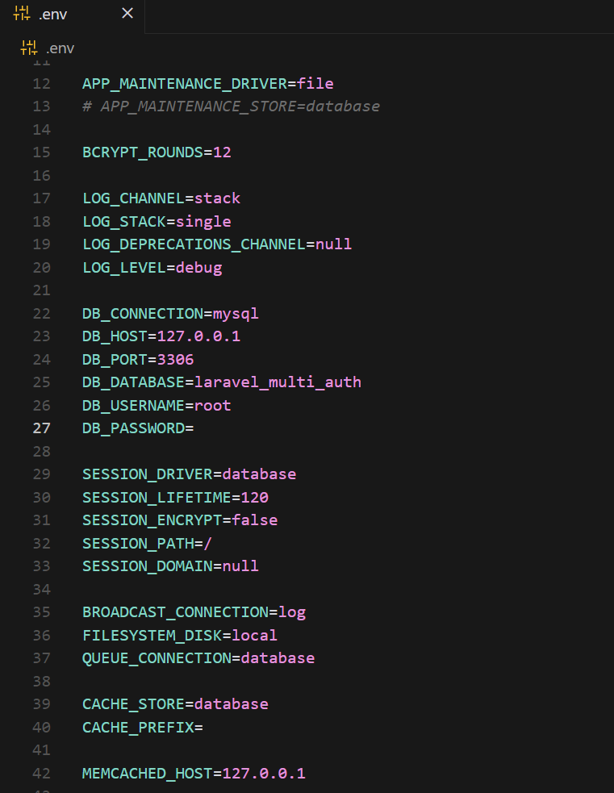

# 6 - Praktek Multi-Auth dengan Laravel 11 dan Breeze

## Pendahuluan

Laravel 11 hadir dengan berbagai fitur dan peningkatan yang membuatnya tetap menjadi pilihan utama bagi pengembang web modern. Salah satu kebutuhan yang sering muncul dalam pengembangan aplikasi adalah sistem multi-auth, yaitu memungkinkan lebih dari satu tipe pengguna (misalnya, admin dan user) untuk login dengan peran dan hak akses yang berbeda. Dalam modul ini, kita akan membahas langkah demi langkah cara mengimplementasikan sistem multi-auth menggunakan Laravel 11 dan Laravel Breeze.

Laravel Breeze adalah starter kit yang ringan, mudah digunakan, dan sesuai untuk implementasi autentikasi dasar. Kita akan memodifikasinya untuk mendukung multi-auth dengan membedakan role (seperti user dan admin), serta menyesuaikan logika login dan dashboard untuk masing-masing peran.

- [6 - Praktek Multi-Auth dengan Laravel 11 dan Breeze](#6---praktek-multi-auth-dengan-laravel-11-dan-breeze)
    - [1. Setup Proyek Laravel 11](#1-setup-proyek-laravel-11)
        - [Langkah 1: Membuat Proyek Laravel 11 Baru](#langkah-1-membuat-proyek-laravel-11-baru)
    - [2. Konfigurasi Database](#2-konfigurasi-database)
        - [Langkah 1: Setup Database MySQL](#langkah-1-setup-database-mysql)
    - [3. Instalasi dan Konfigurasi Laravel Breeze](#3-instalasi-dan-konfigurasi-laravel-breeze)
    	- [Langkah 1: Instal Laravel Breeze](#langkah-1-instal-laravel-breeze)
        - [Langkah 2: Cek Instalasi](#langkah-2-cek-instalasi)
    - [4. Implementasi Multi-Auth](#4-implementasi-multi-auth)
        - [Langkah 1: Menambah Kolom Role di Tabel Users](#langkah-1-menambah-kolom-role-di-tabel-users)
        - [Langkah 2: Modifikasi Model User](#langkah-2-modifikasi-model-user)
    - [5. Kustomisasi Proses Registrasi](#5-kustomisasi-proses-registrasi)
        - [Langkah 1: Modifikasi Form Registrasi](#langkah-1-modifikasi-form-registrasi)
        - [Langkah 2: Modifikasi Controller Registrasi](#langkah-2-modifikasi-controller-registrasi)
    - [6. Kustomisasi Proses Login](#6-kustomisasi-proses-login)
        - [Langkah 1: Membuat LoginController.php](#langkah-1-membuat-logincontrollerphp)
        - [Langkah 2: Menambahkan Routes untuk Login dan Logout](#langkah-2-menambahkan-routes-untuk-login-dan-logout)
        - [Langkah 3: Mengatur Redirect Berdasarkan Role](#langkah-3-mengatur-redirect-berdasarkan-role)
    - [Kesimpulan](#kesimpulan)

Author: Muhammad Irza Arifin (@rifinsra_05)

---

## 1. Setup Proyek Laravel 11

### Pengantar
Langkah pertama dalam membangun sistem multi-auth adalah memulai proyek Laravel baru. Di sini, kita akan mengatur lingkungan kerja Laravel 11 dan menginstal Laravel Breeze sebagai starter kit autentikasi.

### Langkah 1: Membuat Proyek Laravel 11 Baru
1. **Instalasi Composer**: Laravel menggunakan Composer sebagai dependency manager. Pastikan Composer telah diinstal pada sistem Kamu.

    ```bash
    composer create-project --prefer-dist laravel/laravel:^11.0 laravel-multi-auth
    ```

2. **Masuk ke Direktori Proyek**: Setelah proyek selesai dibuat, masuk ke direktori proyek.

    ```bash
    cd laravel-multi-auth
    ```

3. **Jalankan Server Pengembangan**: Untuk memastikan semuanya berjalan dengan baik, jalankan server development.

    ```bash
    php artisan serve
    ```

4. **Akses di Browser**: Buka browser dan akses `http://127.0.0.1:8000` untuk memastikan proyek Laravel telah terinstal dengan benar.

## 2. Konfigurasi Database

### Pengantar
Sistem multi-auth membutuhkan database untuk menyimpan informasi pengguna, termasuk detail seperti email, password, dan peran (role) mereka. Di sini, kita akan mengonfigurasi database MySQL di proyek Laravel.

### Langkah 1: Setup Database MySQL
1. **Buat Database di MySQL**: Masuk ke MySQL dan buat database baru.

    ```sql
    CREATE DATABASE laravel_multi_auth;
    ```

    

2. **Konfigurasi .env**: Buka file `.env` di root proyek Kamu dan sesuaikan pengaturan database:

    ```bash
    DB_CONNECTION=mysql
    DB_HOST=127.0.0.1
    DB_PORT=3306
    DB_DATABASE=laravel_multi_auth
    DB_USERNAME=root
    DB_PASSWORD=your_password
    ```

    Pastikan untuk mengganti `DB_USERNAME` dan `DB_PASSWORD` sesuai dengan kredensial MySQL lokal Kamu.

    

3. **Migrasi Database**: Laravel menggunakan migrasi untuk membuat tabel di database. Jalankan perintah berikut untuk menerapkan migrasi default.

    ```bash
    php artisan migrate
    ```

4. **Troubleshooting**:
   - Jika terjadi error koneksi ke MySQL, pastikan bahwa MySQL sedang berjalan, dan cek kembali konfigurasi di `.env`.
   - Jika terjadi error migrasi, pastikan struktur tabel database belum ada sebelumnya untuk menghindari konflik.

## 3. Instalasi dan Konfigurasi Laravel Breeze

### Langkah 1: Instal Laravel Breeze
1. Jalankan perintah Composer untuk menginstal Laravel Breeze:

    ```bash
    composer require laravel/breeze --dev
    ```

2. **Install Breeze**: Setelah paket diinstal, jalankan perintah berikut untuk menginstal Breeze dengan stack `blade` (karena kita akan menggunakan blade sebagai engine template).

    ```bash
    php artisan breeze:install
    ```

3. **Jalankan NPM**: Breeze membutuhkan dukungan frontend. Instal dependensi NPM dan jalankan build.

    ```bash
    npm install
    npm run dev
    ```

4. **Migrasi Ulang Database**: Breeze membawa migrasi default untuk autentikasi. Jalankan perintah migrasi untuk memastikan tabel pengguna dibuat.

    ```bash
    php artisan migrate
    ```

### Langkah 2: Cek Instalasi
Buka browser dan akses halaman registrasi di `http://127.0.0.1:8000/register`. Kamu akan melihat form registrasi default yang disediakan oleh Breeze.


## 4. Implementasi Multi-Auth

### Pengantar
Sekarang kita akan mulai menerapkan multi-auth dengan menambahkan kolom `role` di tabel `users`, memodifikasi model, dan menambahkan logika pembatasan akses berdasarkan role.

### Langkah 1: Menambah Kolom Role di Tabel Users
1. **Buat Migrasi Baru**: Tambahkan kolom `role` ke tabel `users` dengan membuat migrasi baru.

    ```bash
    php artisan make:migration add_role_to_users_table --table=users
    ```

2. **Edit File Migrasi**: Buka file migrasi yang baru saja dibuat di `database/migrations/xxxx_xx_xx_add_role_to_users_table.php` dan tambahkan kode berikut:

    ```php
    public function up()
    {
        Schema::table('users', function (Blueprint $table) {
            $table->string('role')->default('user'); // Default role is 'user'
        });
    }

    public function down()
    {
        Schema::table('users', function (Blueprint $table) {
            $table->dropColumn('role');
        });
    }
    ```

    

3. **Jalankan Migrasi**: Terapkan perubahan ini ke database.

    ```bash
    php artisan migrate
    ```

4. **Troubleshooting**:
   - Jika migrasi gagal, cek apakah tabel `users` sudah ada atau ada konflik dengan migrasi lainnya.
   - Pastikan kolom `role` telah ditambahkan dengan sukses di tabel `users` di database Kamu.

### Langkah 2: Modifikasi Model User
1. **Edit Model User**: Buka model `User.php` di `app/Models/` dan tambahkan kolom `role` ke properti `$fillable` untuk memastikan data ini bisa diisi.

    ```php
    protected $fillable = [
        'name',
        'email',
        'password',
        'role', // Tambahkan role ke fillable
    ];
    ```

2. **Buat Fungsi Helper**: Tambahkan fungsi helper untuk mengecek role pengguna.

    ```php
    public function isAdmin()
    {
        return $this->role === 'admin';
    }
    ```

    Ini memungkinkan kita memeriksa apakah pengguna memiliki peran admin dengan mudah di berbagai tempat dalam aplikasi.

    

## 5. Kustomisasi Proses Registrasi

### Pengantar
Di bagian ini, kita akan memodifikasi proses registrasi agar pengguna dapat memilih peran mereka saat mendaftar (misalnya, `user` atau `admin`). Kita juga akan memastikan bahwa role tersebut disimpan dengan benar di database.

### Langkah 1: Modifikasi Form Registrasi
1. **Buka File View Registrasi**: Laravel Breeze menggunakan Blade untuk view. Buka file `resources/views/auth/register.blade.php`.
   
2. **Tambahkan Dropdown Role**: Modifikasi form untuk menambahkan pilihan role. Tambahkan kode di bawah sebelum tombol submit.

    ```html
    <div>
        <label for="role" class="block text-sm font-medium text-gray-700">Role</label>
        <select id="role" name="role" required class="mt-1 block w-full border border-gray-300 rounded-md shadow-sm focus:ring-indigo-500 focus:border-indigo-500 sm:text-sm">
            <option value="user">User</option>
            <option value="admin">Admin</option>
        </select>
    </div>
    ```

### Langkah 2: Modifikasi Controller Registrasi
1. **Buka `RegisterController`**: Di Laravel Breeze, form registrasi diproses oleh `RegisterController`, yang terletak di `app/Http/Controllers/Auth/RegisteredUserController.php`.

2. **Tambahkan Validasi Role**: Ubah validasi di method `store` untuk menambahkan validasi role..

    ```php
    $request->validate([
        'name' => ['required', 'string', 'max:255'],
        'email' => ['required', 'string', 'lowercase', 'email', 'max:255', 'unique:'.User::class],
        'password' => ['required', 'confirmed', Rules\Password::defaults()],
        'role' => ['required', 'in:user,admin'], // Validasi role
    ]);

    ```

3. **Simpan Role ke Database**: Modifikasi bagian di mana pengguna dibuat agar role juga disimpan ke dalam tabel `users`.

    ```php
        $user = User::create([
        'name' => $request->name,
        'email' => $request->email,
        'password' => Hash::make($request->password),
        'role' => $request->role, // Simpan role
    ]);

    ```

4. **Ubah `return redirect`**: Ubah `return redirect(RouteServiceProvider::HOME);` menjadi `return redirect()->route('login')->with('status', 'Registration successful. Please log in.');` agar Kamu diarahkan ke halaman login setelah registrasi.

        

5. **Testing Form Registrasi**: Buka halaman registrasi di browser (`http://127.0.0.1:8000/register`). Setelah form dimodifikasi, pengguna sekarang bisa memilih role saat registrasi.

#### Troubleshooting
1. **Error saat menyimpan role**: Jika role tidak tersimpan dengan benar, pastikan bahwa:
    - Kolom `role` sudah ditambahkan ke tabel `users`.
    - Kolom `role` sudah ada di model `User` dan bisa diisi secara massal.
    
    Pastikan di model `User` (file `app/Models/User.php`), Kamu menambahkan `role` ke dalam properti `$fillable` agar bisa diisi secara massal:

    ```php
    protected $fillable = [
        'name',
        'email',
        'password',
        'role', // Tambahkan role di sini
    ];
    ```

2. **Validasi role gagal**: Jika validasi `role` gagal, periksa apakah nilai yang dikirim dari form sesuai dengan yang ada di validasi (`user` atau `admin`).


## 6. Kustomisasi Proses Login

### Langkah 1: Membuat `LoginController.php`

Sekarang, kita akan membuat `LoginController` untuk menangani proses login, mengarahkan pengguna berdasarkan **role**, dan menambahkan logika logout.

#### 1.1. Membuat LoginController

Jalankan perintah berikut untuk membuat `LoginController`:

```bash
php artisan make:controller Auth/LoginController
```

#### 1.2. Menambahkan Logika Login

Buka file `LoginController.php` yang baru saja dibuat di `app/Http/Controllers/Auth/` dan tambahkan kode berikut:

```php
<?php

namespace App\Http\Controllers\Auth;

use App\Http\Controllers\Controller;
use Illuminate\Http\Request;
use Illuminate\Support\Facades\Auth;
use Illuminate\Validation\ValidationException;

class LoginController extends Controller
{
    /**
     * Menampilkan form login.
     */
    public function showLoginForm()
    {
        return view('auth.login');
    }

    /**
     * Menangani proses login.
     */
    public function login(Request $request)
    {
        // Validasi input email dan password
        $credentials = $request->validate([
            'email' => ['required', 'email'],
            'password' => ['required'],
        ]);

        // Proses autentikasi
        if (Auth::attempt($credentials)) {
            $request->session()->regenerate();

            // Mengarahkan pengguna berdasarkan role
            if (Auth::user()->role === 'admin') {
                return redirect()->route('admin.dashboard');
            } elseif (Auth::user()->role === 'user') {
                return redirect()->route('user.dashboard');
            }

            // Jika role tidak valid, logout pengguna
            Auth::logout();
            return redirect()->route('login')->withErrors(['role' => 'Role tidak valid.']);
        }

        // Jika login gagal
        throw ValidationException::withMessages([
            'email' => 'Email atau password salah.',
        ]);
    }

    /**
     * Menangani logout.
     */
    public function logout(Request $request)
    {
        Auth::logout();

        // Invalidate sesi pengguna
        $request->session()->invalidate();

        // Regenerasi token CSRF
        $request->session()->regenerateToken();

        return redirect('/');
    }
}
```

**Penjelasan Kode:**
- Metode `login`: Melakukan autentikasi berdasarkan kredensial yang diberikan (email dan password). Setelah berhasil login, pengguna akan diarahkan ke **dashboard** berdasarkan role (`user` atau `admin`). Jika role tidak valid, pengguna akan otomatis dikeluarkan dan dikembalikan ke halaman login dengan pesan kesalahan.
- Metode `logout`: Mengelola proses logout dengan aman, termasuk menghapus sesi dan regenerasi token CSRF.

### Langkah 2: Menambahkan Routes untuk Login dan Logout

Tambahkan routes untuk login dan logout di file `routes/web.php`:

```php
use App\Http\Controllers\Auth\LoginController;

// Route untuk menampilkan form login
Route::get('/login', [LoginController::class, 'showLoginForm'])->name('login');

// Route untuk menangani proses login
Route::post('/login', [LoginController::class, 'login']);

// Route untuk menangani logout
Route::post('/logout', [LoginController::class, 'logout'])->name('logout');
```

### Langkah 3: Mengatur Redirect Berdasarkan Role

Agar pengguna diarahkan ke dashboard yang sesuai setelah login, kita sudah menambahkan logika redirect dalam `LoginController`. Sekarang, tambahkan route untuk **user** dan **admin** dashboard.

#### 3.1. Tambahkan Route untuk Dashboard

Tambahkan kode berikut ke dalam `routes/web.php`:

```php
// Dashboard untuk user
Route::middleware(['auth'])->group(function () {
    Route::get('/user/dashboard', function () {
        return view('user.dashboard');
    })->name('user.dashboard');
    
    // Dashboard untuk admin
    Route::get('/admin/dashboard', function () {
        return view('admin.dashboard');
    })->name('admin.dashboard');
});
```

#### 3.2. Membuat View Dashboard

- **User Dashboard**: Buat file `resources/views/user/dashboard.blade.php`:

  ```html
    <x-app-layout>
        <x-slot name="header">
            <h2 class="font-semibold text-xl text-gray-800 leading-tight">
                {{ __('Dashboard') }}
            </h2>
        </x-slot>

        <div class="py-12">
            <div class="max-w-7xl mx-auto sm:px-6 lg:px-8">
                <div class="bg-white overflow-hidden shadow-sm sm:rounded-lg">
                    <div class="p-6 text-gray-900">
                        {{ __("You're logged in!") }}

                        <h1 class="tracking-widest text-xl">Welcome to the User Dashboard!</h1>
                    </div>
                </div>
            </div>
        </div>
    </x-app-layout>
  ```

- **Admin Dashboard**: Buat file `resources/views/admin/dashboard.blade.php`:

  ```html
    <x-app-layout>
        <x-slot name="header">
            <h2 class="font-semibold text-xl text-gray-800 leading-tight">
                {{ __('Dashboard') }}
            </h2>
        </x-slot>

        <div class="py-12">
            <div class="max-w-7xl mx-auto sm:px-6 lg:px-8">
                <div class="bg-white overflow-hidden shadow-sm sm:rounded-lg">
                    <div class="p-6 text-gray-900">
                        {{ __("You're logged in!") }}

                        <h1 class="tracking-widest text-xl">Welcome to the Admin Dashboard!</h1>
                    </div>
                </div>
            </div>
        </div>
    </x-app-layout>
  ```

Sekarang, setelah login, pengguna akan diarahkan ke dashboard yang sesuai berdasarkan role mereka.

Dengan mengikuti langkah-langkah di atas, Kamu telah berhasil mengimplementasikan fitur login dengan role-based authentication di aplikasi Laravel Kamu. Pengguna dapat masuk dengan kredensial yang benar dan diarahkan ke dashboard yang sesuai berdasarkan role mereka. Selanjutnya, Kita dapat melanjutkan pengembangan aplikasi dengan menambahkan fitur-fitur lainnya sesuai kebutuhan, mislanya menambahkan session dengan middleware dan lain-lain di modul-modul berikutnya!🎉

## Kesimpulan

Modul ini membahas tentang implementasi sistem multi-auth di Laravel 11 menggunakan Laravel Breeze. Kita telah berhasil membuat aplikasi web yang memungkinkan pengguna dengan role `user` dan `admin` untuk login dan diarahkan ke dashboard mereka masing-masing. Sistem ini membantu meningkatkan keamanan dan mengatur akses pengguna berdasarkan peran mereka di dalam aplikasi.
